# Database Design

This document provides comprehensive coverage of the database architecture for the Temporal.io enterprise deployment, including data models, storage strategies, performance optimization, and operational procedures.

## Database Architecture Overview

The database design implements a multi-store approach with PostgreSQL as the primary database for persistence and visibility, complemented by Elasticsearch for advanced search capabilities and Redis for caching layers.

```mermaid
graph TB
    subgraph "Application Layer"
        APP1[Temporal Frontend]
        APP2[Temporal History]
        APP3[Temporal Matching]
        APP4[Temporal Worker]
        APP5[Temporal Web UI]
    end

    subgraph "Database Layer"
        subgraph "Primary Storage"
            DB1[PostgreSQL Primary<br/>Read/Write Operations]
            DB2[PostgreSQL Replica 1<br/>Read Operations]
            DB3[PostgreSQL Replica 2<br/>Read Operations]
        end

        subgraph "Search Layer"
            ES1[Elasticsearch Master 1]
            ES2[Elasticsearch Master 2]
            ES3[Elasticsearch Master 3]
            ES4[Elasticsearch Data 1]
            ES5[Elasticsearch Data 2]
            ES6[Elasticsearch Data 3]
        end

        subgraph "Cache Layer"
            CACHE1[Redis Primary<br/>Session Cache]
            CACHE2[Redis Replica<br/>Read Cache]
            CACHE3[Redis Sentinel<br/>Failover]
        end

        subgraph "Backup Storage"
            BACKUP1[WAL Streaming<br/>Continuous Backup]
            BACKUP2[Point-in-Time Recovery<br/>PITR]
            BACKUP3[Object Storage<br/>S3/GCS/Azure]
        end
    end

    subgraph "Monitoring & Management"
        MON1[PostgreSQL Exporter<br/>Metrics]
        MON2[Elasticsearch Exporter<br/>Metrics]
        MON3[Redis Exporter<br/>Metrics]
        MON4[Backup Monitoring<br/>Health Checks]
    end

    APP1 --> DB1
    APP2 --> DB1
    APP3 --> DB1
    APP4 --> DB1
    APP5 --> DB2

    APP1 --> ES1
    APP5 --> ES1

    APP1 --> CACHE1
    APP5 --> CACHE1

    DB1 --> DB2
    DB1 --> DB3
    DB1 --> BACKUP1

    MON1 --> DB1
    MON2 --> ES1
    MON3 --> CACHE1
```



## PostgreSQL Database Design

### Primary Database Configuration

#### High Availability Setup

```yaml
# PostgreSQL High Availability Configuration
postgresql_ha:
  deployment_type: "primary_replica"
  replication_mode: "streaming"
  
  primary:
    name: "postgresql-primary"
    resources:
      cpu: "4000m"
      memory: "16Gi"
      storage: "500Gi"
      storage_class: "fast-ssd"
    
  replicas:
    count: 2
    resources:
      cpu: "2000m"
      memory: "8Gi"
      storage: "500Gi"
      storage_class: "fast-ssd"
    lag_threshold: "1MB"
    
  connection_pooling:
    enabled: true
    tool: "pgbouncer"
    max_connections: 1000
    default_pool_size: 50
    min_pool_size: 10
    
  backup:
    type: "continuous"
    tool: "pgbackrest"
    retention: "30_days"
    compression: "lz4"
```

#### PostgreSQL Configuration

```sql
-- postgresql.conf optimizations for Temporal
-- Memory Settings
shared_buffers = '4GB'                    -- 25% of available RAM
effective_cache_size = '12GB'             -- 75% of available RAM
work_mem = '64MB'                         -- For complex queries
maintenance_work_mem = '1GB'              -- For VACUUM, INDEX operations

-- Write-Ahead Logging (WAL)
wal_level = 'replica'                     -- Enable streaming replication
max_wal_size = '2GB'                      -- Maximum WAL size
min_wal_size = '1GB'                      -- Minimum WAL size
wal_compression = on                      -- Compress WAL records
wal_log_hints = on                        -- Enable WAL hints for pg_rewind

-- Checkpoints
checkpoint_completion_target = 0.9        -- Spread checkpoint I/O
checkpoint_timeout = '15min'              -- Checkpoint frequency

-- Connection Settings
max_connections = 1000                    -- Maximum concurrent connections
shared_preload_libraries = 'pg_stat_statements,auto_explain,pg_cron'

-- Query Optimization
random_page_cost = 1.1                    -- SSD optimization
effective_io_concurrency = 200            -- Concurrent I/O operations
default_statistics_target = 500           -- Query planner statistics

-- Logging
log_statement = 'mod'                     -- Log modifications
log_min_duration_statement = 1000         -- Log slow queries (>1s)
log_line_prefix = '%t [%p]: [%l-1] user=%u,db=%d,app=%a,client=%h '
log_lock_waits = on                       -- Log lock waits
log_temp_files = 10MB                     -- Log temp files > 10MB

-- Auto-vacuum
autovacuum = on
autovacuum_max_workers = 6
autovacuum_naptime = 15s
autovacuum_vacuum_threshold = 100
autovacuum_analyze_threshold = 50
autovacuum_vacuum_scale_factor = 0.05
autovacuum_analyze_scale_factor = 0.02
```

### Database Schema Design

#### Temporal Default Store Schema

```sql
-- Core Temporal tables for workflow execution
CREATE SCHEMA temporal;

-- Executions table - stores workflow execution state
CREATE TABLE temporal.executions (
    shard_id INTEGER NOT NULL,
    namespace_id CHAR(64) NOT NULL,
    workflow_id VARCHAR(255) NOT NULL,
    run_id CHAR(64) NOT NULL,
    next_event_id BIGINT NOT NULL,
    last_write_version BIGINT NOT NULL,
    data BYTEA NOT NULL,
    data_encoding VARCHAR(16) NOT NULL,
    state BYTEA NOT NULL,
    state_encoding VARCHAR(16) NOT NULL,
    db_record_version BIGINT NOT NULL DEFAULT 0,
    PRIMARY KEY (shard_id, namespace_id, workflow_id, run_id)
);

-- History tree table - stores workflow history events
CREATE TABLE temporal.history_tree (
    shard_id INTEGER NOT NULL,
    tree_id CHAR(64) NOT NULL,
    branch_id CHAR(64) NOT NULL,
    data BYTEA NOT NULL,
    data_encoding VARCHAR(16) NOT NULL,
    PRIMARY KEY (shard_id, tree_id, branch_id)
);

-- Current executions table - fast lookup for current workflow state
CREATE TABLE temporal.current_executions (
    shard_id INTEGER NOT NULL,
    namespace_id CHAR(64) NOT NULL,
    workflow_id VARCHAR(255) NOT NULL,
    run_id CHAR(64) NOT NULL,
    create_request_id VARCHAR(64) NOT NULL,
    state INTEGER NOT NULL,
    status INTEGER NOT NULL,
    start_version BIGINT NOT NULL,
    last_write_version BIGINT NOT NULL,
    PRIMARY KEY (shard_id, namespace_id, workflow_id)
);

-- Tasks table - stores task queue items
CREATE TABLE temporal.tasks (
    range_hash BIGINT NOT NULL,
    task_queue_id BYTEA NOT NULL,
    task_id BIGINT NOT NULL,
    data BYTEA NOT NULL,
    data_encoding VARCHAR(16) NOT NULL,
    PRIMARY KEY (range_hash, task_queue_id, task_id)
);

-- Activity info table - tracks activity execution state
CREATE TABLE temporal.activity_info_maps (
    shard_id INTEGER NOT NULL,
    namespace_id CHAR(64) NOT NULL,
    workflow_id VARCHAR(255) NOT NULL,
    run_id CHAR(64) NOT NULL,
    schedule_id BIGINT NOT NULL,
    data BYTEA NOT NULL,
    data_encoding VARCHAR(16) NOT NULL,
    last_heartbeat_updated_time TIMESTAMP NOT NULL,
    PRIMARY KEY (shard_id, namespace_id, workflow_id, run_id, schedule_id)
);

-- Timer info table - manages workflow timers
CREATE TABLE temporal.timer_info_maps (
    shard_id INTEGER NOT NULL,
    namespace_id CHAR(64) NOT NULL,
    workflow_id VARCHAR(255) NOT NULL,
    run_id CHAR(64) NOT NULL,
    timer_id VARCHAR(255) NOT NULL,
    data BYTEA NOT NULL,
    data_encoding VARCHAR(16) NOT NULL,
    PRIMARY KEY (shard_id, namespace_id, workflow_id, run_id, timer_id)
);
```

#### Temporal Visibility Store Schema

```sql
-- Visibility schema for search and filtering
CREATE SCHEMA temporal_visibility;

-- Executions visibility table - searchable execution data
CREATE TABLE temporal_visibility.executions (
    namespace_id CHAR(64) NOT NULL,
    run_id CHAR(64) NOT NULL,
    start_time TIMESTAMP NOT NULL,
    execution_time TIMESTAMP NOT NULL,
    workflow_id VARCHAR(255) NOT NULL,
    workflow_type_name VARCHAR(255) NOT NULL,
    status INTEGER NOT NULL,
    close_time TIMESTAMP,
    history_length BIGINT,
    memo BYTEA,
    encoding VARCHAR(16),
    task_queue VARCHAR(255),
    search_attributes JSON,
    PRIMARY KEY (namespace_id, run_id)
);

-- Indexes for efficient querying
CREATE INDEX idx_executions_start_time ON temporal_visibility.executions(namespace_id, start_time DESC);
CREATE INDEX idx_executions_close_time ON temporal_visibility.executions(namespace_id, close_time DESC);
CREATE INDEX idx_executions_workflow_id ON temporal_visibility.executions(namespace_id, workflow_id);
CREATE INDEX idx_executions_workflow_type ON temporal_visibility.executions(namespace_id, workflow_type_name);
CREATE INDEX idx_executions_status ON temporal_visibility.executions(namespace_id, status);
CREATE INDEX idx_executions_task_queue ON temporal_visibility.executions(namespace_id, task_queue);

-- GIN index for JSON search attributes
CREATE INDEX idx_executions_search_attributes ON temporal_visibility.executions USING GIN(search_attributes);

-- Workflow search attributes table
CREATE TABLE temporal_visibility.custom_search_attributes (
    namespace_id CHAR(64) NOT NULL,
    run_id CHAR(64) NOT NULL,
    search_attributes JSON NOT NULL,
    PRIMARY KEY (namespace_id, run_id)
);
```

### Partitioning Strategy

#### Time-based Partitioning

```sql
-- Partition executions table by month
CREATE TABLE temporal_visibility.executions_template (
    LIKE temporal_visibility.executions INCLUDING ALL
) PARTITION BY RANGE (start_time);

-- Create monthly partitions
CREATE TABLE temporal_visibility.executions_2024_01 
    PARTITION OF temporal_visibility.executions_template
    FOR VALUES FROM ('2024-01-01') TO ('2024-02-01');

CREATE TABLE temporal_visibility.executions_2024_02 
    PARTITION OF temporal_visibility.executions_template
    FOR VALUES FROM ('2024-02-01') TO ('2024-03-01');

-- Automated partition management
CREATE OR REPLACE FUNCTION create_monthly_partition() RETURNS void AS $$
DECLARE
    partition_date date;
    partition_name text;
    start_date text;
    end_date text;
BEGIN
    partition_date := date_trunc('month', CURRENT_DATE + interval '1 month');
    partition_name := 'executions_' || to_char(partition_date, 'YYYY_MM');
    start_date := partition_date::text;
    end_date := (partition_date + interval '1 month')::text;
    
    EXECUTE format('CREATE TABLE IF NOT EXISTS temporal_visibility.%I 
                    PARTITION OF temporal_visibility.executions_template
                    FOR VALUES FROM (%L) TO (%L)',
                   partition_name, start_date, end_date);
END;
$$ LANGUAGE plpgsql;

-- Schedule partition creation
SELECT cron.schedule('create-partition', '0 0 1 * *', 'SELECT create_monthly_partition()');
```

### Performance Optimization

#### Index Strategy

```sql
-- Composite indexes for common query patterns
CREATE INDEX CONCURRENTLY idx_executions_composite_status 
    ON temporal_visibility.executions(namespace_id, status, start_time DESC);

CREATE INDEX CONCURRENTLY idx_executions_composite_type 
    ON temporal_visibility.executions(namespace_id, workflow_type_name, start_time DESC);

CREATE INDEX CONCURRENTLY idx_executions_composite_queue 
    ON temporal_visibility.executions(namespace_id, task_queue, start_time DESC);

-- Partial indexes for active workflows
CREATE INDEX CONCURRENTLY idx_executions_active 
    ON temporal_visibility.executions(namespace_id, start_time DESC)
    WHERE status IN (1, 2); -- Running, ContinuedAsNew

-- Functional indexes for complex queries
CREATE INDEX CONCURRENTLY idx_executions_duration 
    ON temporal_visibility.executions(namespace_id, (close_time - start_time))
    WHERE close_time IS NOT NULL;
```

#### Query Optimization

```sql
-- Materialized view for dashboard metrics
CREATE MATERIALIZED VIEW temporal_visibility.workflow_metrics AS
SELECT 
    namespace_id,
    workflow_type_name,
    DATE(start_time) as execution_date,
    COUNT(*) as total_executions,
    COUNT(*) FILTER (WHERE status = 3) as completed_executions,
    COUNT(*) FILTER (WHERE status = 4) as failed_executions,
    COUNT(*) FILTER (WHERE status = 5) as canceled_executions,
    AVG(EXTRACT(EPOCH FROM (close_time - start_time))) as avg_duration_seconds,
    PERCENTILE_CONT(0.5) WITHIN GROUP (ORDER BY EXTRACT(EPOCH FROM (close_time - start_time))) as median_duration_seconds,
    PERCENTILE_CONT(0.95) WITHIN GROUP (ORDER BY EXTRACT(EPOCH FROM (close_time - start_time))) as p95_duration_seconds
FROM temporal_visibility.executions
WHERE start_time >= CURRENT_DATE - INTERVAL '30 days'
GROUP BY namespace_id, workflow_type_name, DATE(start_time);

-- Refresh materialized view hourly
CREATE UNIQUE INDEX ON temporal_visibility.workflow_metrics(namespace_id, workflow_type_name, execution_date);
SELECT cron.schedule('refresh-metrics', '0 * * * *', 'REFRESH MATERIALIZED VIEW CONCURRENTLY temporal_visibility.workflow_metrics');
```

## Elasticsearch Configuration

### Cluster Setup

#### Elasticsearch Cluster Configuration

```yaml
# Elasticsearch cluster for advanced visibility
elasticsearch:
  cluster_name: "temporal-es-cluster"
  
  master_nodes:
    count: 3
    resources:
      cpu: "1000m"
      memory: "2Gi"
      storage: "50Gi"
    jvm_heap: "1g"
    
  data_nodes:
    count: 3
    resources:
      cpu: "2000m"
      memory: "8Gi"
      storage: "500Gi"
    jvm_heap: "4g"
    
  client_nodes:
    count: 2
    resources:
      cpu: "500m"
      memory: "2Gi"
    jvm_heap: "1g"

  settings:
    indices.memory.index_buffer_size: "20%"
    indices.memory.min_index_buffer_size: "48mb"
    indices.fielddata.cache.size: "30%"
    indices.breaker.fielddata.limit: "40%"
    indices.breaker.request.limit: "30%"
    cluster.routing.allocation.disk.watermark.low: "85%"
    cluster.routing.allocation.disk.watermark.high: "90%"
    cluster.routing.allocation.disk.watermark.flood_stage: "95%"
```

### Index Templates and Mappings

#### Temporal Visibility Index Template

```json
{
  "index_patterns": ["temporal_visibility_v1_*"],
  "template": {
    "settings": {
      "number_of_shards": 3,
      "number_of_replicas": 1,
      "refresh_interval": "5s",
      "index.codec": "best_compression",
      "index.mapping.total_fields.limit": 2000,
      "index.max_result_window": 10000,
      "index.lifecycle.name": "temporal_visibility_policy",
      "index.lifecycle.rollover_alias": "temporal_visibility_v1"
    },
    "mappings": {
      "dynamic": "strict",
      "properties": {
        "NamespaceId": {
          "type": "keyword"
        },
        "WorkflowId": {
          "type": "keyword"
        },
        "RunId": {
          "type": "keyword"
        },
        "WorkflowType": {
          "type": "keyword"
        },
        "StartTime": {
          "type": "date",
          "format": "strict_date_optional_time_nanos"
        },
        "ExecutionTime": {
          "type": "date",
          "format": "strict_date_optional_time_nanos"
        },
        "CloseTime": {
          "type": "date",
          "format": "strict_date_optional_time_nanos"
        },
        "ExecutionStatus": {
          "type": "integer"
        },
        "ExecutionDuration": {
          "type": "long"
        },
        "HistoryLength": {
          "type": "long"
        },
        "TaskQueue": {
          "type": "keyword"
        },
        "Memo": {
          "type": "object",
          "enabled": false
        },
        "SearchAttributes": {
          "type": "object",
          "properties": {
            "CustomKeywordField": {
              "type": "keyword"
            },
            "CustomIntField": {
              "type": "integer"
            },
            "CustomDoubleField": {
              "type": "double"
            },
            "CustomBoolField": {
              "type": "boolean"
            },
            "CustomDatetimeField": {
              "type": "date",
              "format": "strict_date_optional_time_nanos"
            },
            "CustomStringField": {
              "type": "text",
              "analyzer": "standard"
            }
          }
        }
      }
    }
  }
}
```

### Index Lifecycle Management

```json
{
  "policy": {
    "phases": {
      "hot": {
        "actions": {
          "rollover": {
            "max_primary_shard_size": "5GB",
            "max_age": "7d"
          },
          "set_priority": {
            "priority": 100
          }
        }
      },
      "warm": {
        "min_age": "7d",
        "actions": {
          "set_priority": {
            "priority": 50
          },
          "allocate": {
            "number_of_replicas": 0
          },
          "forcemerge": {
            "max_num_segments": 1
          },
          "shrink": {
            "number_of_shards": 1
          }
        }
      },
      "cold": {
        "min_age": "30d",
        "actions": {
          "set_priority": {
            "priority": 0
          },
          "allocate": {
            "number_of_replicas": 0
          }
        }
      },
      "delete": {
        "min_age": "90d",
        "actions": {
          "delete": {}
        }
      }
    }
  }
}
```

## Redis Configuration

### Caching Strategy

#### Redis Cluster Setup

```yaml
# Redis configuration for caching
redis:
  deployment_mode: "sentinel"
  
  sentinel:
    count: 3
    resources:
      cpu: "100m"
      memory: "128Mi"
    
  master:
    resources:
      cpu: "500m"
      memory: "2Gi"
    persistence:
      enabled: true
      size: "10Gi"
    
  replica:
    count: 2
    resources:
      cpu: "250m"
      memory: "1Gi"
    
  configuration:
    maxmemory: "1536mb"
    maxmemory-policy: "allkeys-lru"
    timeout: 300
    tcp-keepalive: 60
    save: "900 1 300 10 60 10000"
    stop-writes-on-bgsave-error: "yes"
    rdbcompression: "yes"
    rdbchecksum: "yes"
    
  cache_patterns:
    user_sessions:
      ttl: 3600  # 1 hour
      namespace: "session:"
    
    workflow_metadata:
      ttl: 600   # 10 minutes
      namespace: "wf_meta:"
    
    task_queue_info:
      ttl: 300   # 5 minutes
      namespace: "tq_info:"
```

## Data Management Strategies

### Backup and Recovery

#### Continuous Backup with pgBackRest

```yaml
# pgBackRest configuration
pgbackrest:
  global:
    repo1-type: "s3"
    repo1-s3-bucket: "temporal-backups"
    repo1-s3-region: "us-east-1"
    repo1-s3-endpoint: "s3.amazonaws.com"
    repo1-retention-full: 30
    repo1-retention-diff: 7
    repo1-retention-incr: 3
    
  stanza:
    temporal:
      pg1-path: "/var/lib/postgresql/data"
      pg1-host: "postgresql-primary"
      pg1-host-user: "postgres"
      recovery-option: "recovery_target_action=promote"
      
  backup_schedules:
    full_backup: "0 2 * * 0"  # Weekly full backup
    differential_backup: "0 2 * * 1-6"  # Daily differential backup
    incremental_backup: "0 */6 * * *"  # Every 6 hours incremental backup
```

#### Point-in-Time Recovery

```bash
#!/bin/bash
# Point-in-time recovery script
recover_to_timestamp() {
    local target_timestamp=$1
    local recovery_dir="/var/lib/postgresql/recovery"
    
    # Stop PostgreSQL
    kubectl scale statefulset postgresql-primary --replicas=0
    
    # Restore from backup
    pgbackrest --stanza=temporal --type=time \
               --target="$target_timestamp" \
               --target-action=promote \
               restore
    
    # Start PostgreSQL
    kubectl scale statefulset postgresql-primary --replicas=1
    
    echo "Recovery to $target_timestamp completed"
}
```

### Data Retention Policies

#### Automated Data Cleanup

```sql
-- Data retention stored procedures
CREATE OR REPLACE FUNCTION cleanup_old_executions(retention_days INTEGER DEFAULT 90)
RETURNS INTEGER AS $$
DECLARE
    deleted_count INTEGER;
    cutoff_date TIMESTAMP;
BEGIN
    cutoff_date := CURRENT_TIMESTAMP - (retention_days || ' days')::INTERVAL;
    
    -- Delete old completed executions
    DELETE FROM temporal_visibility.executions 
    WHERE close_time < cutoff_date 
    AND status IN (3, 4, 5, 6, 7, 8); -- Completed, Failed, Canceled, etc.
    
    GET DIAGNOSTICS deleted_count = ROW_COUNT;
    
    -- Log cleanup operation
    INSERT INTO temporal.cleanup_log (cleanup_date, table_name, deleted_rows, retention_days)
    VALUES (CURRENT_TIMESTAMP, 'executions', deleted_count, retention_days);
    
    RETURN deleted_count;
END;
$$ LANGUAGE plpgsql;

-- Schedule automated cleanup
SELECT cron.schedule('cleanup-executions', '0 3 * * *', 'SELECT cleanup_old_executions(90)');
```

### Data Migration and Upgrades

#### Schema Migration Framework

```sql
-- Migration tracking table
CREATE TABLE temporal.schema_migrations (
    version VARCHAR(255) PRIMARY KEY,
    applied_at TIMESTAMP DEFAULT CURRENT_TIMESTAMP,
    checksum VARCHAR(64) NOT NULL,
    description TEXT
);

-- Example migration: Add new search attribute
CREATE OR REPLACE FUNCTION migrate_add_search_attribute()
RETURNS VOID AS $$
BEGIN
    -- Check if migration already applied
    IF EXISTS (SELECT 1 FROM temporal.schema_migrations WHERE version = '1.20.0_add_customer_id') THEN
        RAISE NOTICE 'Migration 1.20.0_add_customer_id already applied';
        RETURN;
    END IF;
    
    -- Add new column
    ALTER TABLE temporal_visibility.executions 
    ADD COLUMN IF NOT EXISTS customer_id VARCHAR(255);
    
    -- Add index
    CREATE INDEX CONCURRENTLY IF NOT EXISTS idx_executions_customer_id 
        ON temporal_visibility.executions(namespace_id, customer_id);
    
    -- Record migration
    INSERT INTO temporal.schema_migrations (version, description, checksum)
    VALUES ('1.20.0_add_customer_id', 'Add customer_id search attribute', 'abc123def456');
    
    RAISE NOTICE 'Migration 1.20.0_add_customer_id completed successfully';
END;
$$ LANGUAGE plpgsql;
```

## Performance Monitoring and Optimization

### Database Metrics Collection

#### PostgreSQL Monitoring

```yaml
# PostgreSQL Exporter configuration
postgresql_exporter:
  enabled: true
  datasource:
    host: "postgresql-primary"
    port: 5432
    database: "temporal"
    user: "postgres_exporter"
    
  custom_queries:
    temporal_metrics:
      query: |
        SELECT 
          schemaname,
          tablename,
          n_tup_ins as inserts,
          n_tup_upd as updates,
          n_tup_del as deletes,
          n_live_tup as live_tuples,
          n_dead_tup as dead_tuples,
          last_vacuum,
          last_autovacuum,
          last_analyze,
          last_autoanalyze
        FROM pg_stat_user_tables 
        WHERE schemaname IN ('temporal', 'temporal_visibility')
      metrics:
        - schemaname:
            usage: "LABEL"
            description: "Schema name"
        - tablename:
            usage: "LABEL"
            description: "Table name"
        - inserts:
            usage: "COUNTER"
            description: "Number of rows inserted"
        - updates:
            usage: "COUNTER"
            description: "Number of rows updated"
        - deletes:
            usage: "COUNTER"
            description: "Number of rows deleted"
        - live_tuples:
            usage: "GAUGE"
            description: "Estimated number of live rows"
        - dead_tuples:
            usage: "GAUGE"
            description: "Estimated number of dead rows"
```

### Performance Tuning

#### Slow Query Analysis

```sql
-- Enable pg_stat_statements for query analysis
CREATE EXTENSION IF NOT EXISTS pg_stat_statements;

-- Query to find slow operations
SELECT 
    query,
    calls,
    total_time,
    mean_time,
    stddev_time,
    rows,
    100.0 * shared_blks_hit / nullif(shared_blks_hit + shared_blks_read, 0) AS hit_percent
FROM pg_stat_statements
WHERE mean_time > 1000  -- Queries taking more than 1 second on average
ORDER BY mean_time DESC
LIMIT 20;

-- Query to find table bloat
SELECT 
    schemaname,
    tablename,
    attname,
    n_distinct,
    correlation,
    most_common_vals,
    histogram_bounds
FROM pg_stats
WHERE schemaname IN ('temporal', 'temporal_visibility')
AND n_distinct < 100  -- Low cardinality columns that might benefit from partial indexes
ORDER BY schemaname, tablename, attname;
```

#### Index Usage Analysis

```sql
-- Analyze index usage patterns
SELECT 
    schemaname,
    tablename,
    indexname,
    idx_scan,
    idx_tup_read,
    idx_tup_fetch,
    pg_size_pretty(pg_relation_size(indexrelid)) as index_size
FROM pg_stat_user_indexes
WHERE schemaname IN ('temporal', 'temporal_visibility')
ORDER BY idx_scan DESC;

-- Find unused indexes
SELECT 
    schemaname,
    tablename,
    indexname,
    pg_size_pretty(pg_relation_size(indexrelid)) as index_size
FROM pg_stat_user_indexes
WHERE schemaname IN ('temporal', 'temporal_visibility')
AND idx_scan = 0
ORDER BY pg_relation_size(indexrelid) DESC;
```

## Disaster Recovery and High Availability

### Database Failover Procedures

#### Automated Failover with Patroni

```yaml
# Patroni configuration for PostgreSQL HA
patroni:
  scope: temporal-cluster
  namespace: temporal-backend
  
  bootstrap:
    dcs:
      ttl: 30
      loop_wait: 10
      retry_timeout: 30
      maximum_lag_on_failover: 1048576  # 1MB
      master_start_timeout: 300
      synchronous_mode: true
      synchronous_mode_strict: false
      
    initdb:
      - encoding: UTF8
      - data-checksums
      
  postgresql:
    use_pg_rewind: true
    use_slots: true
    parameters:
      wal_level: replica
      hot_standby: "on"
      max_connections: 1000
      max_wal_senders: 10
      max_replication_slots: 10
      wal_keep_segments: 8
      
  watchdog:
    mode: required
    device: /dev/watchdog
    safety_margin: 5
```

### Cross-Region Data Replication

#### Logical Replication Setup

```sql
-- Set up logical replication for disaster recovery
-- On primary cluster
CREATE PUBLICATION temporal_pub FOR ALL TABLES IN SCHEMA temporal, temporal_visibility;

-- On secondary cluster (different region)
CREATE SUBSCRIPTION temporal_sub 
CONNECTION 'host=primary-cluster.example.com port=5432 user=replicator dbname=temporal'
PUBLICATION temporal_pub
WITH (copy_data = true, create_slot = true, enabled = true);

-- Monitor replication lag
SELECT 
    application_name,
    client_addr,
    state,
    sent_lsn,
    write_lsn,
    flush_lsn,
    replay_lsn,
    write_lag,
    flush_lag,
    replay_lag
FROM pg_stat_replication;
```

### Recovery Testing

#### Automated Recovery Testing

```bash
#!/bin/bash
# Disaster recovery testing script
test_recovery() {
    local test_type=$1
    local test_timestamp=$(date +%Y%m%d_%H%M%S)
    local test_namespace="temporal-dr-test-$test_timestamp"
    
    echo "Starting DR test: $test_type at $test_timestamp"
    
    case $test_type in
        "point_in_time")
            # Test point-in-time recovery
            test_pitr_recovery "$test_namespace"
            ;;
        "full_restore")
            # Test full backup restore
            test_full_restore "$test_namespace"
            ;;
        "failover")
            # Test automatic failover
            test_automatic_failover "$test_namespace"
            ;;
        *)
            echo "Unknown test type: $test_type"
            exit 1
            ;;
    esac
    
    # Cleanup test resources
    cleanup_test_environment "$test_namespace"
    
    echo "DR test completed: $test_type"
}

# Schedule monthly DR tests
echo "0 3 1 * * /path/to/test_recovery.sh point_in_time" | crontab -
```

This comprehensive database design ensures that the Temporal.io enterprise deployment has a robust, scalable, and highly available data layer that can handle enterprise workloads while maintaining data integrity, performance, and recoverability.
