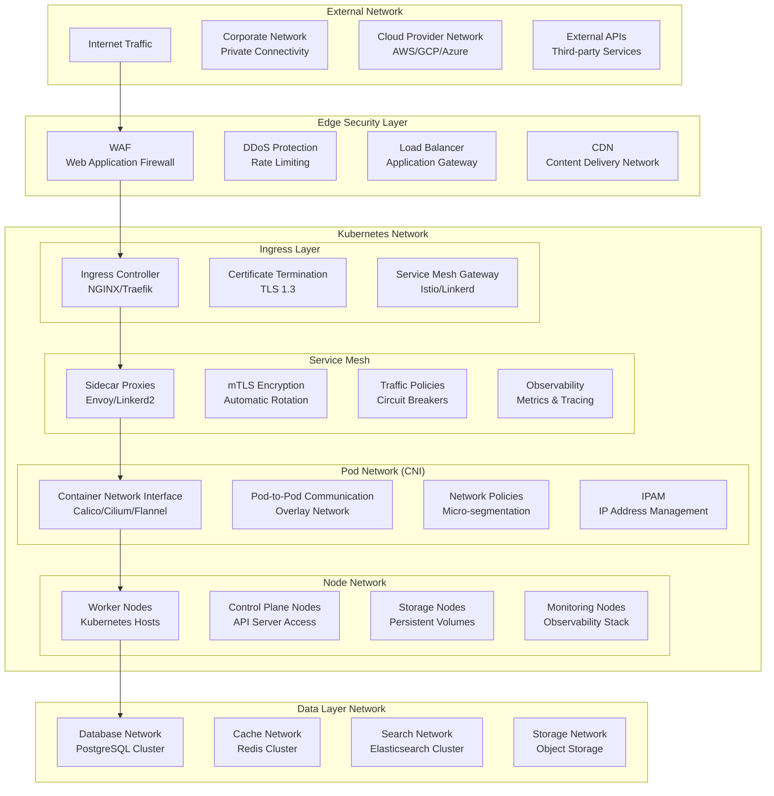

# Network Architecture

This document details the comprehensive network architecture for the Temporal.io enterprise deployment, covering network topology, traffic flows, security policies, and connectivity patterns within the Kubernetes environment.

## Network Architecture Overview

The network design implements a defense-in-depth strategy with multiple layers of network controls, micro-segmentation, and zero-trust networking principles to ensure secure and efficient communication between all system components.



## Network Topology

### Physical Network Layout

#### Multi-Zone Deployment

```yaml
network_topology:
  regions:
    primary:
      name: us-east-1
      zones:
        - us-east-1a
        - us-east-1b
        - us-east-1c
      vpc_cidr: 10.0.0.0/16
      
    secondary:
      name: us-west-2
      zones:
        - us-west-2a
        - us-west-2b
        - us-west-2c
      vpc_cidr: 10.1.0.0/16

  subnets:
    public:
      - cidr: 10.0.1.0/24    # us-east-1a public
      - cidr: 10.0.2.0/24    # us-east-1b public
      - cidr: 10.0.3.0/24    # us-east-1c public
      purpose: Load balancers, NAT gateways
      
    private:
      - cidr: 10.0.10.0/24   # us-east-1a private
      - cidr: 10.0.20.0/24   # us-east-1b private
      - cidr: 10.0.30.0/24   # us-east-1c private
      purpose: Kubernetes nodes, applications
      
    database:
      - cidr: 10.0.100.0/24  # us-east-1a database
      - cidr: 10.0.101.0/24  # us-east-1b database
      - cidr: 10.0.102.0/24  # us-east-1c database
      purpose: Database clusters, storage
```

#### Kubernetes Network Configuration

```yaml
kubernetes_network:
  cluster_cidr: 10.244.0.0/16
  service_cidr: 10.96.0.0/12
  pod_cidr: 10.244.0.0/16
  
  dns:
    cluster_dns: 10.96.0.10
    domain: cluster.local
    
  cni:
    plugin: calico
    mtu: 1500
    backend: vxlan
    
  node_port_range: 30000-32767
```

## Container Network Interface (CNI)

### Calico Configuration

#### Network Policy Engine

```yaml
# Calico Global Network Policy
apiVersion: projectcalico.org/v3
kind: GlobalNetworkPolicy
metadata:
  name: temporal-global-policy
spec:
  order: 100
  namespaceSelector: has(name) && name in {"temporal-backend", "temporal-product"}
  types:
  - Ingress
  - Egress
  egress:
  # Allow DNS
  - action: Allow
    protocol: UDP
    destination:
      selector: k8s-app == "kube-dns"
      ports:
      - 53
  # Allow access to Kubernetes API
  - action: Allow
    protocol: TCP
    destination:
      nets:
      - 10.96.0.1/32  # Kubernetes API service
      ports:
      - 443
  # Deny all other traffic by default
  - action: Deny

---
# Calico IP Pool Configuration
apiVersion: projectcalico.org/v3
kind: IPPool
metadata:
  name: temporal-pool
spec:
  cidr: 10.244.0.0/16
  ipipMode: Always
  natOutgoing: true
  nodeSelector: all()
```

#### Felix Configuration

```yaml
# Calico Felix Configuration
apiVersion: projectcalico.org/v3
kind: FelixConfiguration
metadata:
  name: default
spec:
  bpfLogLevel: "Off"
  floatingIPs: Disabled
  healthPort: 9099
  logSeverityScreen: Info
  prometheusMetricsEnabled: true
  prometheusMetricsPort: 9091
  reportingInterval: 30s
  wireguardEnabled: true
  wireguardInterfaceName: wireguard.cali
```

### Network Policies

#### Namespace-Level Policies

```yaml
# Default deny-all policy for temporal-backend
apiVersion: networking.k8s.io/v1
kind: NetworkPolicy
metadata:
  name: default-deny-all
  namespace: temporal-backend
spec:
  podSelector: {}
  policyTypes:
  - Ingress
  - Egress

---
# Allow temporal-backend internal communication
apiVersion: networking.k8s.io/v1
kind: NetworkPolicy
metadata:
  name: temporal-backend-internal
  namespace: temporal-backend
spec:
  podSelector:
    matchLabels:
      app.kubernetes.io/part-of: temporal
  policyTypes:
  - Ingress
  - Egress
  ingress:
  - from:
    - podSelector:
        matchLabels:
          app.kubernetes.io/part-of: temporal
    - namespaceSelector:
        matchLabels:
          name: temporal-product
    - namespaceSelector:
        matchLabels:
          name: monitoring
    ports:
    - protocol: TCP
      port: 7233  # Frontend service
    - protocol: TCP
      port: 7234  # History service
    - protocol: TCP
      port: 7235  # Matching service
    - protocol: TCP
      port: 7239  # Worker service
    - protocol: TCP
      port: 8080  # Web UI
    - protocol: TCP
      port: 9090  # Metrics
  egress:
  - to:
    - podSelector:
        matchLabels:
          app.kubernetes.io/part-of: temporal
  - to:
    - podSelector:
        matchLabels:
          app: postgresql
    ports:
    - protocol: TCP
      port: 5432
  - to:
    - podSelector:
        matchLabels:
          app: elasticsearch
    ports:
    - protocol: TCP
      port: 9200
  - to: []
    ports:
    - protocol: TCP
      port: 53
    - protocol: UDP
      port: 53

---
# Database access policy
apiVersion: networking.k8s.io/v1
kind: NetworkPolicy
metadata:
  name: database-access
  namespace: temporal-backend
spec:
  podSelector:
    matchLabels:
      app: postgresql
  policyTypes:
  - Ingress
  ingress:
  - from:
    - podSelector:
        matchLabels:
          app.kubernetes.io/part-of: temporal
    - namespaceSelector:
        matchLabels:
          name: monitoring
      podSelector:
        matchLabels:
          app: postgres-exporter
    ports:
    - protocol: TCP
      port: 5432

---
# Elasticsearch access policy
apiVersion: networking.k8s.io/v1
kind: NetworkPolicy
metadata:
  name: elasticsearch-access
  namespace: temporal-backend
spec:
  podSelector:
    matchLabels:
      app: elasticsearch
  policyTypes:
  - Ingress
  ingress:
  - from:
    - podSelector:
        matchLabels:
          app.kubernetes.io/part-of: temporal
    - namespaceSelector:
        matchLabels:
          name: monitoring
    ports:
    - protocol: TCP
      port: 9200
    - protocol: TCP
      port: 9300
```

#### Application-Level Policies

```yaml
# Temporal worker egress policy
apiVersion: networking.k8s.io/v1
kind: NetworkPolicy
metadata:
  name: temporal-worker-egress
  namespace: temporal-product
spec:
  podSelector:
    matchLabels:
      app: temporal-worker
  policyTypes:
  - Egress
  egress:
  # Allow connection to Temporal frontend
  - to:
    - namespaceSelector:
        matchLabels:
          name: temporal-backend
      podSelector:
        matchLabels:
          app: temporal-frontend
    ports:
    - protocol: TCP
      port: 7233
  # Allow DNS resolution
  - to: []
    ports:
    - protocol: TCP
      port: 53
    - protocol: UDP
      port: 53
  # Allow connection to external APIs (specific endpoints)
  - to: []
    ports:
    - protocol: TCP
      port: 443
    - protocol: TCP
      port: 80

---
# FastAPI service policies
apiVersion: networking.k8s.io/v1
kind: NetworkPolicy
metadata:
  name: fastapi-service-policy
  namespace: temporal-product
spec:
  podSelector:
    matchLabels:
      app: fastapi-service
  policyTypes:
  - Ingress
  - Egress
  ingress:
  # Allow ingress controller traffic
  - from:
    - namespaceSelector:
        matchLabels:
          name: ingress-nginx
    ports:
    - protocol: TCP
      port: 8000
  # Allow monitoring
  - from:
    - namespaceSelector:
        matchLabels:
          name: monitoring
    ports:
    - protocol: TCP
      port: 8080  # Metrics endpoint
  egress:
  # Allow connection to Temporal
  - to:
    - namespaceSelector:
        matchLabels:
          name: temporal-backend
    ports:
    - protocol: TCP
      port: 7233
  # Allow database access (if needed)
  - to:
    - namespaceSelector:
        matchLabels:
          name: temporal-backend
      podSelector:
        matchLabels:
          app: postgresql
    ports:
    - protocol: TCP
      port: 5432
  # Allow DNS
  - to: []
    ports:
    - protocol: TCP
      port: 53
    - protocol: UDP
      port: 53
```

## Service Mesh Architecture

### Istio Configuration

#### Mesh-wide Policies

```yaml
# Default mTLS policy
apiVersion: security.istio.io/v1beta1
kind: PeerAuthentication
metadata:
  name: default
  namespace: istio-system
spec:
  mtls:
    mode: STRICT

---
# Temporal namespace mTLS
apiVersion: security.istio.io/v1beta1
kind: PeerAuthentication
metadata:
  name: temporal-mtls
  namespace: temporal-backend
spec:
  mtls:
    mode: STRICT

---
# Destination rule for Temporal services
apiVersion: networking.istio.io/v1beta1
kind: DestinationRule
metadata:
  name: temporal-services
  namespace: temporal-backend
spec:
  host: "*.temporal-backend.svc.cluster.local"
  trafficPolicy:
    tls:
      mode: ISTIO_MUTUAL
    connectionPool:
      tcp:
        maxConnections: 100
      http:
        http1MaxPendingRequests: 50
        http2MaxRequests: 100
        maxRequestsPerConnection: 10
        maxRetries: 3
    circuitBreaker:
      consecutiveErrors: 3
      interval: 30s
      baseEjectionTime: 30s
      maxEjectionPercent: 50
```

#### Traffic Management

```yaml
# Virtual Service for Temporal Web UI
apiVersion: networking.istio.io/v1beta1
kind: VirtualService
metadata:
  name: temporal-web-ui
  namespace: temporal-backend
spec:
  hosts:
  - temporal-ui.example.com
  gateways:
  - temporal-gateway
  http:
  - match:
    - uri:
        prefix: /
    route:
    - destination:
        host: temporal-web.temporal-backend.svc.cluster.local
        port:
          number: 8080
    fault:
      delay:
        percentage:
          value: 0.1
        fixedDelay: 5s
    retries:
      attempts: 3
      perTryTimeout: 10s

---
# Gateway configuration
apiVersion: networking.istio.io/v1beta1
kind: Gateway
metadata:
  name: temporal-gateway
  namespace: temporal-backend
spec:
  selector:
    istio: ingressgateway
  servers:
  - port:
      number: 443
      name: https
      protocol: HTTPS
    tls:
      mode: SIMPLE
      credentialName: temporal-ui-tls
    hosts:
    - temporal-ui.example.com
  - port:
      number: 443
      name: grpc-tls
      protocol: HTTPS
    tls:
      mode: SIMPLE
      credentialName: temporal-api-tls
    hosts:
    - temporal-api.example.com
```

#### Security Policies

```yaml
# Authorization policy for Temporal frontend
apiVersion: security.istio.io/v1beta1
kind: AuthorizationPolicy
metadata:
  name: temporal-frontend-authz
  namespace: temporal-backend
spec:
  selector:
    matchLabels:
      app: temporal-frontend
  rules:
  - from:
    - source:
        namespaces: ["temporal-product"]
    - source:
        principals: ["cluster.local/ns/temporal-backend/sa/temporal-web"]
    to:
    - operation:
        methods: ["POST", "GET"]
        paths: ["/temporal.api.workflowservice.v1.*"]
  - from:
    - source:
        namespaces: ["monitoring"]
    to:
    - operation:
        methods: ["GET"]
        paths: ["/metrics", "/health"]

---
# JWT authentication for external access
apiVersion: security.istio.io/v1beta1
kind: RequestAuthentication
metadata:
  name: temporal-jwt
  namespace: temporal-backend
spec:
  selector:
    matchLabels:
      app: temporal-web
  jwtRules:
  - issuer: "https://authentik.example.com/application/o/temporal/"
    jwksUri: "https://authentik.example.com/application/o/temporal/.well-known/jwks.json"
    audiences:
    - "temporal-client"
```

## Load Balancing and Traffic Distribution

### Ingress Configuration

#### NGINX Ingress Controller

```yaml
# NGINX Ingress for Temporal Web UI
apiVersion: networking.k8s.io/v1
kind: Ingress
metadata:
  name: temporal-web-ingress
  namespace: temporal-backend
  annotations:
    nginx.ingress.kubernetes.io/ssl-redirect: "true"
    nginx.ingress.kubernetes.io/force-ssl-redirect: "true"
    nginx.ingress.kubernetes.io/backend-protocol: "HTTP"
    nginx.ingress.kubernetes.io/upstream-hash-by: "$remote_addr"
    nginx.ingress.kubernetes.io/rate-limit: "100"
    nginx.ingress.kubernetes.io/rate-limit-window: "1m"
    nginx.ingress.kubernetes.io/connection-proxy-header: "keep-alive"
    nginx.ingress.kubernetes.io/proxy-connect-timeout: "10"
    nginx.ingress.kubernetes.io/proxy-send-timeout: "60"
    nginx.ingress.kubernetes.io/proxy-read-timeout: "60"
    nginx.ingress.kubernetes.io/auth-url: "https://authentik.example.com/outpost.goauthentik.io/auth/nginx"
    nginx.ingress.kubernetes.io/auth-signin: "https://authentik.example.com/outpost.goauthentik.io/start?rd=$escaped_request_uri"
spec:
  ingressClassName: nginx
  tls:
  - hosts:
    - temporal-ui.example.com
    secretName: temporal-ui-tls
  rules:
  - host: temporal-ui.example.com
    http:
      paths:
      - path: /
        pathType: Prefix
        backend:
          service:
            name: temporal-web
            port:
              number: 8080

---
# NGINX Ingress for Temporal gRPC API
apiVersion: networking.k8s.io/v1
kind: Ingress
metadata:
  name: temporal-grpc-ingress
  namespace: temporal-backend
  annotations:
    nginx.ingress.kubernetes.io/ssl-redirect: "true"
    nginx.ingress.kubernetes.io/backend-protocol: "GRPC"
    nginx.ingress.kubernetes.io/grpc-backend: "true"
    nginx.ingress.kubernetes.io/upstream-hash-by: "$remote_addr"
    nginx.ingress.kubernetes.io/rate-limit: "1000"
    nginx.ingress.kubernetes.io/rate-limit-window: "1m"
spec:
  ingressClassName: nginx
  tls:
  - hosts:
    - temporal-api.example.com
    secretName: temporal-api-tls
  rules:
  - host: temporal-api.example.com
    http:
      paths:
      - path: /
        pathType: Prefix
        backend:
          service:
            name: temporal-frontend
            port:
              number: 7233
```

### Service Configuration

#### Temporal Services

```yaml
# Temporal Frontend Service
apiVersion: v1
kind: Service
metadata:
  name: temporal-frontend
  namespace: temporal-backend
  labels:
    app: temporal-frontend
  annotations:
    service.beta.kubernetes.io/aws-load-balancer-type: "nlb"
    service.beta.kubernetes.io/aws-load-balancer-backend-protocol: "tcp"
    service.beta.kubernetes.io/aws-load-balancer-connection-idle-timeout: "300"
spec:
  type: ClusterIP
  sessionAffinity: ClientIP
  sessionAffinityConfig:
    clientIP:
      timeoutSeconds: 300
  ports:
  - name: grpc
    port: 7233
    targetPort: 7233
    protocol: TCP
  - name: membership
    port: 6933
    targetPort: 6933
    protocol: TCP
  - name: http
    port: 7243
    targetPort: 7243
    protocol: TCP
  selector:
    app: temporal-frontend

---
# Temporal Web Service
apiVersion: v1
kind: Service
metadata:
  name: temporal-web
  namespace: temporal-backend
  labels:
    app: temporal-web
spec:
  type: ClusterIP
  ports:
  - name: http
    port: 8080
    targetPort: 8080
    protocol: TCP
  selector:
    app: temporal-web

---
# Temporal History Service (Headless for internal use)
apiVersion: v1
kind: Service
metadata:
  name: temporal-history
  namespace: temporal-backend
  labels:
    app: temporal-history
spec:
  type: ClusterIP
  clusterIP: None
  ports:
  - name: grpc
    port: 7234
    targetPort: 7234
    protocol: TCP
  - name: membership
    port: 6934
    targetPort: 6934
    protocol: TCP
  selector:
    app: temporal-history
```

## DNS and Service Discovery

### CoreDNS Configuration

```yaml
# CoreDNS ConfigMap
apiVersion: v1
kind: ConfigMap
metadata:
  name: coredns
  namespace: kube-system
data:
  Corefile: |
    .:53 {
        errors
        health {
            lameduck 5s
        }
        ready
        kubernetes cluster.local in-addr.arpa ip6.arpa {
            pods insecure
            fallthrough in-addr.arpa ip6.arpa
            ttl 30
        }
        prometheus :9153
        forward . /etc/resolv.conf {
            max_concurrent 1000
        }
        cache 30
        loop
        reload
        loadbalance
    }
    
    # Custom zone for temporal services
    temporal.local:53 {
        errors
        cache 30
        kubernetes cluster.local in-addr.arpa ip6.arpa {
            pods insecure
            fallthrough in-addr.arpa ip6.arpa
            ttl 30
        }
        rewrite name temporal-frontend.temporal.local temporal-frontend.temporal-backend.svc.cluster.local
        rewrite name temporal-web.temporal.local temporal-web.temporal-backend.svc.cluster.local
    }
```

### Service Discovery Patterns

```yaml
# Temporal Client Service Discovery
temporal_endpoints:
  frontend:
    fqdn: temporal-frontend.temporal-backend.svc.cluster.local
    port: 7233
    protocol: grpc
    health_check: /temporal.api.workflowservice.v1.WorkflowService/GetSystemInfo
    
  web_ui:
    fqdn: temporal-web.temporal-backend.svc.cluster.local
    port: 8080
    protocol: http
    health_check: /health
    
  history:
    fqdn: temporal-history.temporal-backend.svc.cluster.local
    port: 7234
    protocol: grpc
    discovery_type: headless
    
  matching:
    fqdn: temporal-matching.temporal-backend.svc.cluster.local
    port: 7235
    protocol: grpc
    discovery_type: headless
```

## Network Monitoring and Observability

### Traffic Flow Monitoring

```yaml
# Network monitoring configuration
network_monitoring:
  flow_logs:
    enabled: true
    destinations:
      - cloudwatch_logs
      - elasticsearch
    retention: 7_days
    
  packet_capture:
    enabled: false  # Enable only for debugging
    tools:
      - tcpdump
      - wireshark
      - istio_proxy_debug
    
  metrics:
    - connection_count
    - bandwidth_utilization
    - packet_loss
    - latency_percentiles
    - error_rates
    
  alerts:
    - name: high_connection_count
      threshold: 10000
      duration: 5m
    - name: packet_loss
      threshold: 1%
      duration: 2m
    - name: high_latency
      threshold: 100ms
      duration: 5m
```

### Network Performance Metrics

```yaml
# Prometheus metrics for network monitoring
apiVersion: v1
kind: ConfigMap
metadata:
  name: network-monitoring-rules
  namespace: monitoring
data:
  network.yml: |
    groups:
    - name: network.rules
      rules:
      - alert: HighNetworkLatency
        expr: histogram_quantile(0.99, rate(istio_request_duration_milliseconds_bucket[5m])) > 100
        for: 5m
        labels:
          severity: warning
        annotations:
          summary: "High network latency detected"
          description: "99th percentile latency is {{ $value }}ms"
          
      - alert: NetworkPacketLoss
        expr: rate(node_network_receive_drop_total[5m]) > 0.01
        for: 2m
        labels:
          severity: critical
        annotations:
          summary: "Network packet loss detected"
          description: "Packet loss rate: {{ $value }}"
          
      - alert: ConnectionPoolExhaustion
        expr: envoy_cluster_upstream_cx_active / envoy_cluster_upstream_cx_max > 0.9
        for: 1m
        labels:
          severity: warning
        annotations:
          summary: "Connection pool nearly exhausted"
          description: "Active connections: {{ $value }}"
```

## Network Security Controls

### Firewall Rules

```yaml
# AWS Security Group rules (example)
security_groups:
  temporal_backend:
    description: "Temporal backend security group"
    ingress_rules:
      - protocol: tcp
        from_port: 7233
        to_port: 7233
        source_security_group: temporal_workers
        description: "Temporal gRPC API"
      - protocol: tcp
        from_port: 8080
        to_port: 8080
        source_security_group: load_balancer
        description: "Web UI"
      - protocol: tcp
        from_port: 9090
        to_port: 9090
        source_security_group: monitoring
        description: "Metrics endpoint"
    egress_rules:
      - protocol: tcp
        from_port: 5432
        to_port: 5432
        destination_security_group: database
        description: "PostgreSQL access"
      - protocol: tcp
        from_port: 9200
        to_port: 9200
        destination_security_group: elasticsearch
        description: "Elasticsearch access"
        
  temporal_workers:
    description: "Temporal workers security group"
    ingress_rules:
      - protocol: tcp
        from_port: 8080
        to_port: 8080
        source_security_group: monitoring
        description: "Metrics endpoint"
    egress_rules:
      - protocol: tcp
        from_port: 7233
        to_port: 7233
        destination_security_group: temporal_backend
        description: "Temporal frontend access"
      - protocol: tcp
        from_port: 443
        to_port: 443
        destination: 0.0.0.0/0
        description: "HTTPS outbound"
```

### Network Intrusion Detection

```yaml
# Falco network rules
network_security_rules:
  - rule: Unauthorized Network Connection
    desc: Detect unauthorized network connections from Temporal containers
    condition: >
      inbound_outbound and
      container and
      container.image.repository contains "temporal" and
      (fd.rip != "" and not fd.rip in (allowed_ips))
    output: >
      Unauthorized network connection from Temporal container
      (user=%user.name command=%proc.cmdline connection=%fd.name container=%container.name)
    priority: WARNING
    
  - rule: Suspicious Port Activity
    desc: Detect connections to unusual ports
    condition: >
      inbound_outbound and
      container and
      container.image.repository contains "temporal" and
      fd.rport != "" and
      not fd.rport in (7233, 7234, 7235, 7239, 8080, 5432, 9200, 53, 443, 80)
    output: >
      Suspicious port activity from Temporal container
      (user=%user.name port=%fd.rport container=%container.name)
    priority: WARNING
```

## Disaster Recovery Network Configuration

### Multi-Region Connectivity

```yaml
# Cross-region network configuration
multi_region_setup:
  primary_region:
    name: us-east-1
    vpc_cidr: 10.0.0.0/16
    cluster_cidr: 10.244.0.0/16
    
  secondary_region:
    name: us-west-2
    vpc_cidr: 10.1.0.0/16
    cluster_cidr: 10.245.0.0/16
    
  vpc_peering:
    enabled: true
    routes:
      - destination: 10.1.0.0/16
        target: pcx-12345678
        
  transit_gateway:
    enabled: true
    asn: 64512
    routes:
      - cidr: 10.0.0.0/8
        attachment: primary_cluster
        
  vpn_connections:
    site_to_site:
      enabled: true
      bgp_asn: 65000
      tunnels: 2
      encryption: aes-256
```

### Network Failover

```yaml
# DNS failover configuration
dns_failover:
  health_checks:
    - name: temporal-frontend-primary
      fqdn: temporal-api.example.com
      port: 443
      protocol: https
      path: /health
      interval: 30s
      
  failover_policies:
    - name: temporal-api-failover
      primary:
        region: us-east-1
        weight: 100
      secondary:
        region: us-west-2
        weight: 0
      health_check: temporal-frontend-primary
      failover_threshold: 2
```

This comprehensive network architecture ensures secure, scalable, and resilient connectivity for the Temporal.io enterprise deployment while maintaining performance and observability across all network layers.
