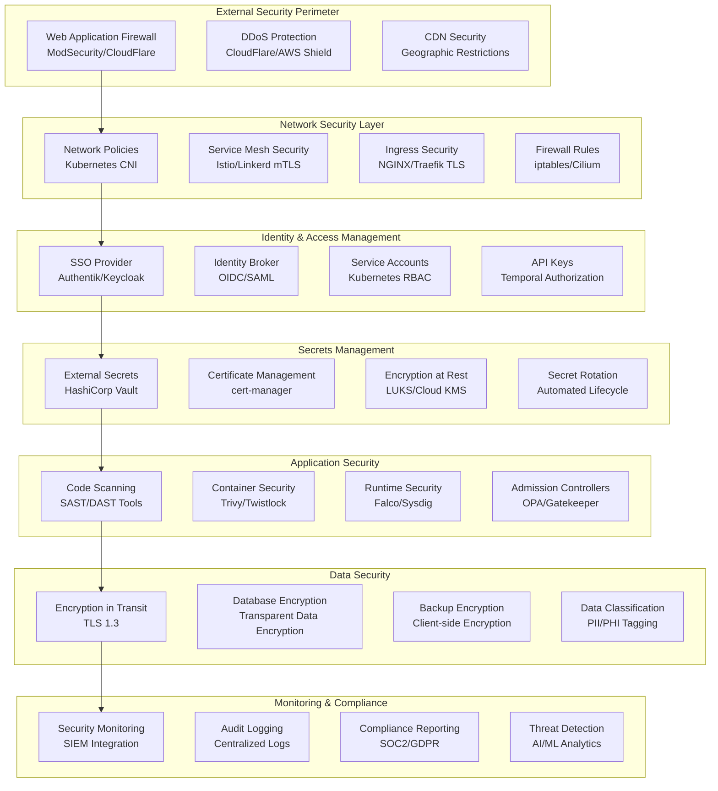
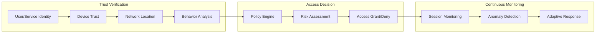

# Security Design

This document outlines the comprehensive security architecture for the Temporal.io enterprise deployment, implementing defense-in-depth strategies and zero-trust principles across all system components.

## Security Architecture Overview

The security design follows a layered approach with multiple security controls at different levels of the stack, ensuring comprehensive protection against various threat vectors.



## Zero Trust Architecture

### Core Principles

1. **Never Trust, Always Verify**
   - Every request requires authentication and authorization
   - Identity verification for both users and services
   - Continuous validation of security posture

2. **Principle of Least Privilege**
   - Minimal access rights by default
   - Just-in-time access provisioning
   - Regular access reviews and rotation

3. **Assume Breach**
   - Micro-segmentation to limit blast radius
   - Continuous monitoring and detection
   - Rapid incident response capabilities

4. **Explicit Verification**
   - Multi-factor authentication
   - Device trust verification
   - Location and behavior analysis

### Implementation Strategy



## Identity and Access Management (IAM)

### Authentication Architecture

#### Single Sign-On (SSO) with Authentik

```yaml
# Authentik Configuration
authentik_config:
  providers:
    temporal_oidc:
      type: oauth2_openid
      name: "Temporal Enterprise"
      client_id: temporal-client
      client_secret: !vault:secret/temporal/oidc#client_secret
      redirect_uris:
        - https://temporal-ui.example.com/auth/callback
        - https://temporal-api.example.com/auth/callback
      scopes:
        - openid
        - profile
        - email
        - groups
      
  applications:
    temporal_web:
      name: "Temporal Web UI"
      slug: temporal-web
      provider: temporal_oidc
      policy_engine_mode: any
      
    temporal_api:
      name: "Temporal API"
      slug: temporal-api
      provider: temporal_oidc
      policy_engine_mode: all

  policies:
    temporal_access:
      name: "Temporal Access Policy"
      policy_type: expression
      expression: |
        return request.user.is_in_group(name="temporal-users") and
               request.user.attributes.get("department") in ["engineering", "devops"]
```

#### Multi-Factor Authentication (MFA)

```yaml
mfa_configuration:
  required_for:
    - administrative_access
    - production_environments
    - privileged_operations
    
  methods:
    - totp: "Time-based One-Time Password"
    - webauthn: "Hardware Security Keys"
    - sms: "SMS-based (fallback only)"
    
  policies:
    admin_users:
      require_methods: ["totp", "webauthn"]
      session_timeout: 8_hours
      
    regular_users:
      require_methods: ["totp"]
      session_timeout: 24_hours
```

### Authorization Framework

#### Role-Based Access Control (RBAC)

```yaml
# Temporal Authorization Roles
temporal_roles:
  temporal_admin:
    description: "Full administrative access"
    permissions:
      - temporal:admin:*
      - temporal:system:*
      - temporal:namespace:*
    
  temporal_developer:
    description: "Development and testing access"
    permissions:
      - temporal:workflow:read
      - temporal:workflow:write
      - temporal:activity:execute
      - temporal:namespace:default:*
    
  temporal_operator:
    description: "Operational monitoring access"
    permissions:
      - temporal:workflow:read
      - temporal:system:health
      - temporal:metrics:read
    
  temporal_viewer:
    description: "Read-only access"
    permissions:
      - temporal:workflow:read
      - temporal:activity:read
      - temporal:metrics:read
```

#### Kubernetes RBAC Integration

```yaml
# Kubernetes Role Definitions
apiVersion: rbac.authorization.k8s.io/v1
kind: Role
metadata:
  namespace: temporal-backend
  name: temporal-operator
rules:
- apiGroups: [""]
  resources: ["pods", "services", "endpoints", "configmaps"]
  verbs: ["get", "list", "watch"]
- apiGroups: ["apps"]
  resources: ["deployments", "replicasets"]
  verbs: ["get", "list", "watch"]
- apiGroups: ["extensions", "networking.k8s.io"]
  resources: ["ingresses"]
  verbs: ["get", "list", "watch"]

---
apiVersion: rbac.authorization.k8s.io/v1
kind: RoleBinding
metadata:
  name: temporal-operators
  namespace: temporal-backend
subjects:
- kind: User
  name: temporal-operator@example.com
  apiGroup: rbac.authorization.k8s.io
roleRef:
  kind: Role
  name: temporal-operator
  apiGroup: rbac.authorization.k8s.io
```

## Secrets Management

### HashiCorp Vault Integration

#### Vault Configuration

```hcl
# Vault Secrets Engine Configuration
path "secret/" {
  type = "kv-v2"
  description = "Temporal secrets storage"
}

# Database dynamic secrets
path "database/" {
  type = "database"
  description = "Database credentials"
}

# PKI for certificate management
path "pki/" {
  type = "pki"
  description = "Certificate authority"
  max_lease_ttl = "8760h"
}

# Kubernetes authentication
auth "kubernetes/" {
  type = "kubernetes"
  description = "Kubernetes cluster authentication"
}
```

#### Secret Policies

```hcl
# Temporal backend secrets policy
path "secret/data/temporal/backend/*" {
  capabilities = ["read", "list"]
}

path "secret/data/temporal/database/*" {
  capabilities = ["read"]
}

path "database/creds/temporal-role" {
  capabilities = ["read"]
}

# Certificate issuance
path "pki/issue/temporal-server" {
  capabilities = ["create", "update"]
}
```

### External Secrets Operator

```yaml
# External Secret Configuration
apiVersion: external-secrets.io/v1beta1
kind: ExternalSecret
metadata:
  name: temporal-database-credentials
  namespace: temporal-backend
spec:
  refreshInterval: 1h
  secretStoreRef:
    name: vault-backend
    kind: SecretStore
  target:
    name: temporal-db-secret
    creationPolicy: Owner
    template:
      type: Opaque
      data:
        username: "{{ .username }}"
        password: "{{ .password }}"
        connection-string: "postgresql://{{ .username }}:{{ .password }}@postgresql:5432/temporal"
  data:
    - secretKey: username
      remoteRef:
        key: database/creds/temporal-role
        property: username
    - secretKey: password
      remoteRef:
        key: database/creds/temporal-role
        property: password
```

### Secret Rotation Strategy

```yaml
rotation_policies:
  database_credentials:
    frequency: 24_hours
    method: vault_dynamic_secrets
    notification: true
    
  api_keys:
    frequency: 30_days
    method: manual_rotation
    notification: true
    
  certificates:
    frequency: 90_days
    method: cert_manager_auto
    notification: false
    
  encryption_keys:
    frequency: 365_days
    method: manual_rotation
    notification: true
```

## Network Security

### Network Policies

#### Namespace Isolation

```yaml
# Deny all traffic by default
apiVersion: networking.k8s.io/v1
kind: NetworkPolicy
metadata:
  name: default-deny-all
  namespace: temporal-backend
spec:
  podSelector: {}
  policyTypes:
  - Ingress
  - Egress

---
# Allow temporal-backend internal communication
apiVersion: networking.k8s.io/v1
kind: NetworkPolicy
metadata:
  name: temporal-backend-internal
  namespace: temporal-backend
spec:
  podSelector:
    matchLabels:
      app.kubernetes.io/part-of: temporal
  policyTypes:
  - Ingress
  - Egress
  ingress:
  - from:
    - namespaceSelector:
        matchLabels:
          name: temporal-product
    - namespaceSelector:
        matchLabels:
          name: monitoring
    - podSelector:
        matchLabels:
          app.kubernetes.io/part-of: temporal
  egress:
  - to:
    - podSelector:
        matchLabels:
          app.kubernetes.io/part-of: temporal
  - to:
    - namespaceSelector:
        matchLabels:
          name: kube-system
    ports:
    - protocol: TCP
      port: 53
    - protocol: UDP
      port: 53

---
# Allow temporal-product to temporal-backend
apiVersion: networking.k8s.io/v1
kind: NetworkPolicy
metadata:
  name: temporal-product-egress
  namespace: temporal-product
spec:
  podSelector: {}
  policyTypes:
  - Egress
  egress:
  - to:
    - namespaceSelector:
        matchLabels:
          name: temporal-backend
    ports:
    - protocol: TCP
      port: 7233  # Temporal frontend
  - to: []
    ports:
    - protocol: TCP
      port: 53
    - protocol: UDP
      port: 53
```

### Service Mesh Security (Istio)

#### mTLS Configuration

```yaml
# Default mTLS policy
apiVersion: security.istio.io/v1beta1
kind: PeerAuthentication
metadata:
  name: default
  namespace: temporal-backend
spec:
  mtls:
    mode: STRICT

---
# Authorization policies
apiVersion: security.istio.io/v1beta1
kind: AuthorizationPolicy
metadata:
  name: temporal-frontend-access
  namespace: temporal-backend
spec:
  selector:
    matchLabels:
      app: temporal-frontend
  rules:
  - from:
    - source:
        namespaces: ["temporal-product"]
    - source:
        principals: ["cluster.local/ns/temporal-backend/sa/temporal-web"]
    to:
    - operation:
        methods: ["POST", "GET"]
        paths: ["/temporal.api.workflowservice.v1.*"]
```

## Encryption

### Encryption in Transit

#### TLS Configuration

```yaml
# Temporal Server TLS Configuration
server:
  config:
    tls:
      frontend:
        server:
          certFile: /etc/temporal/certs/tls.crt
          keyFile: /etc/temporal/certs/tls.key
          requireClientAuth: true
          clientCaFiles:
            - /etc/temporal/certs/ca.crt
          enableHostVerification: true
          serverName: temporal-frontend.temporal-backend.svc.cluster.local
        client:
          serverName: temporal-frontend
          rootCaFiles:
            - /etc/temporal/certs/ca.crt
          certFile: /etc/temporal/certs/client.crt
          keyFile: /etc/temporal/certs/client.key
      
      internode:
        server:
          certFile: /etc/temporal/certs/internode.crt
          keyFile: /etc/temporal/certs/internode.key
          requireClientAuth: true
          clientCaFiles:
            - /etc/temporal/certs/ca.crt
        client:
          serverName: temporal-internode
          rootCaFiles:
            - /etc/temporal/certs/ca.crt
```

#### Certificate Management

```yaml
# Certificate Issuer
apiVersion: cert-manager.io/v1
kind: ClusterIssuer
metadata:
  name: temporal-ca-issuer
spec:
  ca:
    secretName: temporal-ca-secret

---
# Server Certificate
apiVersion: cert-manager.io/v1
kind: Certificate
metadata:
  name: temporal-server-cert
  namespace: temporal-backend
spec:
  secretName: temporal-server-tls
  issuerRef:
    name: temporal-ca-issuer
    kind: ClusterIssuer
  commonName: temporal-frontend.temporal-backend.svc.cluster.local
  dnsNames:
    - temporal-frontend
    - temporal-frontend.temporal-backend
    - temporal-frontend.temporal-backend.svc
    - temporal-frontend.temporal-backend.svc.cluster.local
    - temporal.example.com
  duration: 2160h # 90 days
  renewBefore: 720h # 30 days
```

### Encryption at Rest

#### Database Encryption

```yaml
# PostgreSQL Encryption Configuration
postgresql:
  auth:
    enablePostgresUser: true
    database: temporal
    
  primary:
    initdb:
      args: "--auth-host=md5 --auth-local=md5"
    configuration: |
      ssl = on
      ssl_cert_file = '/etc/ssl/certs/server.crt'
      ssl_key_file = '/etc/ssl/private/server.key'
      ssl_ca_file = '/etc/ssl/certs/ca.crt'
      ssl_crl_file = ''
      ssl_ciphers = 'HIGH:!aNULL:!MD5'
      ssl_prefer_server_ciphers = on
      wal_level = replica
      archive_mode = on
      archive_command = 'pgbackrest --stanza=main archive-push %p'
      
  tls:
    enabled: true
    certificatesSecret: postgresql-tls
    certFilename: tls.crt
    certKeyFilename: tls.key
    certCAFilename: ca.crt
```

#### Kubernetes Secrets Encryption

```yaml
# EncryptionConfiguration for etcd
apiVersion: apiserver.config.k8s.io/v1
kind: EncryptionConfiguration
resources:
- resources:
  - secrets
  providers:
  - aescbc:
      keys:
      - name: key1
        secret: !vault:secret/kubernetes/encryption#key
  - identity: {}
```

## Container and Runtime Security

### Container Image Security

#### Image Scanning Pipeline

```yaml
# GitLab CI Security Scanning
security_scan:
  stage: security
  image: aquasec/trivy:latest
  script:
    - trivy image --exit-code 1 --severity HIGH,CRITICAL $CI_REGISTRY_IMAGE:$CI_COMMIT_SHA
    - trivy fs --exit-code 1 --severity HIGH,CRITICAL .
  artifacts:
    reports:
      container_scanning: gl-container-scanning-report.json
  only:
    - main
    - develop
```

#### Admission Controllers

```yaml
# OPA Gatekeeper Constraint
apiVersion: templates.gatekeeper.sh/v1beta1
kind: ConstraintTemplate
metadata:
  name: requiredlabels
spec:
  crd:
    spec:
      names:
        kind: RequiredLabels
      validation:
        type: object
        properties:
          labels:
            type: array
            items:
              type: string
  targets:
    - target: admission.k8s.gatekeeper.sh
      rego: |
        package requiredlabels
        
        violation[{"msg": msg}] {
          provided := input.review.object.metadata.labels
          required := input.parameters.labels
          missing := required[_]
          not provided[missing]
          msg := sprintf("Missing required label: %v", [missing])
        }

---
apiVersion: constraints.gatekeeper.sh/v1beta1
kind: RequiredLabels
metadata:
  name: temporal-must-have-labels
spec:
  match:
    kinds:
      - apiGroups: ["apps"]
        kinds: ["Deployment"]
    namespaces: ["temporal-backend", "temporal-product"]
  parameters:
    labels: ["app.kubernetes.io/name", "app.kubernetes.io/version", "security.level"]
```

### Runtime Security

#### Falco Rules

```yaml
# Falco Security Rules
- rule: Temporal Container Privilege Escalation
  desc: Detect privilege escalation in Temporal containers
  condition: >
    spawned_process and
    container and
    container.image.repository contains "temporal" and
    (proc.name in (sudo, su, setuid_binary))
  output: >
    Privilege escalation detected in Temporal container
    (user=%user.name command=%proc.cmdline container=%container.name image=%container.image.repository)
  priority: WARNING
  tags: [temporal, privilege_escalation]

- rule: Temporal Sensitive File Access
  desc: Detect access to sensitive files in Temporal containers
  condition: >
    open_read and
    container and
    container.image.repository contains "temporal" and
    (fd.filename startswith /etc/passwd or
     fd.filename startswith /etc/shadow or
     fd.filename startswith /etc/ssh/ or
     fd.filename startswith /root/.ssh/)
  output: >
    Sensitive file accessed in Temporal container
    (user=%user.name file=%fd.name container=%container.name image=%container.image.repository)
  priority: WARNING
  tags: [temporal, file_access]
```

## Compliance and Audit

### Audit Logging

#### Kubernetes Audit Policy

```yaml
# Audit Policy Configuration
apiVersion: audit.k8s.io/v1
kind: Policy
rules:
- level: Metadata
  namespaces: ["temporal-backend", "temporal-product"]
  resources:
  - group: ""
    resources: ["secrets", "configmaps"]
  - group: "apps"
    resources: ["deployments", "statefulsets"]

- level: Request
  users: ["admin@example.com"]
  verbs: ["create", "update", "patch", "delete"]

- level: RequestResponse
  namespaces: ["temporal-backend"]
  resources:
  - group: ""
    resources: ["pods/exec", "pods/portforward"]
```

#### Temporal Audit Configuration

```yaml
# Temporal Server Audit Configuration
server:
  config:
    auditLogger:
      enabled: true
      logLevel: "info"
      outputFormat: "json"
      includeRequest: true
      includeResponse: false
      filters:
        - resource: "workflow"
          actions: ["start", "terminate", "cancel"]
        - resource: "activity"
          actions: ["complete", "fail"]
        - resource: "namespace"
          actions: ["create", "update", "delete"]
```

### Compliance Frameworks

#### SOC 2 Type II Controls

```yaml
soc2_controls:
  cc1_control_environment:
    - identity_management: "Authentik SSO implementation"
    - access_reviews: "Quarterly access reviews"
    - segregation_of_duties: "Role-based access control"
    
  cc2_communication:
    - security_policies: "Documented security procedures"
    - incident_response: "24/7 security monitoring"
    - change_management: "GitOps deployment pipeline"
    
  cc3_risk_assessment:
    - vulnerability_scanning: "Automated container scanning"
    - penetration_testing: "Annual third-party testing"
    - threat_modeling: "Regular architecture reviews"
    
  cc4_monitoring:
    - siem_integration: "Centralized log analysis"
    - anomaly_detection: "AI-powered threat detection"
    - continuous_monitoring: "Real-time alerting"
    
  cc5_control_activities:
    - encryption: "TLS 1.3 and AES-256 encryption"
    - backup_procedures: "Automated backup and recovery"
    - disaster_recovery: "Multi-region deployment"
```

#### GDPR Compliance

```yaml
gdpr_compliance:
  data_protection:
    - encryption_at_rest: "AES-256 encryption"
    - encryption_in_transit: "TLS 1.3"
    - data_classification: "PII/PHI tagging system"
    
  privacy_by_design:
    - data_minimization: "Workflow data retention policies"
    - purpose_limitation: "Explicit consent tracking"
    - storage_limitation: "Automated data purging"
    
  individual_rights:
    - right_to_access: "Data export APIs"
    - right_to_rectification: "Data correction workflows"
    - right_to_erasure: "Data deletion capabilities"
    - right_to_portability: "Standardized data formats"
```

## Security Monitoring and Incident Response

### Security Information and Event Management (SIEM)

#### Log Aggregation

```yaml
# Fluentd Configuration for Security Logs
apiVersion: v1
kind: ConfigMap
metadata:
  name: fluentd-security-config
data:
  fluent.conf: |
    <source>
      @type tail
      path /var/log/audit/audit.log
      pos_file /var/log/fluentd-audit.log.pos
      tag security.audit
      format json
    </source>
    
    <source>
      @type tail
      path /var/log/containers/*temporal*.log
      pos_file /var/log/fluentd-temporal.log.pos
      tag security.temporal
      format json
    </source>
    
    <filter security.**>
      @type record_transformer
      <record>
        cluster_name "#{ENV['CLUSTER_NAME']}"
        environment "#{ENV['ENVIRONMENT']}"
        timestamp ${time}
      </record>
    </filter>
    
    <match security.**>
      @type elasticsearch
      host elasticsearch.monitoring.svc.cluster.local
      port 9200
      index_name security-logs-${+YYYY.MM.dd}
      type_name _doc
    </match>
```

### Threat Detection

#### Anomaly Detection Rules

```yaml
detection_rules:
  failed_authentication:
    query: |
      SELECT COUNT(*) as failed_attempts
      FROM auth_logs 
      WHERE status = 'failed' 
      AND timestamp > NOW() - INTERVAL 5 MINUTE
      GROUP BY source_ip
      HAVING failed_attempts > 10
    
  privilege_escalation:
    query: |
      SELECT *
      FROM audit_logs
      WHERE action IN ('sudo', 'su', 'setuid')
      AND container_name LIKE '%temporal%'
      AND timestamp > NOW() - INTERVAL 1 HOUR
    
  data_exfiltration:
    query: |
      SELECT *
      FROM network_logs
      WHERE bytes_out > 100MB
      AND destination NOT IN (known_endpoints)
      AND source_namespace IN ('temporal-backend', 'temporal-product')
```

### Incident Response

#### Automated Response Actions

```yaml
# Falco Response Configuration
response_actions:
  high_priority:
    - alert: "Send to security team"
    - isolate: "Block suspicious IP addresses"
    - scale_down: "Reduce affected service replicas"
    
  medium_priority:
    - alert: "Log to SIEM"
    - monitor: "Increase logging verbosity"
    
  low_priority:
    - log: "Record for analysis"
```

#### Incident Response Playbook

```yaml
incident_response:
  security_breach:
    steps:
      1. "Isolate affected systems"
      2. "Preserve evidence"
      3. "Assess impact"
      4. "Notify stakeholders"
      5. "Implement containment"
      6. "Eradicate threat"
      7. "Recover systems"
      8. "Lessons learned"
    
  data_loss:
    steps:
      1. "Stop data processing"
      2. "Identify affected data"
      3. "Assess legal requirements"
      4. "Notify authorities"
      5. "Restore from backup"
      6. "Validate data integrity"
    
  service_disruption:
    steps:
      1. "Activate incident response team"
      2. "Implement business continuity"
      3. "Communicate with users"
      4. "Investigate root cause"
      5. "Implement fixes"
      6. "Post-incident review"
```

This comprehensive security design ensures that the Temporal.io enterprise deployment meets the highest security standards while maintaining operational efficiency and compliance requirements.
