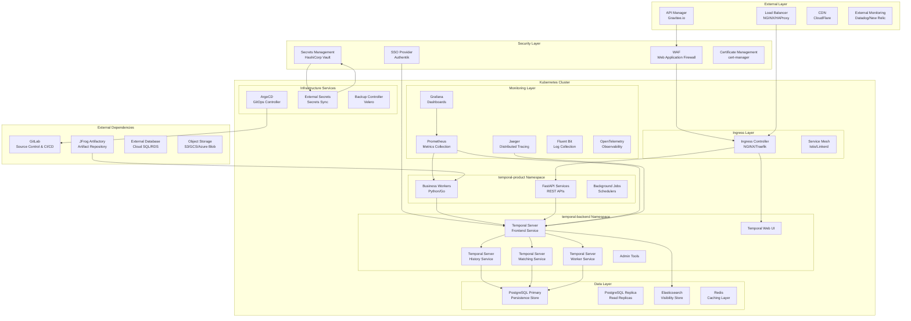
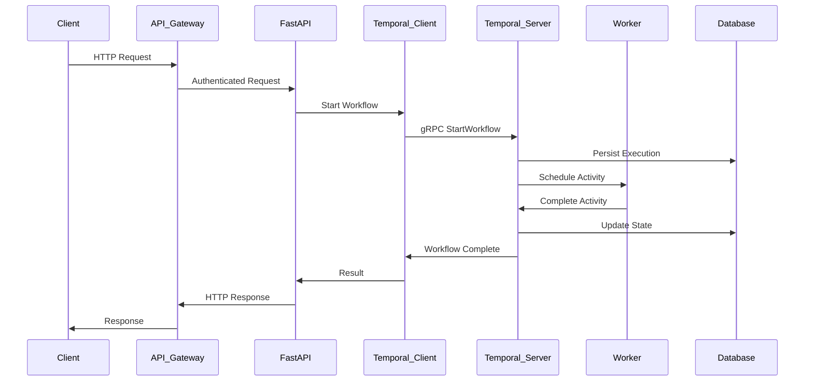

# System Architecture

This document provides a comprehensive overview of the Temporal.io enterprise deployment system architecture, designed for production Kubernetes environments with enterprise-grade requirements.

## Overview

The Temporal.io deployment follows a microservices architecture pattern with clear separation of concerns, high availability, and scalability built-in from the ground up. The system is designed to handle enterprise workloads while maintaining security, observability, and operational excellence.

## High-Level Architecture



## Architecture Principles

### 1. **Separation of Concerns**
- **Control Plane**: Temporal server components (frontend, history, matching, worker)
- **Data Plane**: Business applications and workers
- **Infrastructure Plane**: Monitoring, security, and operational tools

### 2. **High Availability**
- Multi-node Kubernetes cluster with zone distribution
- Database replication and failover capabilities
- Load balancing across all service instances
- Circuit breakers and retry mechanisms

### 3. **Scalability**
- Horizontal scaling for all Temporal components
- Auto-scaling based on metrics (CPU, memory, custom metrics)
- Partitioned databases with sharding support
- Queue-based task distribution

### 4. **Security by Design**
- Zero-trust network architecture
- End-to-end encryption (TLS 1.3)
- Identity and access management integration
- Secrets management with rotation
- Network segmentation with policies

### 5. **Observability**
- Comprehensive metrics collection
- Distributed tracing
- Structured logging
- Real-time monitoring and alerting

## Component Architecture

### Temporal Server Components

#### Frontend Service
```yaml
Component: temporal-frontend
Purpose: gRPC API endpoint for client connections
Responsibilities:
  - Client request handling
  - Authentication and authorization
  - Request routing and load balancing
  - Rate limiting and throttling
Scaling: Horizontal (3+ instances)
Dependencies: Database, Elasticsearch
```

#### History Service
```yaml
Component: temporal-history
Purpose: Workflow execution state management
Responsibilities:
  - Workflow state persistence
  - Event history management
  - Decision task processing
  - Timer management
Scaling: Horizontal with sharding (512 shards)
Dependencies: Database (primary dependency)
```

#### Matching Service
```yaml
Component: temporal-matching
Purpose: Task queue management and distribution
Responsibilities:
  - Task queue operations
  - Task routing to workers
  - Load balancing across workers
  - Sticky worker assignments
Scaling: Horizontal (2+ instances)
Dependencies: Database
```

#### Worker Service
```yaml
Component: temporal-worker
Purpose: Internal system operations
Responsibilities:
  - System workflow execution
  - Archival operations
  - Replication tasks
  - System maintenance
Scaling: Horizontal (1+ instances)
Dependencies: Database, Object Storage
```

### Business Application Layer

#### Temporal Workers
```yaml
Component: business-workers
Technology: Python/Go applications
Purpose: Execute business workflows and activities
Characteristics:
  - Stateless execution
  - Auto-scaling based on queue depth
  - Circuit breaker patterns
  - Health monitoring
Deployment: Kubernetes Deployment with HPA
```

#### API Services
```yaml
Component: fastapi-services
Technology: Python FastAPI
Purpose: REST API endpoints for business operations
Characteristics:
  - Async/await patterns
  - Database connection pooling
  - Caching layer integration
  - Rate limiting
Deployment: Kubernetes Deployment with Ingress
```

## Data Architecture

### Primary Database (PostgreSQL)

#### Temporal Default Store
```sql
-- Core Temporal tables
Tables:
  - executions: Workflow execution state
  - history_tree: Workflow history events
  - tasks: Task queue items
  - timers: Scheduled operations
  - activity_info: Activity execution state
  - child_execution_info: Child workflow tracking
```

#### Temporal Visibility Store
```sql
-- Search and filtering capabilities
Tables:
  - executions_visibility: Searchable execution data
  - workflow_search_attributes: Custom search fields
Indexes:
  - Execution time ranges
  - Workflow types
  - Custom search attributes
```

### Search Layer (Elasticsearch)

#### Advanced Visibility
```json
{
  "temporal_visibility_v1_prod": {
    "mappings": {
      "properties": {
        "WorkflowId": {"type": "keyword"},
        "WorkflowType": {"type": "keyword"},
        "StartTime": {"type": "date"},
        "CloseTime": {"type": "date"},
        "ExecutionStatus": {"type": "keyword"},
        "CustomSearchAttributes": {"type": "object"}
      }
    }
  }
}
```

## Network Architecture

### Namespace Segmentation

```yaml
Namespaces:
  temporal-backend:
    purpose: Temporal server components and infrastructure
    network_policy: restricted_ingress_egress
    resources: high_priority
    
  temporal-product:
    purpose: Business applications and workers
    network_policy: restricted_egress_to_backend
    resources: auto_scaling
    
  monitoring:
    purpose: Observability stack
    network_policy: metrics_collection_only
    resources: persistent_storage
    
  security:
    purpose: Security tools and certificate management
    network_policy: cluster_wide_access
    resources: minimal
```

### Service Communication

#### Internal Communication
- **gRPC**: Temporal client-server communication
- **HTTP/REST**: Web UI and API services
- **Database Protocol**: PostgreSQL native protocol
- **HTTP**: Elasticsearch REST API

#### External Communication
- **HTTPS**: All external traffic (TLS 1.3)
- **mTLS**: Service-to-service communication
- **gRPC-TLS**: Temporal client connections

## Deployment Architecture

### Multi-Environment Strategy

```yaml
Environments:
  development:
    cluster_size: 3_nodes
    database: single_instance
    monitoring: basic
    security: development_tls
    
  staging:
    cluster_size: 6_nodes
    database: replica_setup
    monitoring: full_stack
    security: production_like
    
  production:
    cluster_size: 12_nodes
    database: ha_cluster
    monitoring: enterprise_grade
    security: zero_trust
```

### Resource Distribution

#### Node Classification
```yaml
Node Types:
  control-plane:
    count: 3
    purpose: Kubernetes control plane
    taints: NoSchedule
    
  temporal-backend:
    count: 4
    purpose: Temporal server components
    labels: tier=backend
    resources: cpu_optimized
    
  temporal-workers:
    count: 4
    purpose: Business application workers
    labels: tier=workers
    resources: memory_optimized
    
  data-layer:
    count: 3
    purpose: Database and storage
    labels: tier=data
    resources: storage_optimized
    
  monitoring:
    count: 2
    purpose: Observability stack
    labels: tier=monitoring
    resources: balanced
```

## Integration Patterns

### Event-Driven Architecture



### Workflow Patterns

#### Long-Running Processes
```python
@workflow.defn
class OrderProcessingWorkflow:
    @workflow.run
    async def run(self, order_id: str) -> OrderResult:
        # Validate order (Activity)
        validation = await workflow.execute_activity(
            validate_order,
            order_id,
            start_to_close_timeout=timedelta(minutes=5)
        )
        
        # Process payment (Activity with retry)
        payment = await workflow.execute_activity(
            process_payment,
            validation.payment_info,
            start_to_close_timeout=timedelta(minutes=10),
            retry_policy=RetryPolicy(maximum_attempts=3)
        )
        
        # Wait for fulfillment (Signal/Timer)
        await workflow.wait_condition(
            lambda: self.fulfillment_complete,
            timeout=timedelta(days=7)
        )
        
        return OrderResult(order_id=order_id, status="completed")
```

## Performance Characteristics

### Throughput Specifications

```yaml
Performance Targets:
  workflow_starts_per_second: 1000+
  activity_executions_per_second: 10000+
  concurrent_workflows: 100000+
  history_events_per_workflow: unlimited
  
Database Performance:
  read_iops: 10000+
  write_iops: 5000+
  connection_pool_size: 100
  query_timeout: 5s
  
Network Performance:
  internal_latency: <1ms
  external_latency: <10ms
  throughput: 10Gbps
```

### Scaling Characteristics

#### Horizontal Scaling Limits
```yaml
Component Scaling:
  temporal_frontend: 1-20_instances
  temporal_history: 1-50_instances
  temporal_matching: 1-10_instances
  temporal_worker: 1-5_instances
  business_workers: 1-100_instances
  
Database Scaling:
  postgresql_connections: 100-1000
  elasticsearch_nodes: 3-20
  redis_instances: 1-10
```

## Disaster Recovery Architecture

### Backup Strategy
```yaml
Backup Components:
  database:
    frequency: continuous_wal_streaming
    retention: 30_days
    rto: 15_minutes
    rpo: 1_minute
    
  elasticsearch:
    frequency: hourly_snapshots
    retention: 7_days
    rto: 30_minutes
    rpo: 1_hour
    
  kubernetes_state:
    frequency: daily_etcd_backup
    retention: 14_days
    rto: 1_hour
    rpo: 24_hours
```

### Multi-Region Setup
```yaml
Region Strategy:
  primary_region: us-east-1
  secondary_region: us-west-2
  
  replication:
    database: async_streaming
    object_storage: cross_region_sync
    kubernetes: independent_clusters
    
  failover:
    automatic: database_only
    manual: full_stack
    rto: 1_hour
    rpo: 5_minutes
```

## Security Architecture Integration

### Zero Trust Implementation
- All communication encrypted (TLS 1.3)
- Identity verification for every request
- Principle of least privilege access
- Network micro-segmentation
- Continuous security monitoring

### Compliance Requirements
- SOC 2 Type II compliance
- GDPR data protection
- PCI DSS for payment processing
- HIPAA for healthcare workflows
- Custom audit logging

## Monitoring and Observability

### Metrics Collection
```yaml
Metric Categories:
  business_metrics:
    - workflow_completion_rate
    - activity_success_rate
    - processing_duration
    
  system_metrics:
    - resource_utilization
    - error_rates
    - response_times
    
  infrastructure_metrics:
    - node_health
    - network_performance
    - storage_usage
```

### Alerting Strategy
```yaml
Alert Levels:
  critical:
    - service_unavailable
    - data_loss_risk
    - security_breach
    
  warning:
    - performance_degradation
    - resource_constraints
    - configuration_drift
    
  info:
    - deployment_events
    - scaling_operations
    - maintenance_windows
```

## Future Architecture Considerations

### Roadmap Items
1. **Multi-tenancy**: Namespace isolation per tenant
2. **Edge Computing**: Regional Temporal clusters
3. **AI/ML Integration**: Workflow optimization
4. **Serverless Workers**: FaaS-based activity execution
5. **Advanced Analytics**: Real-time business intelligence

### Technology Evolution
- **Container Runtime**: Docker → containerd → gVisor
- **Service Mesh**: Istio → Linkerd → Cilium
- **Database**: PostgreSQL → CockroachDB (for global scale)
- **Monitoring**: Prometheus → OpenTelemetry native

This system architecture provides a robust foundation for enterprise Temporal.io deployments with built-in scalability, security, and operational excellence.
