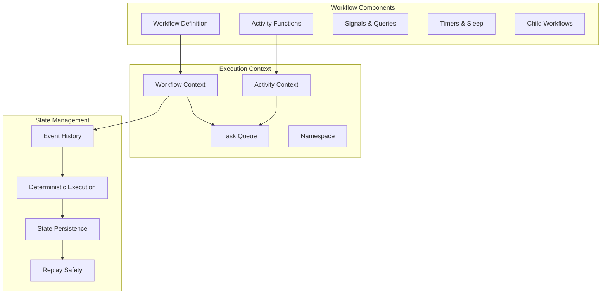

# Workflow Development

This document provides comprehensive guidance for developing workflows in the Temporal.io enterprise environment, covering best practices, patterns, and advanced techniques for building robust and scalable workflow applications.

## Overview

Temporal workflows are the core building blocks for orchestrating business processes. This guide covers the complete workflow development lifecycle from design to deployment, with enterprise-specific considerations for reliability, observability, and maintainability.

## Workflow Fundamentals

### Core Concepts



### Workflow Design Principles

#### 1. Deterministic Execution
```python
# ❌ Non-deterministic - Don't do this
@workflow.defn
class BadWorkflow:
    @workflow.run
    async def run(self) -> str:
        import random
        import datetime
        
        # Non-deterministic operations
        random_value = random.random()  # ❌ Non-deterministic
        current_time = datetime.datetime.now()  # ❌ Non-deterministic
        
        return f"Value: {random_value}, Time: {current_time}"

# ✅ Deterministic - Correct approach
@workflow.defn
class GoodWorkflow:
    @workflow.run
    async def run(self) -> str:
        # Use workflow time
        current_time = workflow.now()
        
        # Use activity for random values
        random_value = await workflow.execute_activity(
            generate_random_value,
            start_to_close_timeout=timedelta(seconds=30)
        )
        
        return f"Value: {random_value}, Time: {current_time}"

@activity.defn
async def generate_random_value() -> float:
    import random
    return random.random()
```

#### 2. Idempotent Operations
```python
@workflow.defn
class IdempotentWorkflow:
    def __init__(self) -> None:
        self._completed_steps: Set[str] = set()
        
    @workflow.run
    async def run(self, order_id: str) -> OrderResult:
        result = OrderResult(order_id=order_id)
        
        # Step 1: Validate order (idempotent)
        if "validate" not in self._completed_steps:
            result.validation = await workflow.execute_activity(
                validate_order,
                order_id,
                start_to_close_timeout=timedelta(minutes=5),
                retry_policy=RetryPolicy(
                    initial_interval=timedelta(seconds=1),
                    maximum_interval=timedelta(seconds=60),
                    maximum_attempts=3
                )
            )
            self._completed_steps.add("validate")
        
        # Step 2: Process payment (idempotent)
        if "payment" not in self._completed_steps:
            result.payment = await workflow.execute_activity(
                process_payment,
                ProcessPaymentRequest(
                    order_id=order_id,
                    amount=result.validation.amount,
                    idempotency_key=f"payment-{order_id}"
                ),
                start_to_close_timeout=timedelta(minutes=10),
                retry_policy=RetryPolicy(
                    initial_interval=timedelta(seconds=2),
                    maximum_interval=timedelta(minutes=1),
                    maximum_attempts=5
                )
            )
            self._completed_steps.add("payment")
        
        return result
```

## Workflow Patterns

### 1. Sequential Processing Pattern

```python
@workflow.defn
class SequentialProcessingWorkflow:
    @workflow.run
    async def run(self, request: ProcessingRequest) -> ProcessingResult:
        result = ProcessingResult(request_id=request.id)
        
        # Step 1: Data validation
        validation_result = await workflow.execute_activity(
            validate_data,
            request.data,
            start_to_close_timeout=timedelta(minutes=5)
        )
        result.validation = validation_result
        
        # Step 2: Data transformation (depends on validation)
        if validation_result.is_valid:
            transformation_result = await workflow.execute_activity(
                transform_data,
                TransformationRequest(
                    data=request.data,
                    rules=validation_result.transformation_rules
                ),
                start_to_close_timeout=timedelta(minutes=15)
            )
            result.transformation = transformation_result
            
            # Step 3: Data storage (depends on transformation)
            storage_result = await workflow.execute_activity(
                store_data,
                StorageRequest(
                    transformed_data=transformation_result.data,
                    metadata=transformation_result.metadata
                ),
                start_to_close_timeout=timedelta(minutes=10)
            )
            result.storage = storage_result
        
        return result
```

### 2. Parallel Processing Pattern

```python
@workflow.defn
class ParallelProcessingWorkflow:
    @workflow.run
    async def run(self, batch_request: BatchRequest) -> BatchResult:
        # Process items in parallel
        tasks = []
        for item in batch_request.items:
            task = workflow.execute_activity(
                process_item,
                item,
                start_to_close_timeout=timedelta(minutes=10),
                task_queue="processing-queue"
            )
            tasks.append(task)
        
        # Wait for all tasks to complete
        results = await asyncio.gather(*tasks, return_exceptions=True)
        
        # Process results
        successful_results = []
        failed_results = []
        
        for i, result in enumerate(results):
            if isinstance(result, Exception):
                failed_results.append({
                    'item_id': batch_request.items[i].id,
                    'error': str(result)
                })
            else:
                successful_results.append(result)
        
        return BatchResult(
            successful=successful_results,
            failed=failed_results,
            total_processed=len(results)
        )
```

### 3. Saga Pattern (Distributed Transactions)

```python
@workflow.defn
class SagaWorkflow:
    def __init__(self) -> None:
        self._compensations: List[Callable] = []
        
    @workflow.run
    async def run(self, order: Order) -> OrderResult:
        try:
            # Step 1: Reserve inventory
            inventory_reservation = await self._reserve_inventory(order)
            
            # Step 2: Process payment
            payment_result = await self._process_payment(order, inventory_reservation)
            
            # Step 3: Ship order
            shipping_result = await self._ship_order(order, payment_result)
            
            return OrderResult(
                order_id=order.id,
                status="completed",
                inventory_reservation=inventory_reservation,
                payment=payment_result,
                shipping=shipping_result
            )
            
        except Exception as e:
            # Execute compensations in reverse order
            await self._execute_compensations()
            raise
    
    async def _reserve_inventory(self, order: Order) -> InventoryReservation:
        reservation = await workflow.execute_activity(
            reserve_inventory,
            order.items,
            start_to_close_timeout=timedelta(minutes=5)
        )
        
        # Add compensation
        self._compensations.append(
            lambda: workflow.execute_activity(
                release_inventory,
                reservation.reservation_id,
                start_to_close_timeout=timedelta(minutes=5)
            )
        )
        
        return reservation
    
    async def _process_payment(self, order: Order, inventory: InventoryReservation) -> PaymentResult:
        payment = await workflow.execute_activity(
            charge_payment,
            PaymentRequest(
                order_id=order.id,
                amount=order.total_amount,
                payment_method=order.payment_method
            ),
            start_to_close_timeout=timedelta(minutes=10)
        )
        
        # Add compensation
        self._compensations.append(
            lambda: workflow.execute_activity(
                refund_payment,
                payment.transaction_id,
                start_to_close_timeout=timedelta(minutes=10)
            )
        )
        
        return payment
    
    async def _ship_order(self, order: Order, payment: PaymentResult) -> ShippingResult:
        return await workflow.execute_activity(
            ship_order,
            ShippingRequest(
                order_id=order.id,
                address=order.shipping_address,
                items=order.items
            ),
            start_to_close_timeout=timedelta(hours=24)
        )
    
    async def _execute_compensations(self):
        """Execute compensations in reverse order"""
        for compensation in reversed(self._compensations):
            try:
                await compensation()
            except Exception as e:
                workflow.logger.error(f"Compensation failed: {e}")
```

### 4. Long-Running Process with Signals

```python
@workflow.defn
class LongRunningProcessWorkflow:
    def __init__(self) -> None:
        self._status = "initialized"
        self._pause_requested = False
        self._cancel_requested = False
        self._progress = 0
        
    @workflow.run
    async def run(self, config: ProcessConfig) -> ProcessResult:
        self._status = "running"
        
        try:
            for i in range(config.total_steps):
                # Check for pause/cancel signals
                if self._cancel_requested:
                    self._status = "cancelled"
                    return ProcessResult(status="cancelled", progress=self._progress)
                
                while self._pause_requested:
                    self._status = "paused"
                    await workflow.wait_condition(lambda: not self._pause_requested)
                    self._status = "running"
                
                # Execute processing step
                step_result = await workflow.execute_activity(
                    process_step,
                    ProcessStepRequest(
                        step_number=i + 1,
                        config=config.step_configs[i]
                    ),
                    start_to_close_timeout=timedelta(minutes=30)
                )
                
                self._progress = ((i + 1) / config.total_steps) * 100
                
                # Optional: Wait between steps
                if config.step_delay_seconds > 0:
                    await asyncio.sleep(config.step_delay_seconds)
            
            self._status = "completed"
            return ProcessResult(status="completed", progress=100)
            
        except Exception as e:
            self._status = "failed"
            raise
    
    @workflow.signal
    async def pause(self) -> None:
        """Pause the workflow"""
        self._pause_requested = True
    
    @workflow.signal
    async def resume(self) -> None:
        """Resume the workflow"""
        self._pause_requested = False
    
    @workflow.signal
    async def cancel(self) -> None:
        """Cancel the workflow"""
        self._cancel_requested = True
    
    @workflow.query
    def get_status(self) -> Dict[str, Any]:
        """Get current workflow status"""
        return {
            "status": self._status,
            "progress": self._progress,
            "paused": self._pause_requested,
            "cancel_requested": self._cancel_requested
        }
```

## Advanced Workflow Techniques

### 1. Dynamic Workflows

```python
@workflow.defn
class DynamicWorkflow:
    @workflow.run
    async def run(self, workflow_config: WorkflowConfig) -> WorkflowResult:
        """Execute a dynamically configured workflow"""
        
        # Parse workflow definition
        steps = self._parse_workflow_definition(workflow_config.definition)
        
        # Execute steps based on configuration
        results = {}
        for step in steps:
            if step.type == "activity":
                result = await self._execute_activity_step(step)
            elif step.type == "parallel":
                result = await self._execute_parallel_step(step)
            elif step.type == "conditional":
                result = await self._execute_conditional_step(step, results)
            elif step.type == "loop":
                result = await self._execute_loop_step(step, results)
            else:
                raise ValueError(f"Unknown step type: {step.type}")
            
            results[step.name] = result
            
            # Check if we should continue based on step result
            if not self._should_continue(step, result):
                break
        
        return WorkflowResult(
            success=True,
            results=results,
            workflow_id=workflow_config.id
        )
    
    async def _execute_activity_step(self, step: WorkflowStep) -> Any:
        """Execute a single activity step"""
        activity_func = self._get_activity_function(step.activity_name)
        
        return await workflow.execute_activity(
            activity_func,
            step.parameters,
            start_to_close_timeout=timedelta(seconds=step.timeout_seconds),
            retry_policy=RetryPolicy(
                maximum_attempts=step.max_retries,
                initial_interval=timedelta(seconds=step.retry_interval_seconds)
            )
        )
    
    async def _execute_parallel_step(self, step: WorkflowStep) -> List[Any]:
        """Execute multiple activities in parallel"""
        tasks = []
        for sub_step in step.parallel_steps:
            task = self._execute_activity_step(sub_step)
            tasks.append(task)
        
        return await asyncio.gather(*tasks)
    
    async def _execute_conditional_step(self, step: WorkflowStep, previous_results: Dict) -> Any:
        """Execute conditional logic"""
        condition_result = self._evaluate_condition(step.condition, previous_results)
        
        if condition_result:
            return await self._execute_activity_step(step.if_step)
        elif step.else_step:
            return await self._execute_activity_step(step.else_step)
        
        return None
```

### 2. Workflow Versioning

```python
from temporalio import workflow
from temporalio.common import SearchAttributeKey

# Version 1 of the workflow
@workflow.defn
class OrderProcessingWorkflow:
    @workflow.run
    async def run(self, order: Order) -> OrderResult:
        version = workflow.patched("order-processing-v2")
        
        if version:
            # New version logic
            return await self._run_v2(order)
        else:
            # Legacy version logic
            return await self._run_v1(order)
    
    async def _run_v1(self, order: Order) -> OrderResult:
        """Legacy workflow implementation"""
        # Validate order
        validation = await workflow.execute_activity(
            validate_order_v1,
            order,
            start_to_close_timeout=timedelta(minutes=5)
        )
        
        # Process payment
        payment = await workflow.execute_activity(
            process_payment_v1,
            order.payment_info,
            start_to_close_timeout=timedelta(minutes=10)
        )
        
        return OrderResult(validation=validation, payment=payment)
    
    async def _run_v2(self, order: Order) -> OrderResult:
        """New workflow implementation with additional features"""
        # Enhanced validation with fraud detection
        validation = await workflow.execute_activity(
            validate_order_v2,
            order,
            start_to_close_timeout=timedelta(minutes=5)
        )
        
        # Fraud check (new in v2)
        fraud_check = await workflow.execute_activity(
            fraud_detection,
            FraudCheckRequest(
                order_id=order.id,
                customer_id=order.customer_id,
                amount=order.total_amount
            ),
            start_to_close_timeout=timedelta(minutes=2)
        )
        
        if fraud_check.is_suspicious:
            # Manual review process (new in v2)
            await workflow.execute_activity(
                trigger_manual_review,
                ManualReviewRequest(
                    order_id=order.id,
                    fraud_score=fraud_check.score,
                    reason=fraud_check.reason
                ),
                start_to_close_timeout=timedelta(hours=24)
            )
        
        # Enhanced payment processing
        payment = await workflow.execute_activity(
            process_payment_v2,
            PaymentRequestV2(
                order=order,
                fraud_score=fraud_check.score
            ),
            start_to_close_timeout=timedelta(minutes=10)
        )
        
        return OrderResult(
            validation=validation,
            fraud_check=fraud_check,
            payment=payment
        )
```

### 3. Child Workflows

```python
@workflow.defn
class ParentWorkflow:
    @workflow.run
    async def run(self, batch_request: BatchProcessingRequest) -> BatchResult:
        """Parent workflow that spawns child workflows for each item"""
        
        # Start child workflows for each item
        child_handles = []
        for item in batch_request.items:
            handle = await workflow.start_child_workflow(
                ItemProcessingWorkflow.run,
                item,
                id=f"item-processing-{item.id}",
                task_queue="item-processing-queue",
                execution_timeout=timedelta(hours=2)
            )
            child_handles.append((item.id, handle))
        
        # Collect results from child workflows
        results = []
        failed_items = []
        
        for item_id, handle in child_handles:
            try:
                result = await handle
                results.append(result)
            except Exception as e:
                failed_items.append({
                    'item_id': item_id,
                    'error': str(e)
                })
        
        # Generate summary report
        summary = await workflow.execute_activity(
            generate_batch_summary,
            BatchSummaryRequest(
                total_items=len(batch_request.items),
                successful_items=len(results),
                failed_items=len(failed_items),
                results=results
            ),
            start_to_close_timeout=timedelta(minutes=5)
        )
        
        return BatchResult(
            summary=summary,
            successful_results=results,
            failed_items=failed_items
        )

@workflow.defn
class ItemProcessingWorkflow:
    @workflow.run
    async def run(self, item: ProcessingItem) -> ItemResult:
        """Child workflow for processing individual items"""
        
        # Validate item
        validation = await workflow.execute_activity(
            validate_item,
            item,
            start_to_close_timeout=timedelta(minutes=2)
        )
        
        if not validation.is_valid:
            raise ApplicationError(
                f"Item validation failed: {validation.error_message}",
                type="ValidationError"
            )
        
        # Process item
        processing_result = await workflow.execute_activity(
            process_item_data,
            ProcessingRequest(
                item=item,
                validation_context=validation.context
            ),
            start_to_close_timeout=timedelta(minutes=30)
        )
        
        # Store result
        storage_result = await workflow.execute_activity(
            store_processed_item,
            StorageRequest(
                item_id=item.id,
                processed_data=processing_result.data,
                metadata=processing_result.metadata
            ),
            start_to_close_timeout=timedelta(minutes=5)
        )
        
        return ItemResult(
            item_id=item.id,
            processing_result=processing_result,
            storage_result=storage_result
        )
```

## Error Handling and Resilience

### 1. Comprehensive Error Handling

```python
from temporalio.exceptions import ApplicationError, ActivityError, ChildWorkflowError

@workflow.defn
class ResilientWorkflow:
    @workflow.run
    async def run(self, request: ProcessingRequest) -> ProcessingResult:
        try:
            # Critical operation with custom retry policy
            result = await workflow.execute_activity(
                critical_operation,
                request.data,
                start_to_close_timeout=timedelta(minutes=10),
                retry_policy=RetryPolicy(
                    initial_interval=timedelta(seconds=1),
                    maximum_interval=timedelta(minutes=2),
                    maximum_attempts=5,
                    non_retryable_error_types=["ValidationError", "AuthenticationError"]
                )
            )
            
            return ProcessingResult(success=True, data=result)
            
        except ActivityError as e:
            # Handle activity-specific errors
            if e.cause and isinstance(e.cause, ApplicationError):
                if e.cause.type == "ValidationError":
                    # Handle validation errors
                    await self._handle_validation_error(request, e.cause)
                elif e.cause.type == "BusinessLogicError":
                    # Handle business logic errors
                    await self._handle_business_error(request, e.cause)
                else:
                    # Handle unknown application errors
                    await self._handle_unknown_error(request, e.cause)
            else:
                # Handle system errors (timeouts, network issues, etc.)
                await self._handle_system_error(request, e)
            
            raise  # Re-raise to fail the workflow
            
        except ChildWorkflowError as e:
            # Handle child workflow errors
            workflow.logger.error(f"Child workflow failed: {e}")
            await self._handle_child_workflow_error(request, e)
            raise
            
        except Exception as e:
            # Handle unexpected errors
            workflow.logger.error(f"Unexpected error: {e}")
            await self._handle_unexpected_error(request, e)
            raise
    
    async def _handle_validation_error(self, request: ProcessingRequest, error: ApplicationError):
        """Handle validation errors with notification"""
        await workflow.execute_activity(
            send_validation_error_notification,
            ValidationErrorNotification(
                request_id=request.id,
                error_message=error.message,
                error_details=error.details
            ),
            start_to_close_timeout=timedelta(minutes=2)
        )
    
    async def _handle_business_error(self, request: ProcessingRequest, error: ApplicationError):
        """Handle business logic errors with escalation"""
        await workflow.execute_activity(
            escalate_business_error,
            BusinessErrorEscalation(
                request_id=request.id,
                error_type=error.type,
                error_message=error.message,
                escalation_level="high"
            ),
            start_to_close_timeout=timedelta(minutes=5)
        )
    
    async def _handle_system_error(self, request: ProcessingRequest, error: ActivityError):
        """Handle system errors with monitoring"""
        await workflow.execute_activity(
            log_system_error,
            SystemErrorLog(
                request_id=request.id,
                error_type="system_error",
                error_message=str(error),
                timestamp=workflow.now()
            ),
            start_to_close_timeout=timedelta(minutes=1)
        )
```

### 2. Circuit Breaker Pattern

```python
@workflow.defn
class CircuitBreakerWorkflow:
    def __init__(self) -> None:
        self._failure_count = 0
        self._last_failure_time = None
        self._circuit_open = False
        self._circuit_timeout = timedelta(minutes=5)
        
    @workflow.run
    async def run(self, requests: List[ExternalAPIRequest]) -> List[APIResponse]:
        results = []
        
        for request in requests:
            if self._is_circuit_open():
                # Circuit is open, skip external calls
                results.append(APIResponse(
                    request_id=request.id,
                    success=False,
                    error="Circuit breaker is open"
                ))
                continue
            
            try:
                # Attempt external API call
                response = await workflow.execute_activity(
                    call_external_api,
                    request,
                    start_to_close_timeout=timedelta(seconds=30),
                    retry_policy=RetryPolicy(maximum_attempts=1)  # No retries
                )
                
                # Success - reset failure count
                self._failure_count = 0
                self._circuit_open = False
                results.append(response)
                
            except Exception as e:
                # Failure - increment counter and potentially open circuit
                self._failure_count += 1
                self._last_failure_time = workflow.now()
                
                if self._failure_count >= 5:  # Threshold
                    self._circuit_open = True
                    workflow.logger.warning("Circuit breaker opened due to failures")
                
                results.append(APIResponse(
                    request_id=request.id,
                    success=False,
                    error=str(e)
                ))
        
        return results
    
    def _is_circuit_open(self) -> bool:
        """Check if circuit breaker should remain open"""
        if not self._circuit_open:
            return False
        
        if self._last_failure_time is None:
            return False
        
        # Check if timeout has elapsed
        time_since_failure = workflow.now() - self._last_failure_time
        if time_since_failure > self._circuit_timeout:
            self._circuit_open = False
            self._failure_count = 0
            workflow.logger.info("Circuit breaker reset after timeout")
            return False
        
        return True
```

## Workflow Testing and Debugging

### 1. Unit Testing Workflows

```python
import pytest
from temporalio.testing import WorkflowEnvironment
from temporalio.worker import Worker

@pytest.mark.asyncio
async def test_order_processing_workflow():
    """Test order processing workflow with mocked activities"""
    
    # Create test environment
    async with WorkflowEnvironment() as env:
        # Mock activities
        async def mock_validate_order(order: Order) -> ValidationResult:
            return ValidationResult(is_valid=True, amount=order.total_amount)
        
        async def mock_process_payment(request: ProcessPaymentRequest) -> PaymentResult:
            return PaymentResult(
                transaction_id="test-txn-123",
                success=True,
                amount=request.amount
            )
        
        # Create worker with mocked activities
        worker = Worker(
            env.client,
            task_queue="test-queue",
            workflows=[OrderProcessingWorkflow],
            activities=[mock_validate_order, mock_process_payment]
        )
        
        # Start worker
        async with worker:
            # Execute workflow
            result = await env.client.execute_workflow(
                OrderProcessingWorkflow.run,
                Order(
                    id="test-order-123",
                    customer_id="test-customer",
                    total_amount=100.0,
                    items=[OrderItem(id="item1", quantity=2, price=50.0)]
                ),
                id="test-workflow-123",
                task_queue="test-queue"
            )
            
            # Verify results
            assert result.order_id == "test-order-123"
            assert result.validation.is_valid
            assert result.payment.success
            assert result.payment.transaction_id == "test-txn-123"

@pytest.mark.asyncio
async def test_workflow_with_signals():
    """Test workflow that handles signals"""
    
    async with WorkflowEnvironment() as env:
        worker = Worker(
            env.client,
            task_queue="test-queue",
            workflows=[LongRunningProcessWorkflow],
            activities=[mock_process_step]
        )
        
        async with worker:
            # Start workflow
            handle = await env.client.start_workflow(
                LongRunningProcessWorkflow.run,
                ProcessConfig(total_steps=3, step_delay_seconds=0),
                id="test-long-running",
                task_queue="test-queue"
            )
            
            # Send pause signal
            await handle.signal(LongRunningProcessWorkflow.pause)
            
            # Check status
            status = await handle.query(LongRunningProcessWorkflow.get_status)
            assert status["paused"] is True
            
            # Send resume signal
            await handle.signal(LongRunningProcessWorkflow.resume)
            
            # Wait for completion
            result = await handle.result()
            assert result.status == "completed"
            assert result.progress == 100
```

### 2. Integration Testing

```python
@pytest.mark.integration
@pytest.mark.asyncio
async def test_full_order_processing_integration():
    """Integration test with real Temporal server"""
    
    from temporalio.client import Client
    from temporalio.worker import Worker
    
    # Connect to test Temporal server
    client = await Client.connect("localhost:7233", namespace="test")
    
    # Create worker with real activities
    worker = Worker(
        client,
        task_queue="integration-test-queue",
        workflows=[OrderProcessingWorkflow],
        activities=[
            validate_order,
            process_payment,
            ship_order
        ]
    )
    
    async with worker:
        # Execute workflow with real data
        test_order = Order(
            id=f"test-order-{uuid.uuid4()}",
            customer_id="test-customer-123",
            total_amount=99.99,
            items=[
                OrderItem(id="book-123", quantity=1, price=29.99),
                OrderItem(id="shipping", quantity=1, price=9.99)
            ],
            payment_method=PaymentMethod(
                type="credit_card",
                token="test-token-123"
            ),
            shipping_address=Address(
                street="123 Test St",
                city="Test City",
                state="TS",
                zip_code="12345"
            )
        )
        
        result = await client.execute_workflow(
            OrderProcessingWorkflow.run,
            test_order,
            id=f"integration-test-{uuid.uuid4()}",
            task_queue="integration-test-queue",
            execution_timeout=timedelta(minutes=30)
        )
        
        # Verify integration results
        assert result.order_id == test_order.id
        assert result.validation.is_valid
        assert result.payment.success
        assert result.shipping.tracking_number is not None
        
        # Verify side effects (database updates, external API calls, etc.)
        # This would typically involve checking external systems
```

## Performance Optimization

### 1. Workflow Optimization Techniques

```python
@workflow.defn
class OptimizedWorkflow:
    @workflow.run
    async def run(self, batch_request: BatchRequest) -> BatchResult:
        # Technique 1: Batch similar operations
        validation_tasks = []
        for item in batch_request.items:
            task = workflow.execute_activity(
                validate_item,
                item,
                start_to_close_timeout=timedelta(minutes=2),
                task_queue="validation-queue"  # Dedicated queue for validation
            )
            validation_tasks.append(task)
        
        # Wait for all validations to complete
        validation_results = await asyncio.gather(*validation_tasks)
        
        # Technique 2: Process in chunks to avoid memory issues
        chunk_size = 50
        processing_results = []
        
        for i in range(0, len(batch_request.items), chunk_size):
            chunk = batch_request.items[i:i + chunk_size]
            chunk_results = await self._process_chunk(chunk)
            processing_results.extend(chunk_results)
            
            # Optional: Brief pause between chunks to reduce system load
            if i + chunk_size < len(batch_request.items):
                await asyncio.sleep(0.1)
        
        # Technique 3: Use local activities for lightweight operations
        summary = await workflow.execute_local_activity(
            generate_summary,
            SummaryRequest(
                total_items=len(batch_request.items),
                validation_results=validation_results,
                processing_results=processing_results
            ),
            start_to_close_timeout=timedelta(seconds=30)
        )
        
        return BatchResult(
            summary=summary,
            item_results=processing_results
        )
    
    async def _process_chunk(self, chunk: List[Item]) -> List[ProcessingResult]:
        """Process a chunk of items in parallel"""
        tasks = []
        for item in chunk:
            task = workflow.execute_activity(
                process_item,
                item,
                start_to_close_timeout=timedelta(minutes=10),
                task_queue="processing-queue",
                # Use heartbeat for long-running activities
                heartbeat_timeout=timedelta(minutes=2)
            )
            tasks.append(task)
        
        return await asyncio.gather(*tasks, return_exceptions=True)
```

### 2. Activity Optimization

```python
@activity.defn
async def optimized_batch_processing(request: BatchProcessingRequest) -> BatchProcessingResult:
    """Optimized activity for batch processing"""
    
    # Use activity heartbeat for long-running operations
    activity.heartbeat("Starting batch processing")
    
    results = []
    total_items = len(request.items)
    
    # Process in smaller batches
    batch_size = 10
    for i in range(0, total_items, batch_size):
        batch = request.items[i:i + batch_size]
        
        # Process batch
        batch_results = await process_batch_items(batch)
        results.extend(batch_results)
        
        # Report progress via heartbeat
        progress = ((i + len(batch)) / total_items) * 100
        activity.heartbeat(f"Processed {i + len(batch)}/{total_items} items ({progress:.1f}%)")
        
        # Check for cancellation
        if activity.is_cancelled():
            activity.heartbeat("Processing cancelled, cleaning up...")
            await cleanup_partial_processing(results)
            raise ActivityError("Processing was cancelled")
    
    activity.heartbeat("Batch processing completed")
    return BatchProcessingResult(
        success=True,
        processed_count=len(results),
        results=results
    )

@activity.defn
async def cached_external_api_call(request: APIRequest) -> APIResponse:
    """Activity with intelligent caching"""
    
    # Check cache first
    cache_key = f"api_call:{request.endpoint}:{hash(request.parameters)}"
    cached_result = await get_from_cache(cache_key)
    
    if cached_result:
        activity.logger.info(f"Cache hit for {cache_key}")
        return cached_result
    
    # Make actual API call
    activity.heartbeat(f"Calling external API: {request.endpoint}")
    
    try:
        response = await make_external_api_call(request)
        
        # Cache successful responses
        if response.success:
            await store_in_cache(cache_key, response, ttl_seconds=300)
        
        return response
        
    except Exception as e:
        activity.logger.error(f"API call failed: {e}")
        
        # Return cached response if available (even if stale)
        stale_cache = await get_from_cache(cache_key, allow_stale=True)
        if stale_cache:
            activity.logger.warning("Returning stale cached response due to API failure")
            return stale_cache
        
        raise
```

This comprehensive workflow development guide provides the foundation for building robust, scalable, and maintainable workflows in the Temporal.io enterprise environment. The patterns and techniques demonstrated here address real-world challenges and follow enterprise best practices for reliability and performance.
