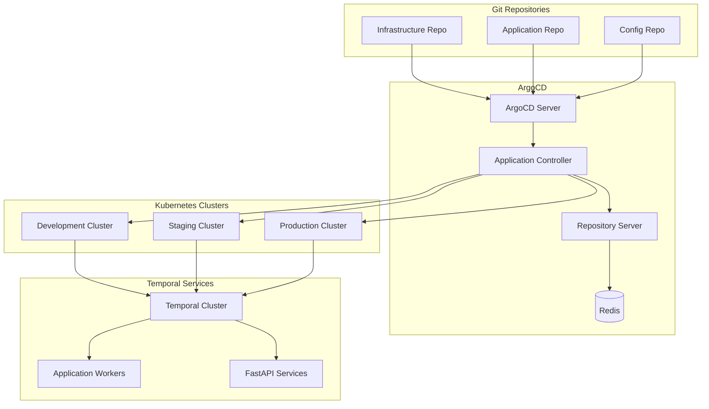

# ArgoCD Setup

This guide provides comprehensive setup instructions for ArgoCD to enable GitOps deployment of Temporal.io infrastructure and applications in enterprise environments.

## Overview

ArgoCD enables GitOps deployment patterns for Temporal.io infrastructure, providing:
- Declarative configuration management
- Automated deployment and rollback
- Multi-environment management
- RBAC and security controls
- Application monitoring and health checks
- Integration with CI/CD pipelines

## Architecture



## Prerequisites

### Required Tools
```bash
# Install ArgoCD CLI on macOS
brew install argocd

# Install kubectl and helm
brew install kubectl helm

# Verify installations
argocd version --client
kubectl version --client
helm version
```

### Cluster Requirements
- Kubernetes 1.20+
- 4GB+ available memory
- 2 CPU cores minimum
- LoadBalancer or Ingress controller
- Persistent storage support

## ArgoCD Installation

### Install ArgoCD Server

#### Namespace Setup
```yaml
# argocd/namespace.yaml
apiVersion: v1
kind: Namespace
metadata:
  name: argocd
  labels:
    name: argocd
    app.kubernetes.io/part-of: argocd
```

#### Core Installation
```bash
#!/bin/bash
# scripts/install-argocd.sh

set -euo pipefail

NAMESPACE="argocd"
ARGOCD_VERSION="v2.8.4"

log() {
    echo -e "\033[0;32m[$(date +'%Y-%m-%d %H:%M:%S')] $1\033[0m"
}

error() {
    echo -e "\033[0;31m[$(date +'%Y-%m-%d %H:%M:%S')] ERROR: $1\033[0m"
    exit 1
}

log "Installing ArgoCD ${ARGOCD_VERSION}..."

# Create namespace
kubectl create namespace "$NAMESPACE" --dry-run=client -o yaml | kubectl apply -f -

# Install ArgoCD
kubectl apply -n "$NAMESPACE" -f "https://raw.githubusercontent.com/argoproj/argo-cd/${ARGOCD_VERSION}/manifests/install.yaml"

# Wait for ArgoCD to be ready
log "Waiting for ArgoCD to be ready..."
kubectl wait --for=condition=available deployment/argocd-server -n "$NAMESPACE" --timeout=300s
kubectl wait --for=condition=available deployment/argocd-repo-server -n "$NAMESPACE" --timeout=300s
kubectl wait --for=condition=available deployment/argocd-application-controller -n "$NAMESPACE" --timeout=300s

log "ArgoCD installation completed successfully!"
```

### Custom ArgoCD Configuration

#### ArgoCD Server Configuration
```yaml
# argocd/argocd-server-config.yaml
apiVersion: v1
kind: ConfigMap
metadata:
  name: argocd-server-config
  namespace: argocd
  labels:
    app.kubernetes.io/name: argocd-server-config
    app.kubernetes.io/part-of: argocd
data:
  # Server configuration
  server.config: |
    url: https://argocd.temporal.company.com
    insecure: false
    grpc.web: true
    
    # OIDC configuration
    oidc.config: |
      name: Company SSO
      issuer: https://auth.company.com
      clientId: argocd
      clientSecret: $argocd-oidc-secret:clientSecret
      requestedScopes: ["openid", "profile", "email", "groups"]
      requestedIDTokenClaims: {"groups": {"essential": true}}
    
    # URL aliases for multiple clusters
    application.instanceLabelKey: argocd.argoproj.io/instance
    
    # Resource customizations
    resource.customizations: |
      argoproj.io/Rollout:
        health.lua: |
          hs = {}
          if obj.status ~= nil then
            if obj.status.replicas ~= nil and obj.status.updatedReplicas ~= nil and obj.status.readyReplicas ~= nil and obj.status.availableReplicas ~= nil then
              if obj.status.replicas == obj.status.updatedReplicas and obj.status.replicas == obj.status.readyReplicas and obj.status.replicas == obj.status.availableReplicas then
                hs.status = "Healthy"
                hs.message = "Rollout is healthy"
                return hs
              end
            end
          end
          hs.status = "Progressing"
          hs.message = "Waiting for rollout to finish"
          return hs
    
    # Additional configuration
    accounts.temporal-admin: login
    accounts.temporal-admin.enabled: "true"
  
  # RBAC configuration
  policy.default: role:readonly
  policy.csv: |
    p, role:admin, applications, *, */*, allow
    p, role:admin, clusters, *, *, allow
    p, role:admin, repositories, *, *, allow
    
    p, role:developer, applications, get, */*, allow
    p, role:developer, applications, sync, */*, allow
    p, role:developer, applications, action/*, */*, allow
    p, role:developer, repositories, get, *, allow
    
    p, role:readonly, applications, get, */*, allow
    p, role:readonly, repositories, get, *, allow
    p, role:readonly, clusters, get, *, allow
    
    g, temporal-admins, role:admin
    g, temporal-developers, role:developer
    g, temporal-users, role:readonly
    
    g, temporal-admin, role:admin
```

#### ArgoCD CMD Parameters
```yaml
# argocd/argocd-cmd-params.yaml
apiVersion: v1
kind: ConfigMap
metadata:
  name: argocd-cmd-params-cm
  namespace: argocd
  labels:
    app.kubernetes.io/name: argocd-cmd-params-cm
    app.kubernetes.io/part-of: argocd
data:
  # Server parameters
  server.insecure: "false"
  server.grpc.web: "true"
  server.enable.proxy.extension: "true"
  
  # Application controller parameters
  application.controller.self.heal.timeout.seconds: "30"
  application.controller.operation.processors: "20"
  application.controller.status.processors: "20"
  application.controller.repo.server.timeout.seconds: "120"
  
  # Repository server parameters
  reposerver.parallelism.limit: "10"
  reposerver.init.timeout: "600"
```

### High Availability Configuration

#### ArgoCD HA Setup
```yaml
# argocd/argocd-ha.yaml
apiVersion: apps/v1
kind: Deployment
metadata:
  name: argocd-server
  namespace: argocd
spec:
  replicas: 3
  selector:
    matchLabels:
      app.kubernetes.io/name: argocd-server
  template:
    metadata:
      labels:
        app.kubernetes.io/name: argocd-server
    spec:
      affinity:
        podAntiAffinity:
          preferredDuringSchedulingIgnoredDuringExecution:
          - weight: 100
            podAffinityTerm:
              labelSelector:
                matchLabels:
                  app.kubernetes.io/name: argocd-server
              topologyKey: kubernetes.io/hostname
      containers:
      - name: argocd-server
        image: quay.io/argoproj/argocd:v2.8.4
        args:
        - argocd-server
        - --staticassets
        - /shared/app
        - --redis
        - argocd-redis:6379
        resources:
          requests:
            memory: "256Mi"
            cpu: "250m"
          limits:
            memory: "512Mi"
            cpu: "500m"
        
---
apiVersion: apps/v1
kind: Deployment
metadata:
  name: argocd-repo-server
  namespace: argocd
spec:
  replicas: 2
  selector:
    matchLabels:
      app.kubernetes.io/name: argocd-repo-server
  template:
    metadata:
      labels:
        app.kubernetes.io/name: argocd-repo-server
    spec:
      affinity:
        podAntiAffinity:
          preferredDuringSchedulingIgnoredDuringExecution:
          - weight: 100
            podAffinityTerm:
              labelSelector:
                matchLabels:
                  app.kubernetes.io/name: argocd-repo-server
              topologyKey: kubernetes.io/hostname
      containers:
      - name: argocd-repo-server
        image: quay.io/argoproj/argocd:v2.8.4
        args:
        - argocd-repo-server
        - --redis
        - argocd-redis:6379
        resources:
          requests:
            memory: "512Mi"
            cpu: "250m"
          limits:
            memory: "1Gi"
            cpu: "500m"

---
apiVersion: apps/v1
kind: StatefulSet
metadata:
  name: argocd-application-controller
  namespace: argocd
spec:
  replicas: 1  # Application controller should be single instance
  serviceName: argocd-application-controller
  selector:
    matchLabels:
      app.kubernetes.io/name: argocd-application-controller
  template:
    metadata:
      labels:
        app.kubernetes.io/name: argocd-application-controller
    spec:
      containers:
      - name: argocd-application-controller
        image: quay.io/argoproj/argocd:v2.8.4
        args:
        - argocd-application-controller
        - --redis
        - argocd-redis:6379
        - --operation-processors
        - "20"
        - --status-processors
        - "20"
        - --kubectl-parallelism-limit
        - "30"
        resources:
          requests:
            memory: "1Gi"
            cpu: "500m"
          limits:
            memory: "2Gi"
            cpu: "1000m"
```

## Ingress and SSL Configuration

### ArgoCD Ingress
```yaml
# argocd/ingress.yaml
apiVersion: networking.k8s.io/v1
kind: Ingress
metadata:
  name: argocd-server-ingress
  namespace: argocd
  annotations:
    kubernetes.io/ingress.class: alb
    alb.ingress.kubernetes.io/scheme: internet-facing
    alb.ingress.kubernetes.io/target-type: ip
    alb.ingress.kubernetes.io/certificate-arn: arn:aws:acm:us-west-2:ACCOUNT:certificate/CERT-ID
    alb.ingress.kubernetes.io/ssl-redirect: "443"
    alb.ingress.kubernetes.io/listen-ports: '[{"HTTP": 80}, {"HTTPS": 443}]'
    alb.ingress.kubernetes.io/backend-protocol: HTTPS
    alb.ingress.kubernetes.io/healthcheck-path: /healthz
    nginx.ingress.kubernetes.io/backend-protocol: "GRPC"
    nginx.ingress.kubernetes.io/grpc-backend: "true"
spec:
  tls:
  - hosts:
    - argocd.temporal.company.com
    secretName: argocd-server-tls
  rules:
  - host: argocd.temporal.company.com
    http:
      paths:
      - path: /
        pathType: Prefix
        backend:
          service:
            name: argocd-server
            port:
              number: 443
```

## Security Configuration

### RBAC Setup
```yaml
# argocd/rbac.yaml
apiVersion: v1
kind: ServiceAccount
metadata:
  name: argocd-admin
  namespace: argocd

---
apiVersion: rbac.authorization.k8s.io/v1
kind: ClusterRole
metadata:
  name: argocd-admin
rules:
- apiGroups: ["*"]
  resources: ["*"]
  verbs: ["*"]
- nonResourceURLs: ["*"]
  verbs: ["*"]

---
apiVersion: rbac.authorization.k8s.io/v1
kind: ClusterRoleBinding
metadata:
  name: argocd-admin
roleRef:
  apiGroup: rbac.authorization.k8s.io
  kind: ClusterRole
  name: argocd-admin
subjects:
- kind: ServiceAccount
  name: argocd-admin
  namespace: argocd

---
apiVersion: rbac.authorization.k8s.io/v1
kind: ClusterRole
metadata:
  name: argocd-temporal-admin
rules:
- apiGroups: [""]
  resources: ["*"]
  verbs: ["*"]
- apiGroups: ["apps"]
  resources: ["*"]
  verbs: ["*"]
- apiGroups: ["extensions"]
  resources: ["*"]
  verbs: ["*"]
- apiGroups: ["argoproj.io"]
  resources: ["*"]
  verbs: ["*"]

---
apiVersion: rbac.authorization.k8s.io/v1
kind: ClusterRoleBinding
metadata:
  name: argocd-temporal-admin
roleRef:
  apiGroup: rbac.authorization.k8s.io
  kind: ClusterRole
  name: argocd-temporal-admin
subjects:
- kind: User
  name: temporal-admin@company.com
  apiGroup: rbac.authorization.k8s.io
```

### Secrets Management
```yaml
# argocd/secrets.yaml
apiVersion: external-secrets.io/v1beta1
kind: ExternalSecret
metadata:
  name: argocd-oidc-secret
  namespace: argocd
spec:
  refreshInterval: 1h
  secretStoreRef:
    name: vault-backend
    kind: SecretStore
  target:
    name: argocd-oidc-secret
    creationPolicy: Owner
  data:
  - secretKey: clientSecret
    remoteRef:
      key: argocd/oidc
      property: client_secret

---
apiVersion: external-secrets.io/v1beta1
kind: ExternalSecret
metadata:
  name: argocd-repo-credentials
  namespace: argocd
spec:
  refreshInterval: 1h
  secretStoreRef:
    name: vault-backend
    kind: SecretStore
  target:
    name: argocd-repo-credentials
    creationPolicy: Owner
    template:
      type: Opaque
      data:
        type: git
        url: "{{ .repo_url }}"
        username: "{{ .username }}"
        password: "{{ .password }}"
  data:
  - secretKey: repo_url
    remoteRef:
      key: argocd/git
      property: repo_url
  - secretKey: username
    remoteRef:
      key: argocd/git
      property: username
  - secretKey: password
    remoteRef:
      key: argocd/git
      property: password
```

## Repository Configuration

### Git Repository Setup
```yaml
# argocd/repositories.yaml
apiVersion: v1
kind: Secret
metadata:
  name: temporal-infrastructure-repo
  namespace: argocd
  labels:
    argocd.argoproj.io/secret-type: repository
type: Opaque
stringData:
  type: git
  url: https://github.com/company/temporal-infrastructure
  username: argocd-bot
  password: ghp_xxxxxxxxxxxxxxxxxxxx

---
apiVersion: v1
kind: Secret
metadata:
  name: temporal-applications-repo
  namespace: argocd
  labels:
    argocd.argoproj.io/secret-type: repository
type: Opaque
stringData:
  type: git
  url: https://github.com/company/temporal-applications
  username: argocd-bot
  password: ghp_xxxxxxxxxxxxxxxxxxxx

---
apiVersion: v1
kind: Secret
metadata:
  name: temporal-config-repo
  namespace: argocd
  labels:
    argocd.argoproj.io/secret-type: repository
type: Opaque
stringData:
  type: git
  url: https://github.com/company/temporal-config
  username: argocd-bot
  password: ghp_xxxxxxxxxxxxxxxxxxxx
```

### Cluster Credentials
```yaml
# argocd/clusters.yaml
apiVersion: v1
kind: Secret
metadata:
  name: temporal-development-cluster
  namespace: argocd
  labels:
    argocd.argoproj.io/secret-type: cluster
type: Opaque
stringData:
  name: temporal-development
  server: https://eks-dev.us-west-2.eks.amazonaws.com
  config: |
    {
      "bearerToken": "eyJhbGciOiJSUzI1NiIsImtpZCI6...",
      "tlsClientConfig": {
        "insecure": false,
        "caData": "LS0tLS1CRUdJTi..."
      }
    }

---
apiVersion: v1
kind: Secret
metadata:
  name: temporal-staging-cluster
  namespace: argocd
  labels:
    argocd.argoproj.io/secret-type: cluster
type: Opaque
stringData:
  name: temporal-staging
  server: https://eks-staging.us-west-2.eks.amazonaws.com
  config: |
    {
      "bearerToken": "eyJhbGciOiJSUzI1NiIsImtpZCI6...",
      "tlsClientConfig": {
        "insecure": false,
        "caData": "LS0tLS1CRUdJTi..."
      }
    }

---
apiVersion: v1
kind: Secret
metadata:
  name: temporal-production-cluster
  namespace: argocd
  labels:
    argocd.argoproj.io/secret-type: cluster
type: Opaque
stringData:
  name: temporal-production
  server: https://eks-prod.us-west-2.eks.amazonaws.com
  config: |
    {
      "bearerToken": "eyJhbGciOiJSUzI1NiIsImtpZCI6...",
      "tlsClientConfig": {
        "insecure": false,
        "caData": "LS0tLS1CRUdJTi..."
      }
    }
```

## Application Projects

### Temporal Project
```yaml
# argocd/projects/temporal-project.yaml
apiVersion: argoproj.io/v1alpha1
kind: AppProject
metadata:
  name: temporal
  namespace: argocd
  finalizers:
    - resources-finalizer.argocd.argoproj.io
spec:
  description: Temporal.io deployment project
  
  sourceRepos:
  - 'https://github.com/company/temporal-infrastructure'
  - 'https://github.com/company/temporal-applications'
  - 'https://github.com/company/temporal-config'
  - 'https://helm.temporal.io'
  
  destinations:
  - namespace: 'temporal-*'
    server: '*'
  - namespace: 'argocd'
    server: '*'
  
  clusterResourceWhitelist:
  - group: ''
    kind: Namespace
  - group: 'rbac.authorization.k8s.io'
    kind: ClusterRole
  - group: 'rbac.authorization.k8s.io'
    kind: ClusterRoleBinding
  - group: 'networking.k8s.io'
    kind: NetworkPolicy
  - group: 'policy'
    kind: PodSecurityPolicy
  - group: 'apiextensions.k8s.io'
    kind: CustomResourceDefinition
  
  namespaceResourceWhitelist:
  - group: ''
    kind: '*'
  - group: 'apps'
    kind: '*'
  - group: 'extensions'
    kind: '*'
  - group: 'networking.k8s.io'
    kind: '*'
  - group: 'policy'
    kind: '*'
  - group: 'autoscaling'
    kind: '*'
  - group: 'monitoring.coreos.com'
    kind: '*'
  - group: 'external-secrets.io'
    kind: '*'
  
  roles:
  - name: temporal-admin
    description: Admin access to Temporal project
    policies:
    - p, proj:temporal:temporal-admin, applications, *, temporal/*, allow
    - p, proj:temporal:temporal-admin, repositories, *, *, allow
    groups:
    - temporal-admins
  
  - name: temporal-developer
    description: Developer access to Temporal project
    policies:
    - p, proj:temporal:temporal-developer, applications, get, temporal/*, allow
    - p, proj:temporal:temporal-developer, applications, sync, temporal/*, allow
    - p, proj:temporal:temporal-developer, applications, action/*, temporal/*, allow
    groups:
    - temporal-developers
  
  - name: temporal-readonly
    description: Read-only access to Temporal project
    policies:
    - p, proj:temporal:temporal-readonly, applications, get, temporal/*, allow
    groups:
    - temporal-users
  
  syncWindows:
  - kind: allow
    schedule: '0 2 * * *'
    duration: 1h
    applications:
    - '*'
    manualSync: true
  
  - kind: deny
    schedule: '0 12 * * 1-5'
    duration: 8h
    applications:
    - 'temporal-production-*'
    manualSync: false
```

## Monitoring and Observability

### Prometheus ServiceMonitor
```yaml
# argocd/monitoring/service-monitor.yaml
apiVersion: monitoring.coreos.com/v1
kind: ServiceMonitor
metadata:
  name: argocd-metrics
  namespace: argocd
  labels:
    app.kubernetes.io/component: metrics
    app.kubernetes.io/name: argocd-metrics
    app.kubernetes.io/part-of: argocd
spec:
  selector:
    matchLabels:
      app.kubernetes.io/name: argocd-metrics
  endpoints:
  - port: metrics
    interval: 30s
    path: /metrics
  - port: metrics
    interval: 30s
    path: /metrics
    targetPort: 8083

---
apiVersion: monitoring.coreos.com/v1
kind: ServiceMonitor
metadata:
  name: argocd-server-metrics
  namespace: argocd
  labels:
    app.kubernetes.io/component: server
    app.kubernetes.io/name: argocd-server-metrics
    app.kubernetes.io/part-of: argocd
spec:
  selector:
    matchLabels:
      app.kubernetes.io/component: server
      app.kubernetes.io/name: argocd-server-metrics
      app.kubernetes.io/part-of: argocd
  endpoints:
  - port: metrics
    interval: 30s
    path: /metrics

---
apiVersion: monitoring.coreos.com/v1
kind: ServiceMonitor
metadata:
  name: argocd-repo-server-metrics
  namespace: argocd
  labels:
    app.kubernetes.io/component: repo-server
    app.kubernetes.io/name: argocd-repo-server
    app.kubernetes.io/part-of: argocd
spec:
  selector:
    matchLabels:
      app.kubernetes.io/component: repo-server
      app.kubernetes.io/name: argocd-repo-server
      app.kubernetes.io/part-of: argocd
  endpoints:
  - port: metrics
    interval: 30s
    path: /metrics
```

### Grafana Dashboard
```json
{
  "dashboard": {
    "id": null,
    "title": "ArgoCD Dashboard",
    "tags": ["argocd", "gitops"],
    "style": "dark",
    "timezone": "browser",
    "panels": [
      {
        "id": 1,
        "title": "Application Health",
        "type": "stat",
        "targets": [
          {
            "expr": "argocd_app_health_status{name=~\"temporal.*\"}",
            "legendFormat": "{{name}}"
          }
        ],
        "gridPos": {"h": 8, "w": 12, "x": 0, "y": 0}
      },
      {
        "id": 2,
        "title": "Sync Status",
        "type": "stat",
        "targets": [
          {
            "expr": "argocd_app_sync_total{name=~\"temporal.*\"}",
            "legendFormat": "{{name}}"
          }
        ],
        "gridPos": {"h": 8, "w": 12, "x": 12, "y": 0}
      },
      {
        "id": 3,
        "title": "Repository Activity",
        "type": "graph",
        "targets": [
          {
            "expr": "rate(argocd_git_request_total[5m])",
            "legendFormat": "Git Requests/sec"
          }
        ],
        "gridPos": {"h": 8, "w": 12, "x": 0, "y": 8}
      },
      {
        "id": 4,
        "title": "Controller Performance",
        "type": "graph",
        "targets": [
          {
            "expr": "argocd_app_reconcile_bucket",
            "legendFormat": "Reconcile Time"
          }
        ],
        "gridPos": {"h": 8, "w": 12, "x": 12, "y": 8}
      }
    ],
    "time": {
      "from": "now-1h",
      "to": "now"
    },
    "refresh": "30s"
  }
}
```

## Operations and Maintenance

### Backup Configuration
```bash
#!/bin/bash
# scripts/backup-argocd.sh

set -euo pipefail

NAMESPACE="argocd"
BACKUP_DIR="/backups/argocd"
TIMESTAMP=$(date +%Y%m%d_%H%M%S)

log() {
    echo -e "\033[0;32m[$(date +'%Y-%m-%d %H:%M:%S')] $1\033[0m"
}

log "Starting ArgoCD backup..."

# Create backup directory
mkdir -p "$BACKUP_DIR"

# Backup ArgoCD resources
kubectl get applications -n "$NAMESPACE" -o yaml > "$BACKUP_DIR/applications-${TIMESTAMP}.yaml"
kubectl get appprojects -n "$NAMESPACE" -o yaml > "$BACKUP_DIR/appprojects-${TIMESTAMP}.yaml"
kubectl get secrets -n "$NAMESPACE" -o yaml > "$BACKUP_DIR/secrets-${TIMESTAMP}.yaml"
kubectl get configmaps -n "$NAMESPACE" -o yaml > "$BACKUP_DIR/configmaps-${TIMESTAMP}.yaml"

# Backup to S3
tar -czf "$BACKUP_DIR/argocd-backup-${TIMESTAMP}.tar.gz" -C "$BACKUP_DIR" .
aws s3 cp "$BACKUP_DIR/argocd-backup-${TIMESTAMP}.tar.gz" "s3://temporal-backups/argocd/"

# Clean up local files older than 7 days
find "$BACKUP_DIR" -name "*.yaml" -mtime +7 -delete
find "$BACKUP_DIR" -name "*.tar.gz" -mtime +7 -delete

log "ArgoCD backup completed: argocd-backup-${TIMESTAMP}.tar.gz"
```

### Health Check Script
```bash
#!/bin/bash
# scripts/health-check-argocd.sh

set -euo pipefail

NAMESPACE="argocd"

log() {
    echo -e "\033[0;32m[$(date +'%Y-%m-%d %H:%M:%S')] $1\033[0m"
}

error() {
    echo -e "\033[0;31m[$(date +'%Y-%m-%d %H:%M:%S')] ERROR: $1\033[0m"
}

warn() {
    echo -e "\033[1;33m[$(date +'%Y-%m-%d %H:%M:%S')] WARNING: $1\033[0m"
}

log "Running ArgoCD health checks..."

# Check pod status
PODS_NOT_READY=$(kubectl get pods -n "$NAMESPACE" -o jsonpath='{.items[?(@.status.phase!="Running")].metadata.name}')
if [[ -n "$PODS_NOT_READY" ]]; then
    warn "Pods not ready: $PODS_NOT_READY"
else
    log "✓ All pods are running"
fi

# Check ArgoCD server health
kubectl run argocd-health --image=curlimages/curl:latest --rm -i --restart=Never -- \
    curl -f "http://argocd-server.${NAMESPACE}.svc.cluster.local:80/healthz" > /dev/null 2>&1
if [[ $? -eq 0 ]]; then
    log "✓ ArgoCD server health check passed"
else
    error "✗ ArgoCD server health check failed"
fi

# Check application sync status
UNHEALTHY_APPS=$(argocd app list --output json | jq -r '.[] | select(.status.health.status != "Healthy") | .metadata.name' || true)
if [[ -n "$UNHEALTHY_APPS" ]]; then
    warn "Unhealthy applications: $UNHEALTHY_APPS"
else
    log "✓ All applications are healthy"
fi

log "ArgoCD health check completed"
```

This comprehensive ArgoCD setup guide provides enterprise-grade GitOps capabilities for Temporal.io deployments with high availability, security, monitoring, and operational automation.
