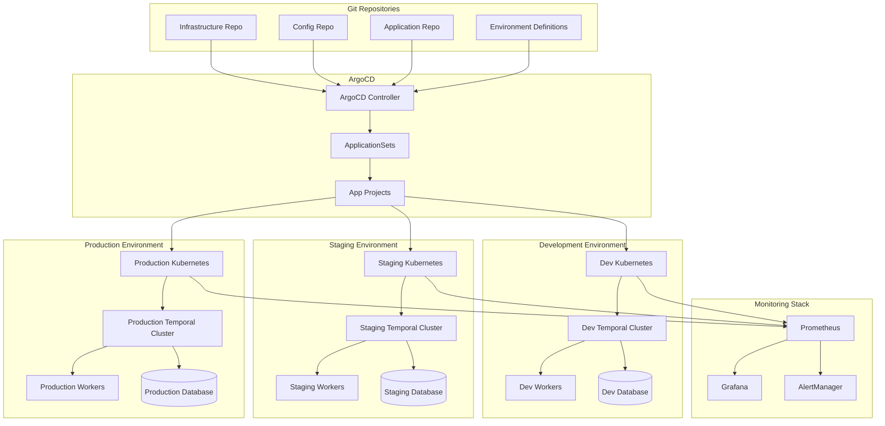
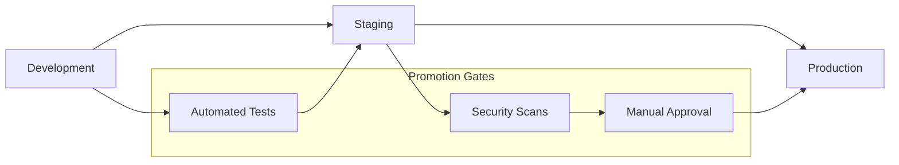

# Environment Management

This guide provides comprehensive strategies for managing multiple environments in Temporal.io deployments using GitOps patterns, ensuring consistent, scalable, and secure infrastructure across development, staging, and production environments.

## Overview

Environment management in GitOps involves:
- Declarative environment definitions
- Automated promotion pipelines
- Environment-specific configurations
- Security boundaries and access controls
- Monitoring and observability per environment
- Disaster recovery and backup strategies

## Architecture



## Environment Strategy

### Environment Types

#### Development Environment
- **Purpose**: Feature development and testing
- **Characteristics**: 
  - Shared resources
  - Relaxed security policies
  - Frequent deployments
  - Cost-optimized configurations
  - Extended logging and debugging

#### Staging Environment
- **Purpose**: Pre-production validation
- **Characteristics**:
  - Production-like configuration
  - Performance testing
  - Security validation
  - Data migration testing
  - User acceptance testing

#### Production Environment
- **Purpose**: Live workloads
- **Characteristics**:
  - High availability
  - Security hardened
  - Performance optimized
  - Comprehensive monitoring
  - Disaster recovery enabled

### Environment Lifecycle



## Repository Structure

### Environment Configuration Repository
```
temporal-environments/
├── environments/
│   ├── dev/
│   │   ├── kustomization.yaml
│   │   ├── namespace.yaml
│   │   ├── temporal/
│   │   │   ├── values.yaml
│   │   │   ├── server-config.yaml
│   │   │   └── worker-config.yaml
│   │   ├── observability/
│   │   │   ├── prometheus.yaml
│   │   │   ├── grafana.yaml
│   │   │   └── jaeger.yaml
│   │   └── security/
│   │       ├── rbac.yaml
│   │       ├── network-policies.yaml
│   │       └── pod-security.yaml
│   ├── staging/
│   │   ├── kustomization.yaml
│   │   ├── namespace.yaml
│   │   ├── temporal/
│   │   │   ├── values.yaml
│   │   │   ├── server-config.yaml
│   │   │   └── worker-config.yaml
│   │   ├── observability/
│   │   │   ├── prometheus.yaml
│   │   │   ├── grafana.yaml
│   │   │   └── jaeger.yaml
│   │   └── security/
│   │       ├── rbac.yaml
│   │       ├── network-policies.yaml
│   │       └── pod-security.yaml
│   └── production/
│       ├── kustomization.yaml
│       ├── namespace.yaml
│       ├── temporal/
│       │   ├── values.yaml
│       │   ├── server-config.yaml
│       │   └── worker-config.yaml
│       ├── observability/
│       │   ├── prometheus.yaml
│       │   ├── grafana.yaml
│       │   └── jaeger.yaml
│       └── security/
│           ├── rbac.yaml
│           ├── network-policies.yaml
│           └── pod-security.yaml
├── base/
│   ├── temporal/
│   │   ├── deployment.yaml
│   │   ├── service.yaml
│   │   ├── configmap.yaml
│   │   └── ingress.yaml
│   ├── observability/
│   │   ├── prometheus/
│   │   │   ├── deployment.yaml
│   │   │   ├── configmap.yaml
│   │   │   └── service.yaml
│   │   └── grafana/
│   │       ├── deployment.yaml
│   │       ├── configmap.yaml
│   │       └── service.yaml
│   └── security/
│       ├── rbac-template.yaml
│       ├── network-policy-template.yaml
│       └── pod-security-template.yaml
├── argocd/
│   ├── applications/
│   │   ├── dev-environment.yaml
│   │   ├── staging-environment.yaml
│   │   └── production-environment.yaml
│   ├── applicationsets/
│   │   └── temporal-environments.yaml
│   └── projects/
│       ├── temporal-dev.yaml
│       ├── temporal-staging.yaml
│       └── temporal-production.yaml
└── scripts/
    ├── promote-environment.sh
    ├── validate-environment.sh
    └── rollback-environment.sh
```

## Environment Definitions

### Base Configuration Template
```yaml
# base/temporal/deployment.yaml
apiVersion: apps/v1
kind: Deployment
metadata:
  name: temporal-server
  labels:
    app: temporal-server
    component: server
spec:
  selector:
    matchLabels:
      app: temporal-server
  template:
    metadata:
      labels:
        app: temporal-server
        component: server
    spec:
      containers:
      - name: temporal
        image: temporalio/auto-setup:1.22.0
        ports:
        - containerPort: 7233
          name: rpc
        - containerPort: 7234
          name: membership
        - containerPort: 7235
          name: history
        - containerPort: 7239
          name: worker
        env:
        - name: DB
          value: "postgresql"
        - name: DB_PORT
          value: "5432"
        - name: POSTGRES_USER
          valueFrom:
            secretKeyRef:
              name: temporal-postgres
              key: username
        - name: POSTGRES_PWD
          valueFrom:
            secretKeyRef:
              name: temporal-postgres
              key: password
        - name: POSTGRES_SEEDS
          valueFrom:
            configMapKeyRef:
              name: temporal-config
              key: postgres-hosts
        - name: DYNAMIC_CONFIG_FILE_PATH
          value: config/dynamicconfig/development.yaml
        volumeMounts:
        - name: config
          mountPath: /etc/temporal/config
        - name: dynamic-config
          mountPath: /etc/temporal/config/dynamicconfig
        resources:
          requests:
            memory: "512Mi"
            cpu: "250m"
          limits:
            memory: "1Gi"
            cpu: "500m"
      volumes:
      - name: config
        configMap:
          name: temporal-config
      - name: dynamic-config
        configMap:
          name: temporal-dynamic-config
```

### Development Environment
```yaml
# environments/dev/kustomization.yaml
apiVersion: kustomize.config.k8s.io/v1beta1
kind: Kustomization

namespace: temporal-dev

resources:
- ../../base/temporal
- ../../base/observability
- namespace.yaml

patchesStrategicMerge:
- temporal/values.yaml

configMapGenerator:
- name: temporal-config
  files:
  - temporal/server-config.yaml
- name: temporal-dynamic-config
  files:
  - temporal/dynamic-config.yaml

images:
- name: temporalio/auto-setup
  newTag: 1.22.0-dev

replicas:
- name: temporal-server
  count: 1

commonLabels:
  environment: development
  project: temporal
```

```yaml
# environments/dev/namespace.yaml
apiVersion: v1
kind: Namespace
metadata:
  name: temporal-dev
  labels:
    name: temporal-dev
    environment: development
    project: temporal
  annotations:
    argocd.argoproj.io/sync-wave: "0"
```

```yaml
# environments/dev/temporal/values.yaml
apiVersion: apps/v1
kind: Deployment
metadata:
  name: temporal-server
spec:
  replicas: 1
  template:
    spec:
      containers:
      - name: temporal
        env:
        - name: LOG_LEVEL
          value: debug
        - name: SERVICES
          value: history,matching,worker,frontend
        - name: TEMPORAL_CLI_ADDRESS
          value: temporal-server:7233
        resources:
          requests:
            memory: 256Mi
            cpu: 100m
          limits:
            memory: 512Mi
            cpu: 250m
```

### Staging Environment
```yaml
# environments/staging/kustomization.yaml
apiVersion: kustomize.config.k8s.io/v1beta1
kind: Kustomization

namespace: temporal-staging

resources:
- ../../base/temporal
- ../../base/observability
- ../../base/security
- namespace.yaml

patchesStrategicMerge:
- temporal/values.yaml
- security/rbac.yaml

configMapGenerator:
- name: temporal-config
  files:
  - temporal/server-config.yaml
- name: temporal-dynamic-config
  files:
  - temporal/dynamic-config.yaml

secretGenerator:
- name: temporal-tls
  files:
  - temporal/tls/ca.crt
  - temporal/tls/tls.crt
  - temporal/tls/tls.key

images:
- name: temporalio/auto-setup
  newTag: 1.22.0

replicas:
- name: temporal-server
  count: 2

commonLabels:
  environment: staging
  project: temporal
```

```yaml
# environments/staging/temporal/values.yaml
apiVersion: apps/v1
kind: Deployment
metadata:
  name: temporal-server
spec:
  replicas: 2
  template:
    spec:
      affinity:
        podAntiAffinity:
          preferredDuringSchedulingIgnoredDuringExecution:
          - weight: 100
            podAffinityTerm:
              labelSelector:
                matchLabels:
                  app: temporal-server
              topologyKey: kubernetes.io/hostname
      containers:
      - name: temporal
        env:
        - name: LOG_LEVEL
          value: info
        - name: SERVICES
          value: history,matching,worker,frontend
        - name: TLS_ENABLED
          value: "true"
        - name: TLS_CERT_FILE
          value: /etc/temporal/tls/tls.crt
        - name: TLS_KEY_FILE
          value: /etc/temporal/tls/tls.key
        - name: TLS_CA_FILE
          value: /etc/temporal/tls/ca.crt
        volumeMounts:
        - name: tls
          mountPath: /etc/temporal/tls
          readOnly: true
        resources:
          requests:
            memory: 512Mi
            cpu: 250m
          limits:
            memory: 1Gi
            cpu: 500m
      volumes:
      - name: tls
        secret:
          secretName: temporal-tls
```

### Production Environment
```yaml
# environments/production/kustomization.yaml
apiVersion: kustomize.config.k8s.io/v1beta1
kind: Kustomization

namespace: temporal-production

resources:
- ../../base/temporal
- ../../base/observability
- ../../base/security
- namespace.yaml

patchesStrategicMerge:
- temporal/values.yaml
- security/rbac.yaml
- security/network-policies.yaml
- security/pod-security.yaml

configMapGenerator:
- name: temporal-config
  files:
  - temporal/server-config.yaml
- name: temporal-dynamic-config
  files:
  - temporal/dynamic-config.yaml

secretGenerator:
- name: temporal-tls
  files:
  - temporal/tls/ca.crt
  - temporal/tls/tls.crt
  - temporal/tls/tls.key

images:
- name: temporalio/auto-setup
  newTag: 1.22.0

replicas:
- name: temporal-server
  count: 3

commonLabels:
  environment: production
  project: temporal
```

```yaml
# environments/production/temporal/values.yaml
apiVersion: apps/v1
kind: Deployment
metadata:
  name: temporal-server
spec:
  replicas: 3
  strategy:
    type: RollingUpdate
    rollingUpdate:
      maxUnavailable: 1
      maxSurge: 1
  template:
    spec:
      affinity:
        podAntiAffinity:
          requiredDuringSchedulingIgnoredDuringExecution:
          - labelSelector:
              matchLabels:
                app: temporal-server
            topologyKey: kubernetes.io/hostname
        nodeAffinity:
          requiredDuringSchedulingIgnoredDuringExecution:
            nodeSelectorTerms:
            - matchExpressions:
              - key: node-type
                operator: In
                values:
                - temporal
      tolerations:
      - key: temporal
        operator: Equal
        value: "true"
        effect: NoSchedule
      containers:
      - name: temporal
        env:
        - name: LOG_LEVEL
          value: warn
        - name: SERVICES
          value: history,matching,worker,frontend
        - name: TLS_ENABLED
          value: "true"
        - name: TLS_CERT_FILE
          value: /etc/temporal/tls/tls.crt
        - name: TLS_KEY_FILE
          value: /etc/temporal/tls/tls.key
        - name: TLS_CA_FILE
          value: /etc/temporal/tls/ca.crt
        - name: TEMPORAL_BROADCAST_ADDRESS
          valueFrom:
            fieldRef:
              fieldPath: status.podIP
        volumeMounts:
        - name: tls
          mountPath: /etc/temporal/tls
          readOnly: true
        resources:
          requests:
            memory: 2Gi
            cpu: 1000m
          limits:
            memory: 4Gi
            cpu: 2000m
        livenessProbe:
          exec:
            command:
            - temporal
            - workflow
            - list
            - --namespace
            - default
          initialDelaySeconds: 60
          periodSeconds: 30
          timeoutSeconds: 10
          failureThreshold: 3
        readinessProbe:
          exec:
            command:
            - temporal
            - workflow
            - list
            - --namespace
            - default
          initialDelaySeconds: 30
          periodSeconds: 10
          timeoutSeconds: 5
          failureThreshold: 3
      volumes:
      - name: tls
        secret:
          secretName: temporal-tls
```

## ArgoCD ApplicationSets

### Environment ApplicationSet
```yaml
# argocd/applicationsets/temporal-environments.yaml
apiVersion: argoproj.io/v1alpha1
kind: ApplicationSet
metadata:
  name: temporal-environments
  namespace: argocd
spec:
  generators:
  - git:
      repoURL: https://github.com/company/temporal-environments
      revision: HEAD
      directories:
      - path: environments/*
  - matrix:
      generators:
      - git:
          repoURL: https://github.com/company/temporal-environments
          revision: HEAD
          directories:
          - path: environments/*
      - clusters: {}
  template:
    metadata:
      name: '{{path.basename}}-{{cluster.name}}'
      labels:
        environment: '{{path.basename}}'
        cluster: '{{cluster.name}}'
    spec:
      project: 'temporal-{{path.basename}}'
      source:
        repoURL: https://github.com/company/temporal-environments
        targetRevision: HEAD
        path: '{{path}}'
      destination:
        server: '{{cluster.server}}'
        namespace: 'temporal-{{path.basename}}'
      syncPolicy:
        automated:
          prune: true
          selfHeal: true
        syncOptions:
        - CreateNamespace=true
        - ApplyOutOfSyncOnly=true
      ignoreDifferences:
      - group: apps
        kind: Deployment
        jsonPointers:
        - /spec/replicas
  syncPolicy:
    preserveResourcesOnDeletion: false
```

### Progressive Deployment ApplicationSet
```yaml
# argocd/applicationsets/progressive-deployment.yaml
apiVersion: argoproj.io/v1alpha1
kind: ApplicationSet
metadata:
  name: temporal-progressive-deployment
  namespace: argocd
spec:
  generators:
  - pullRequest:
      github:
        owner: company
        repo: temporal-environments
        tokenRef:
          secretName: github-token
          key: token
      requeueAfterSeconds: 300
  template:
    metadata:
      name: 'pr-{{number}}-{{head_sha}}'
      labels:
        pull-request: '{{number}}'
        branch: '{{branch}}'
    spec:
      project: temporal-dev
      source:
        repoURL: '{{head_sha}}'
        targetRevision: '{{head_sha}}'
        path: environments/dev
      destination:
        server: https://kubernetes.default.svc
        namespace: 'temporal-pr-{{number}}'
      syncPolicy:
        automated:
          prune: true
          selfHeal: true
        syncOptions:
        - CreateNamespace=true
      info:
      - name: 'Pull Request'
        value: 'https://github.com/company/temporal-environments/pull/{{number}}'
```

## Environment-Specific Configurations

### Security Configurations

#### Development Security
```yaml
# environments/dev/security/rbac.yaml
apiVersion: rbac.authorization.k8s.io/v1
kind: Role
metadata:
  namespace: temporal-dev
  name: temporal-dev-access
rules:
- apiGroups: [""]
  resources: ["pods", "services", "configmaps", "secrets"]
  verbs: ["get", "list", "watch", "create", "update", "patch", "delete"]
- apiGroups: ["apps"]
  resources: ["deployments", "replicasets"]
  verbs: ["get", "list", "watch", "create", "update", "patch", "delete"]

---
apiVersion: rbac.authorization.k8s.io/v1
kind: RoleBinding
metadata:
  name: temporal-dev-binding
  namespace: temporal-dev
subjects:
- kind: Group
  name: temporal-developers
  apiGroup: rbac.authorization.k8s.io
roleRef:
  kind: Role
  name: temporal-dev-access
  apiGroup: rbac.authorization.k8s.io
```

#### Production Security
```yaml
# environments/production/security/rbac.yaml
apiVersion: rbac.authorization.k8s.io/v1
kind: Role
metadata:
  namespace: temporal-production
  name: temporal-prod-readonly
rules:
- apiGroups: [""]
  resources: ["pods", "services", "configmaps"]
  verbs: ["get", "list", "watch"]
- apiGroups: ["apps"]
  resources: ["deployments", "replicasets"]
  verbs: ["get", "list", "watch"]

---
apiVersion: rbac.authorization.k8s.io/v1
kind: Role
metadata:
  namespace: temporal-production
  name: temporal-prod-admin
rules:
- apiGroups: [""]
  resources: ["*"]
  verbs: ["*"]
- apiGroups: ["apps"]
  resources: ["*"]
  verbs: ["*"]

---
apiVersion: rbac.authorization.k8s.io/v1
kind: RoleBinding
metadata:
  name: temporal-prod-readonly-binding
  namespace: temporal-production
subjects:
- kind: Group
  name: temporal-users
  apiGroup: rbac.authorization.k8s.io
roleRef:
  kind: Role
  name: temporal-prod-readonly
  apiGroup: rbac.authorization.k8s.io

---
apiVersion: rbac.authorization.k8s.io/v1
kind: RoleBinding
metadata:
  name: temporal-prod-admin-binding
  namespace: temporal-production
subjects:
- kind: Group
  name: temporal-admins
  apiGroup: rbac.authorization.k8s.io
roleRef:
  kind: Role
  name: temporal-prod-admin
  apiGroup: rbac.authorization.k8s.io
```

### Network Policies
```yaml
# environments/production/security/network-policies.yaml
apiVersion: networking.k8s.io/v1
kind: NetworkPolicy
metadata:
  name: temporal-server-netpol
  namespace: temporal-production
spec:
  podSelector:
    matchLabels:
      app: temporal-server
  policyTypes:
  - Ingress
  - Egress
  ingress:
  - from:
    - namespaceSelector:
        matchLabels:
          name: temporal-production
    - namespaceSelector:
        matchLabels:
          name: monitoring
    ports:
    - protocol: TCP
      port: 7233
    - protocol: TCP
      port: 7234
  egress:
  - to:
    - namespaceSelector:
        matchLabels:
          name: temporal-production
  - to: []
    ports:
    - protocol: TCP
      port: 5432  # PostgreSQL
    - protocol: TCP
      port: 53    # DNS
    - protocol: UDP
      port: 53    # DNS

---
apiVersion: networking.k8s.io/v1
kind: NetworkPolicy
metadata:
  name: deny-all-default
  namespace: temporal-production
spec:
  podSelector: {}
  policyTypes:
  - Ingress
  - Egress
```

### Pod Security Standards
```yaml
# environments/production/security/pod-security.yaml
apiVersion: v1
kind: Namespace
metadata:
  name: temporal-production
  labels:
    pod-security.kubernetes.io/enforce: restricted
    pod-security.kubernetes.io/audit: restricted
    pod-security.kubernetes.io/warn: restricted

---
apiVersion: policy/v1beta1
kind: PodSecurityPolicy
metadata:
  name: temporal-psp
  namespace: temporal-production
spec:
  privileged: false
  allowPrivilegeEscalation: false
  requiredDropCapabilities:
    - ALL
  volumes:
    - 'configMap'
    - 'emptyDir'
    - 'projected'
    - 'secret'
    - 'downwardAPI'
    - 'persistentVolumeClaim'
  runAsUser:
    rule: 'MustRunAsNonRoot'
  seLinux:
    rule: 'RunAsAny'
  fsGroup:
    rule: 'RunAsAny'
```

## Environment Promotion

### Promotion Workflow
```bash
#!/bin/bash
# scripts/promote-environment.sh

set -euo pipefail

SCRIPT_DIR="$(cd "$(dirname "${BASH_SOURCE[0]}")" && pwd)"
PROJECT_ROOT="$(dirname "$SCRIPT_DIR")"

# Configuration
SOURCE_ENV=""
TARGET_ENV=""
DRY_RUN="false"
AUTO_APPROVE="false"

log() {
    echo -e "\033[0;32m[$(date +'%Y-%m-%d %H:%M:%S')] $1\033[0m"
}

error() {
    echo -e "\033[0;31m[$(date +'%Y-%m-%d %H:%M:%S')] ERROR: $1\033[0m"
    exit 1
}

warn() {
    echo -e "\033[1;33m[$(date +'%Y-%m-%d %H:%M:%S')] WARNING: $1\033[0m"
}

usage() {
    cat << EOF
Usage: $0 [OPTIONS]

Options:
    -s, --source-env ENV        Source environment (dev, staging)
    -t, --target-env ENV        Target environment (staging, production)
    -d, --dry-run              Perform dry run without applying changes
    -a, --auto-approve         Skip manual approval prompts
    -h, --help                 Show this help message

Examples:
    $0 --source-env dev --target-env staging
    $0 --source-env staging --target-env production --dry-run
EOF
}

validate_environments() {
    local valid_envs=("dev" "staging" "production")
    
    if [[ ! " ${valid_envs[@]} " =~ " ${SOURCE_ENV} " ]]; then
        error "Invalid source environment: $SOURCE_ENV"
    fi
    
    if [[ ! " ${valid_envs[@]} " =~ " ${TARGET_ENV} " ]]; then
        error "Invalid target environment: $TARGET_ENV"
    fi
    
    if [[ "$SOURCE_ENV" == "$TARGET_ENV" ]]; then
        error "Source and target environments cannot be the same"
    fi
    
    # Validate promotion path
    case "$SOURCE_ENV:$TARGET_ENV" in
        "dev:staging"|"staging:production")
            log "✓ Valid promotion path: $SOURCE_ENV → $TARGET_ENV"
            ;;
        *)
            error "Invalid promotion path: $SOURCE_ENV → $TARGET_ENV. Valid paths: dev→staging, staging→production"
            ;;
    esac
}

get_current_versions() {
    local env="$1"
    local env_file="$PROJECT_ROOT/environments/$env/kustomization.yaml"
    
    if [[ ! -f "$env_file" ]]; then
        error "Environment file not found: $env_file"
    fi
    
    # Extract image versions
    yq eval '.images[] | .name + ":" + .newTag' "$env_file"
}

run_tests() {
    local env="$1"
    
    log "Running validation tests for $env environment..."
    
    # Kustomize validation
    if ! kustomize build "$PROJECT_ROOT/environments/$env" > /dev/null; then
        error "Kustomize validation failed for $env environment"
    fi
    
    # Kubernetes validation
    if ! kustomize build "$PROJECT_ROOT/environments/$env" | kubectl apply --dry-run=client -f -; then
        error "Kubernetes validation failed for $env environment"
    fi
    
    # Security scanning
    if command -v kubesec &> /dev/null; then
        log "Running security scan..."
        kustomize build "$PROJECT_ROOT/environments/$env" | kubesec scan -
    fi
    
    # Policy validation
    if command -v conftest &> /dev/null; then
        log "Running policy validation..."
        kustomize build "$PROJECT_ROOT/environments/$env" | conftest verify --policy "$PROJECT_ROOT/policies/"
    fi
    
    log "✓ All validation tests passed for $env environment"
}

promote_configuration() {
    local source_env="$1"
    local target_env="$2"
    
    log "Promoting configuration from $source_env to $target_env..."
    
    # Get source versions
    local source_file="$PROJECT_ROOT/environments/$source_env/kustomization.yaml"
    local target_file="$PROJECT_ROOT/environments/$target_env/kustomization.yaml"
    
    # Create backup
    cp "$target_file" "$target_file.backup.$(date +%Y%m%d_%H%M%S)"
    
    # Extract and update image versions
    while IFS= read -r image_line; do
        local image_name=$(echo "$image_line" | cut -d: -f1)
        local new_tag=$(echo "$image_line" | cut -d: -f2)
        
        log "Updating $image_name to $new_tag in $target_env"
        
        # Update the target kustomization file
        yq eval "(.images[] | select(.name == \"$image_name\") | .newTag) = \"$new_tag\"" -i "$target_file"
    done < <(get_current_versions "$source_env")
    
    log "✓ Configuration promoted successfully"
}

create_pull_request() {
    local source_env="$1"
    local target_env="$2"
    
    # Create feature branch
    local branch_name="promote-${source_env}-to-${target_env}-$(date +%Y%m%d_%H%M%S)"
    
    git checkout -b "$branch_name"
    git add .
    git commit -m "Promote $source_env configuration to $target_env

    - Updated image versions from $source_env environment
    - Validated configurations and security policies
    - Ready for $target_env deployment"
    
    git push origin "$branch_name"
    
    # Create PR using GitHub CLI if available
    if command -v gh &> /dev/null; then
        gh pr create \
            --title "Promote $source_env to $target_env" \
            --body "Automated promotion of configuration from $source_env to $target_env environment." \
            --label "promotion" \
            --label "$target_env"
    else
        log "GitHub CLI not available. Please create PR manually for branch: $branch_name"
    fi
}

main() {
    # Parse arguments
    while [[ $# -gt 0 ]]; do
        case $1 in
            -s|--source-env)
                SOURCE_ENV="$2"
                shift 2
                ;;
            -t|--target-env)
                TARGET_ENV="$2"
                shift 2
                ;;
            -d|--dry-run)
                DRY_RUN="true"
                shift
                ;;
            -a|--auto-approve)
                AUTO_APPROVE="true"
                shift
                ;;
            -h|--help)
                usage
                exit 0
                ;;
            *)
                error "Unknown option: $1"
                ;;
        esac
    done
    
    # Validate required parameters
    if [[ -z "$SOURCE_ENV" || -z "$TARGET_ENV" ]]; then
        error "Source and target environments are required"
    fi
    
    validate_environments
    
    log "Starting promotion: $SOURCE_ENV → $TARGET_ENV"
    
    # Show current versions
    log "Current versions in $SOURCE_ENV:"
    get_current_versions "$SOURCE_ENV"
    
    log "Current versions in $TARGET_ENV:"
    get_current_versions "$TARGET_ENV"
    
    # Run validation tests
    run_tests "$SOURCE_ENV"
    run_tests "$TARGET_ENV"
    
    # Manual approval for production
    if [[ "$TARGET_ENV" == "production" && "$AUTO_APPROVE" != "true" ]]; then
        echo
        warn "PRODUCTION DEPLOYMENT DETECTED"
        echo "Source Environment: $SOURCE_ENV"
        echo "Target Environment: $TARGET_ENV"
        echo
        read -p "Are you sure you want to promote to production? (yes/no): " confirm
        
        if [[ "$confirm" != "yes" ]]; then
            log "Promotion cancelled by user"
            exit 0
        fi
    fi
    
    if [[ "$DRY_RUN" == "true" ]]; then
        log "DRY RUN: Would promote $SOURCE_ENV configuration to $TARGET_ENV"
        exit 0
    fi
    
    # Perform promotion
    promote_configuration "$SOURCE_ENV" "$TARGET_ENV"
    
    # Validate promoted configuration
    run_tests "$TARGET_ENV"
    
    # Create pull request
    create_pull_request "$SOURCE_ENV" "$TARGET_ENV"
    
    log "✓ Promotion completed successfully!"
}

main "$@"
```

### Environment Validation
```bash
#!/bin/bash
# scripts/validate-environment.sh

set -euo pipefail

ENVIRONMENT=""
VERBOSE="false"

log() {
    echo -e "\033[0;32m[$(date +'%Y-%m-%d %H:%M:%S')] $1\033[0m"
}

error() {
    echo -e "\033[0;31m[$(date +'%Y-%m-%d %H:%M:%S')] ERROR: $1\033[0m"
    exit 1
}

verbose() {
    if [[ "$VERBOSE" == "true" ]]; then
        echo -e "\033[0;36m[$(date +'%Y-%m-%d %H:%M:%S')] $1\033[0m"
    fi
}

usage() {
    cat << EOF
Usage: $0 [OPTIONS]

Options:
    -e, --environment ENV      Environment to validate (dev, staging, production)
    -v, --verbose             Enable verbose output
    -h, --help                Show this help message

Examples:
    $0 --environment dev
    $0 --environment production --verbose
EOF
}

validate_structure() {
    local env="$1"
    local env_dir="environments/$env"
    
    log "Validating structure for $env environment..."
    
    # Check required files
    local required_files=(
        "$env_dir/kustomization.yaml"
        "$env_dir/namespace.yaml"
        "$env_dir/temporal/values.yaml"
    )
    
    for file in "${required_files[@]}"; do
        if [[ ! -f "$file" ]]; then
            error "Required file missing: $file"
        fi
        verbose "✓ Found: $file"
    done
    
    log "✓ Structure validation passed"
}

validate_syntax() {
    local env="$1"
    local env_dir="environments/$env"
    
    log "Validating YAML syntax for $env environment..."
    
    # Validate all YAML files
    while IFS= read -r -d '' file; do
        if ! yq eval '.' "$file" > /dev/null 2>&1; then
            error "Invalid YAML syntax in: $file"
        fi
        verbose "✓ Valid YAML: $file"
    done < <(find "$env_dir" -name "*.yaml" -print0)
    
    log "✓ YAML syntax validation passed"
}

validate_kustomize() {
    local env="$1"
    local env_dir="environments/$env"
    
    log "Validating Kustomize build for $env environment..."
    
    if ! kustomize build "$env_dir" > /dev/null; then
        error "Kustomize build failed for $env environment"
    fi
    
    verbose "✓ Kustomize build successful"
    log "✓ Kustomize validation passed"
}

validate_kubernetes() {
    local env="$1"
    local env_dir="environments/$env"
    
    log "Validating Kubernetes manifests for $env environment..."
    
    # Dry-run apply
    if ! kustomize build "$env_dir" | kubectl apply --dry-run=client -f -; then
        error "Kubernetes manifest validation failed for $env environment"
    fi
    
    log "✓ Kubernetes validation passed"
}

validate_security() {
    local env="$1"
    local env_dir="environments/$env"
    
    log "Validating security policies for $env environment..."
    
    # Check for security configurations in production
    if [[ "$env" == "production" ]]; then
        local security_files=(
            "$env_dir/security/rbac.yaml"
            "$env_dir/security/network-policies.yaml"
            "$env_dir/security/pod-security.yaml"
        )
        
        for file in "${security_files[@]}"; do
            if [[ ! -f "$file" ]]; then
                error "Security file missing in production: $file"
            fi
            verbose "✓ Found security file: $file"
        done
    fi
    
    # Validate with kubesec if available
    if command -v kubesec &> /dev/null; then
        verbose "Running kubesec security scan..."
        local temp_file=$(mktemp)
        kustomize build "$env_dir" > "$temp_file"
        
        if ! kubesec scan "$temp_file" | jq -e '.[] | select(.score < 0)' > /dev/null; then
            verbose "✓ Security scan passed"
        else
            warn "Security scan found issues. Review kubesec output."
        fi
        
        rm "$temp_file"
    fi
    
    log "✓ Security validation passed"
}

validate_resources() {
    local env="$1"
    local env_dir="environments/$env"
    
    log "Validating resource configurations for $env environment..."
    
    # Extract and validate resource configurations
    local temp_file=$(mktemp)
    kustomize build "$env_dir" > "$temp_file"
    
    # Check that all containers have resource limits
    local containers_without_limits=$(kubectl apply --dry-run=client -f "$temp_file" -o json | \
        jq -r '.items[] | select(.kind == "Deployment") | 
               .spec.template.spec.containers[] | 
               select(.resources.limits == null) | 
               .name' || true)
    
    if [[ -n "$containers_without_limits" ]]; then
        warn "Containers without resource limits found: $containers_without_limits"
    else
        verbose "✓ All containers have resource limits"
    fi
    
    # Validate environment-specific resource requirements
    case "$env" in
        "dev")
            # Check that dev has minimal resources
            ;;
        "staging")
            # Check that staging has moderate resources
            ;;
        "production")
            # Check that production has adequate resources
            local min_memory="1Gi"
            local min_cpu="500m"
            ;;
    esac
    
    rm "$temp_file"
    log "✓ Resource validation passed"
}

validate_environment_specific() {
    local env="$1"
    
    log "Running environment-specific validations for $env..."
    
    case "$env" in
        "dev")
            # Development-specific validations
            verbose "Validating development environment specifics..."
            ;;
        "staging")
            # Staging-specific validations
            verbose "Validating staging environment specifics..."
            ;;
        "production")
            # Production-specific validations
            verbose "Validating production environment specifics..."
            
            # Ensure high availability
            local env_dir="environments/$env"
            local replicas=$(kustomize build "$env_dir" | yq eval 'select(.kind == "Deployment") | .spec.replicas' -)
            if [[ "$replicas" -lt 2 ]]; then
                warn "Production deployment should have at least 2 replicas for high availability"
            fi
            ;;
    esac
    
    log "✓ Environment-specific validation passed"
}

main() {
    # Parse arguments
    while [[ $# -gt 0 ]]; do
        case $1 in
            -e|--environment)
                ENVIRONMENT="$2"
                shift 2
                ;;
            -v|--verbose)
                VERBOSE="true"
                shift
                ;;
            -h|--help)
                usage
                exit 0
                ;;
            *)
                error "Unknown option: $1"
                ;;
        esac
    done
    
    # Validate required parameters
    if [[ -z "$ENVIRONMENT" ]]; then
        error "Environment is required"
    fi
    
    # Validate environment
    local valid_envs=("dev" "staging" "production")
    if [[ ! " ${valid_envs[@]} " =~ " ${ENVIRONMENT} " ]]; then
        error "Invalid environment: $ENVIRONMENT. Valid options: ${valid_envs[*]}"
    fi
    
    log "Starting validation for $ENVIRONMENT environment..."
    
    # Run all validations
    validate_structure "$ENVIRONMENT"
    validate_syntax "$ENVIRONMENT"
    validate_kustomize "$ENVIRONMENT"
    validate_kubernetes "$ENVIRONMENT"
    validate_security "$ENVIRONMENT"
    validate_resources "$ENVIRONMENT"
    validate_environment_specific "$ENVIRONMENT"
    
    log "✅ All validations passed for $ENVIRONMENT environment!"
}

main "$@"
```

## Monitoring and Observability

### Environment-Specific Monitoring
```yaml
# environments/production/observability/prometheus.yaml
apiVersion: v1
kind: ConfigMap
metadata:
  name: prometheus-config
  namespace: temporal-production
data:
  prometheus.yml: |
    global:
      scrape_interval: 15s
      evaluation_interval: 15s
    
    rule_files:
      - "temporal-rules.yml"
      - "infrastructure-rules.yml"
    
    scrape_configs:
    - job_name: 'temporal-server'
      kubernetes_sd_configs:
      - role: endpoints
        namespaces:
          names:
          - temporal-production
      relabel_configs:
      - source_labels: [__meta_kubernetes_service_name]
        action: keep
        regex: temporal-server
      - source_labels: [__meta_kubernetes_endpoint_port_name]
        action: keep
        regex: metrics
      - source_labels: [__meta_kubernetes_pod_name]
        target_label: pod
      - source_labels: [__meta_kubernetes_service_name]
        target_label: service
      - target_label: environment
        replacement: production
    
    - job_name: 'temporal-workers'
      kubernetes_sd_configs:
      - role: endpoints
        namespaces:
          names:
          - temporal-production
      relabel_configs:
      - source_labels: [__meta_kubernetes_service_name]
        action: keep
        regex: temporal-worker
      - target_label: environment
        replacement: production
    
    alerting:
      alertmanagers:
      - static_configs:
        - targets:
          - alertmanager.monitoring.svc.cluster.local:9093
```

### Environment Health Checks
```yaml
# argocd/applications/environment-health.yaml
apiVersion: argoproj.io/v1alpha1
kind: Application
metadata:
  name: environment-health-checks
  namespace: argocd
spec:
  project: temporal-monitoring
  source:
    repoURL: https://github.com/company/temporal-environments
    targetRevision: HEAD
    path: monitoring/health-checks
  destination:
    server: https://kubernetes.default.svc
    namespace: temporal-monitoring
  syncPolicy:
    automated:
      prune: true
      selfHeal: true
    syncOptions:
    - CreateNamespace=true
```

## Disaster Recovery

### Environment Backup Strategy
```bash
#!/bin/bash
# scripts/backup-environment.sh

set -euo pipefail

ENVIRONMENT=""
BACKUP_LOCATION=""

backup_environment() {
    local env="$1"
    local backup_dir="$2/$(date +%Y%m%d_%H%M%S)"
    
    mkdir -p "$backup_dir"
    
    # Backup Kubernetes resources
    kubectl get all -n "temporal-$env" -o yaml > "$backup_dir/k8s-resources.yaml"
    kubectl get secrets -n "temporal-$env" -o yaml > "$backup_dir/secrets.yaml"
    kubectl get configmaps -n "temporal-$env" -o yaml > "$backup_dir/configmaps.yaml"
    
    # Backup Git configuration
    tar -czf "$backup_dir/git-config.tar.gz" "environments/$env"
    
    # Backup database if applicable
    if kubectl get secret temporal-postgres -n "temporal-$env" &> /dev/null; then
        pg_dump "$(kubectl get secret temporal-postgres -n "temporal-$env" -o jsonpath='{.data.connection-string}' | base64 -d)" > "$backup_dir/database.sql"
    fi
    
    log "✓ Environment backup completed: $backup_dir"
}
```

This comprehensive environment management guide provides enterprise-grade GitOps practices for managing multiple Temporal.io environments with proper security, monitoring, and operational procedures.
