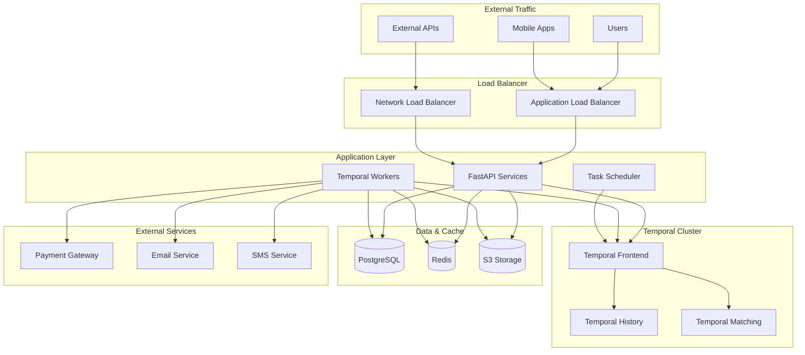

# Application Deployment

This guide provides comprehensive deployment instructions for Temporal.io application services including workers, FastAPI services, and supporting infrastructure in enterprise environments.

## Overview

The application deployment includes:
- Temporal workers for workflow and activity execution
- FastAPI services for REST API functionality
- Application configuration management
- Service mesh integration
- Auto-scaling and load balancing
- Monitoring and observability

## Architecture Components

### Application Services



## FastAPI Service Deployment

### Deployment Configuration
```yaml
# k8s/applications/fastapi/deployment.yaml
apiVersion: apps/v1
kind: Deployment
metadata:
  name: temporal-api
  namespace: temporal-app
  labels:
    app.kubernetes.io/name: temporal-api
    app.kubernetes.io/component: api
    app.kubernetes.io/part-of: temporal-app
spec:
  replicas: 3
  strategy:
    type: RollingUpdate
    rollingUpdate:
      maxUnavailable: 1
      maxSurge: 1
  selector:
    matchLabels:
      app.kubernetes.io/name: temporal-api
  template:
    metadata:
      labels:
        app.kubernetes.io/name: temporal-api
        app.kubernetes.io/component: api
        app.kubernetes.io/part-of: temporal-app
      annotations:
        prometheus.io/scrape: "true"
        prometheus.io/port: "8000"
        prometheus.io/path: "/metrics"
    spec:
      serviceAccountName: temporal-api
      
      containers:
      - name: api
        image: your-registry.com/temporal-api:latest
        imagePullPolicy: Always
        
        ports:
        - containerPort: 8000
          name: http
          protocol: TCP
        
        env:
        - name: ENVIRONMENT
          value: "production"
        - name: LOG_LEVEL
          value: "INFO"
        - name: TEMPORAL_SERVER_URL
          value: "temporal-frontend.temporal-system.svc.cluster.local:7233"
        - name: TEMPORAL_NAMESPACE
          value: "default"
        - name: DATABASE_URL
          valueFrom:
            secretKeyRef:
              name: app-database-credentials
              key: connection_string
        - name: REDIS_URL
          valueFrom:
            secretKeyRef:
              name: app-redis-credentials
              key: connection_string
        - name: JWT_SECRET
          valueFrom:
            secretKeyRef:
              name: app-secrets
              key: jwt_secret
        - name: ENCRYPTION_KEY
          valueFrom:
            secretKeyRef:
              name: app-secrets
              key: encryption_key
        
        resources:
          requests:
            memory: "512Mi"
            cpu: "250m"
          limits:
            memory: "1Gi"
            cpu: "500m"
        
        livenessProbe:
          httpGet:
            path: /health
            port: 8000
          initialDelaySeconds: 30
          periodSeconds: 10
          timeoutSeconds: 5
          failureThreshold: 3
        
        readinessProbe:
          httpGet:
            path: /ready
            port: 8000
          initialDelaySeconds: 5
          periodSeconds: 5
          timeoutSeconds: 3
          failureThreshold: 3
        
        securityContext:
          allowPrivilegeEscalation: false
          readOnlyRootFilesystem: true
          runAsNonRoot: true
          runAsUser: 10001
          runAsGroup: 10001
          capabilities:
            drop:
            - ALL
        
        volumeMounts:
        - name: tmp
          mountPath: /tmp
        - name: cache
          mountPath: /app/cache
        - name: temporal-certs
          mountPath: /etc/temporal/certs
          readOnly: true
      
      volumes:
      - name: tmp
        emptyDir: {}
      - name: cache
        emptyDir: {}
      - name: temporal-certs
        secret:
          secretName: temporal-tls-secret
      
      securityContext:
        runAsNonRoot: true
        runAsUser: 10001
        runAsGroup: 10001
        fsGroup: 10001
      
      affinity:
        podAntiAffinity:
          preferredDuringSchedulingIgnoredDuringExecution:
          - weight: 100
            podAffinityTerm:
              labelSelector:
                matchExpressions:
                - key: app.kubernetes.io/name
                  operator: In
                  values:
                  - temporal-api
              topologyKey: kubernetes.io/hostname
```

### Service Configuration
```yaml
# k8s/applications/fastapi/service.yaml
apiVersion: v1
kind: Service
metadata:
  name: temporal-api
  namespace: temporal-app
  labels:
    app.kubernetes.io/name: temporal-api
    app.kubernetes.io/component: api
spec:
  type: ClusterIP
  ports:
  - port: 80
    targetPort: 8000
    protocol: TCP
    name: http
  selector:
    app.kubernetes.io/name: temporal-api

---
apiVersion: v1
kind: Service
metadata:
  name: temporal-api-external
  namespace: temporal-app
  annotations:
    service.beta.kubernetes.io/aws-load-balancer-type: "alb"
    service.beta.kubernetes.io/aws-load-balancer-scheme: "internet-facing"
    service.beta.kubernetes.io/aws-load-balancer-target-type: "ip"
    service.beta.kubernetes.io/aws-load-balancer-healthcheck-path: "/health"
    service.beta.kubernetes.io/aws-load-balancer-ssl-redirect: "443"
spec:
  type: LoadBalancer
  ports:
  - port: 80
    targetPort: 8000
    protocol: TCP
    name: http
  - port: 443
    targetPort: 8000
    protocol: TCP
    name: https
  selector:
    app.kubernetes.io/name: temporal-api
```

### Auto-scaling Configuration
```yaml
# k8s/applications/fastapi/hpa.yaml
apiVersion: autoscaling/v2
kind: HorizontalPodAutoscaler
metadata:
  name: temporal-api-hpa
  namespace: temporal-app
spec:
  scaleTargetRef:
    apiVersion: apps/v1
    kind: Deployment
    name: temporal-api
  minReplicas: 3
  maxReplicas: 20
  metrics:
  - type: Resource
    resource:
      name: cpu
      target:
        type: Utilization
        averageUtilization: 70
  - type: Resource
    resource:
      name: memory
      target:
        type: Utilization
        averageUtilization: 80
  - type: Pods
    pods:
      metric:
        name: http_requests_per_second
      target:
        type: AverageValue
        averageValue: "100"
  behavior:
    scaleDown:
      stabilizationWindowSeconds: 300
      policies:
      - type: Percent
        value: 50
        periodSeconds: 60
    scaleUp:
      stabilizationWindowSeconds: 60
      policies:
      - type: Percent
        value: 100
        periodSeconds: 60
      - type: Pods
        value: 2
        periodSeconds: 60
      selectPolicy: Max
```

## Temporal Workers Deployment

### Worker Deployment Configuration
```yaml
# k8s/applications/workers/deployment.yaml
apiVersion: apps/v1
kind: Deployment
metadata:
  name: temporal-worker
  namespace: temporal-app
  labels:
    app.kubernetes.io/name: temporal-worker
    app.kubernetes.io/component: worker
    app.kubernetes.io/part-of: temporal-app
spec:
  replicas: 5
  strategy:
    type: RollingUpdate
    rollingUpdate:
      maxUnavailable: 1
      maxSurge: 1
  selector:
    matchLabels:
      app.kubernetes.io/name: temporal-worker
  template:
    metadata:
      labels:
        app.kubernetes.io/name: temporal-worker
        app.kubernetes.io/component: worker
        app.kubernetes.io/part-of: temporal-app
      annotations:
        prometheus.io/scrape: "true"
        prometheus.io/port: "9090"
        prometheus.io/path: "/metrics"
    spec:
      serviceAccountName: temporal-worker
      
      containers:
      - name: worker
        image: your-registry.com/temporal-worker:latest
        imagePullPolicy: Always
        
        ports:
        - containerPort: 9090
          name: metrics
          protocol: TCP
        
        env:
        - name: ENVIRONMENT
          value: "production"
        - name: LOG_LEVEL
          value: "INFO"
        - name: TEMPORAL_SERVER_URL
          value: "temporal-frontend.temporal-system.svc.cluster.local:7233"
        - name: TEMPORAL_NAMESPACE
          value: "default"
        - name: TASK_QUEUE
          value: "temporal-product-queue"
        - name: WORKER_IDENTITY
          valueFrom:
            fieldRef:
              fieldPath: metadata.name
        - name: MAX_CONCURRENT_WORKFLOW_TASKS
          value: "100"
        - name: MAX_CONCURRENT_ACTIVITY_TASKS
          value: "1000"
        - name: DATABASE_URL
          valueFrom:
            secretKeyRef:
              name: app-database-credentials
              key: connection_string
        - name: REDIS_URL
          valueFrom:
            secretKeyRef:
              name: app-redis-credentials
              key: connection_string
        - name: PAYMENT_API_KEY
          valueFrom:
            secretKeyRef:
              name: external-api-keys
              key: payment_api_key
        - name: EMAIL_API_KEY
          valueFrom:
            secretKeyRef:
              name: external-api-keys
              key: email_api_key
        - name: SMS_API_KEY
          valueFrom:
            secretKeyRef:
              name: external-api-keys
              key: sms_api_key
        
        resources:
          requests:
            memory: "1Gi"
            cpu: "500m"
          limits:
            memory: "2Gi"
            cpu: "1000m"
        
        livenessProbe:
          httpGet:
            path: /health
            port: 9090
          initialDelaySeconds: 60
          periodSeconds: 30
          timeoutSeconds: 10
          failureThreshold: 3
        
        readinessProbe:
          httpGet:
            path: /ready
            port: 9090
          initialDelaySeconds: 10
          periodSeconds: 10
          timeoutSeconds: 5
          failureThreshold: 3
        
        securityContext:
          allowPrivilegeEscalation: false
          readOnlyRootFilesystem: true
          runAsNonRoot: true
          runAsUser: 10001
          runAsGroup: 10001
          capabilities:
            drop:
            - ALL
        
        volumeMounts:
        - name: tmp
          mountPath: /tmp
        - name: cache
          mountPath: /app/cache
        - name: temporal-certs
          mountPath: /etc/temporal/certs
          readOnly: true
      
      volumes:
      - name: tmp
        emptyDir: {}
      - name: cache
        emptyDir: {}
      - name: temporal-certs
        secret:
          secretName: temporal-tls-secret
      
      securityContext:
        runAsNonRoot: true
        runAsUser: 10001
        runAsGroup: 10001
        fsGroup: 10001
      
      affinity:
        podAntiAffinity:
          preferredDuringSchedulingIgnoredDuringExecution:
          - weight: 100
            podAffinityTerm:
              labelSelector:
                matchExpressions:
                - key: app.kubernetes.io/name
                  operator: In
                  values:
                  - temporal-worker
              topologyKey: kubernetes.io/hostname
```

### Worker Service Configuration
```yaml
# k8s/applications/workers/service.yaml
apiVersion: v1
kind: Service
metadata:
  name: temporal-worker
  namespace: temporal-app
  labels:
    app.kubernetes.io/name: temporal-worker
    app.kubernetes.io/component: worker
spec:
  type: ClusterIP
  ports:
  - port: 9090
    targetPort: 9090
    protocol: TCP
    name: metrics
  selector:
    app.kubernetes.io/name: temporal-worker
```

### Worker Auto-scaling Configuration
```yaml
# k8s/applications/workers/hpa.yaml
apiVersion: autoscaling/v2
kind: HorizontalPodAutoscaler
metadata:
  name: temporal-worker-hpa
  namespace: temporal-app
spec:
  scaleTargetRef:
    apiVersion: apps/v1
    kind: Deployment
    name: temporal-worker
  minReplicas: 3
  maxReplicas: 50
  metrics:
  - type: Resource
    resource:
      name: cpu
      target:
        type: Utilization
        averageUtilization: 70
  - type: Resource
    resource:
      name: memory
      target:
        type: Utilization
        averageUtilization: 80
  - type: External
    external:
      metric:
        name: temporal_task_queue_backlog
        selector:
          matchLabels:
            task_queue: "temporal-product-queue"
      target:
        type: AverageValue
        averageValue: "10"
  behavior:
    scaleDown:
      stabilizationWindowSeconds: 600  # 10 minutes
      policies:
      - type: Percent
        value: 25
        periodSeconds: 300  # 5 minutes
    scaleUp:
      stabilizationWindowSeconds: 60
      policies:
      - type: Percent
        value: 100
        periodSeconds: 60
      - type: Pods
        value: 5
        periodSeconds: 60
      selectPolicy: Max
```

## Application Secrets Management

### Database Credentials
```yaml
# k8s/applications/secrets/database-credentials.yaml
apiVersion: external-secrets.io/v1beta1
kind: ExternalSecret
metadata:
  name: app-database-credentials
  namespace: temporal-app
spec:
  refreshInterval: 1h
  secretStoreRef:
    name: vault-backend
    kind: SecretStore
  target:
    name: app-database-credentials
    creationPolicy: Owner
    template:
      type: Opaque
      data:
        host: "{{ .host }}"
        port: "{{ .port }}"
        database: "{{ .database }}"
        username: "{{ .username }}"
        password: "{{ .password }}"
        connection_string: "postgresql://{{ .username }}:{{ .password }}@{{ .host }}:{{ .port }}/{{ .database }}?sslmode=require"
  data:
  - secretKey: host
    remoteRef:
      key: temporal/app/database
      property: host
  - secretKey: port
    remoteRef:
      key: temporal/app/database
      property: port
  - secretKey: database
    remoteRef:
      key: temporal/app/database
      property: database
  - secretKey: username
    remoteRef:
      key: temporal/app/database
      property: username
  - secretKey: password
    remoteRef:
      key: temporal/app/database
      property: password
```

### Application Secrets
```yaml
# k8s/applications/secrets/app-secrets.yaml
apiVersion: external-secrets.io/v1beta1
kind: ExternalSecret
metadata:
  name: app-secrets
  namespace: temporal-app
spec:
  refreshInterval: 1h
  secretStoreRef:
    name: vault-backend
    kind: SecretStore
  target:
    name: app-secrets
    creationPolicy: Owner
  data:
  - secretKey: jwt_secret
    remoteRef:
      key: temporal/app/auth
      property: jwt_secret
  - secretKey: encryption_key
    remoteRef:
      key: temporal/app/auth
      property: encryption_key
  - secretKey: api_key
    remoteRef:
      key: temporal/app/auth
      property: api_key

---
apiVersion: external-secrets.io/v1beta1
kind: ExternalSecret
metadata:
  name: external-api-keys
  namespace: temporal-app
spec:
  refreshInterval: 1h
  secretStoreRef:
    name: vault-backend
    kind: SecretStore
  target:
    name: external-api-keys
    creationPolicy: Owner
  data:
  - secretKey: payment_api_key
    remoteRef:
      key: temporal/app/external
      property: payment_api_key
  - secretKey: email_api_key
    remoteRef:
      key: temporal/app/external
      property: email_api_key
  - secretKey: sms_api_key
    remoteRef:
      key: temporal/app/external
      property: sms_api_key
```

## Configuration Management

### ConfigMaps
```yaml
# k8s/applications/config/app-config.yaml
apiVersion: v1
kind: ConfigMap
metadata:
  name: app-config
  namespace: temporal-app
data:
  # Application configuration
  app.yaml: |
    server:
      host: "0.0.0.0"
      port: 8000
      workers: 4
      timeout: 30
      max_requests: 1000
    
    temporal:
      server_url: "temporal-frontend.temporal-system.svc.cluster.local:7233"
      namespace: "default"
      task_queue: "temporal-product-queue"
      tls:
        enabled: true
        cert_file: "/etc/temporal/certs/tls.crt"
        key_file: "/etc/temporal/certs/tls.key"
        ca_file: "/etc/temporal/certs/ca.crt"
    
    logging:
      level: "INFO"
      format: "json"
      handlers:
        - "console"
        - "file"
      file_path: "/app/logs/app.log"
    
    metrics:
      enabled: true
      port: 9090
      path: "/metrics"
    
    health:
      enabled: true
      path: "/health"
      checks:
        - "database"
        - "redis"
        - "temporal"
    
    cache:
      type: "redis"
      ttl: 3600
      max_connections: 10
    
    external_services:
      payment_gateway:
        base_url: "https://api.payment.com"
        timeout: 30
        retries: 3
      email_service:
        base_url: "https://api.email.com"
        timeout: 10
        retries: 2
      sms_service:
        base_url: "https://api.sms.com"
        timeout: 10
        retries: 2

---
apiVersion: v1
kind: ConfigMap
metadata:
  name: worker-config
  namespace: temporal-app
data:
  # Worker configuration
  worker.yaml: |
    worker:
      identity: "${WORKER_IDENTITY}"
      max_concurrent_workflow_tasks: 100
      max_concurrent_activity_tasks: 1000
      max_concurrent_local_activity_tasks: 1000
      sticky_schedule_to_start_timeout: "5s"
      max_heartbeat_throttle_interval: "60s"
      default_heartbeat_throttle_interval: "30s"
    
    task_queues:
      - name: "temporal-product-queue"
        workflows:
          - "OrderProcessingWorkflow"
          - "PaymentProcessingWorkflow"
          - "InventoryManagementWorkflow"
        activities:
          - "PaymentActivity"
          - "InventoryActivity"
          - "ShippingActivity"
          - "NotificationActivity"
    
    retry_policies:
      default:
        initial_interval: "1s"
        backoff_coefficient: 2.0
        maximum_interval: "100s"
        maximum_attempts: 3
      
      payment:
        initial_interval: "5s"
        backoff_coefficient: 2.0
        maximum_interval: "300s"
        maximum_attempts: 5
      
      notification:
        initial_interval: "1s"
        backoff_coefficient: 1.5
        maximum_interval: "30s"
        maximum_attempts: 10
```

## RBAC Configuration

### Service Accounts and Roles
```yaml
# k8s/applications/rbac/rbac.yaml
apiVersion: v1
kind: ServiceAccount
metadata:
  name: temporal-api
  namespace: temporal-app
  annotations:
    eks.amazonaws.com/role-arn: arn:aws:iam::ACCOUNT:role/temporal-api-role

---
apiVersion: v1
kind: ServiceAccount
metadata:
  name: temporal-worker
  namespace: temporal-app
  annotations:
    eks.amazonaws.com/role-arn: arn:aws:iam::ACCOUNT:role/temporal-worker-role

---
apiVersion: rbac.authorization.k8s.io/v1
kind: Role
metadata:
  namespace: temporal-app
  name: temporal-app-role
rules:
- apiGroups: [""]
  resources: ["configmaps", "secrets"]
  verbs: ["get", "list", "watch"]
- apiGroups: [""]
  resources: ["pods"]
  verbs: ["get", "list", "watch"]
- apiGroups: ["apps"]
  resources: ["deployments"]
  verbs: ["get", "list", "watch"]

---
apiVersion: rbac.authorization.k8s.io/v1
kind: RoleBinding
metadata:
  name: temporal-api-binding
  namespace: temporal-app
subjects:
- kind: ServiceAccount
  name: temporal-api
  namespace: temporal-app
roleRef:
  kind: Role
  name: temporal-app-role
  apiGroup: rbac.authorization.k8s.io

---
apiVersion: rbac.authorization.k8s.io/v1
kind: RoleBinding
metadata:
  name: temporal-worker-binding
  namespace: temporal-app
subjects:
- kind: ServiceAccount
  name: temporal-worker
  namespace: temporal-app
roleRef:
  kind: Role
  name: temporal-app-role
  apiGroup: rbac.authorization.k8s.io
```

## Monitoring and Observability

### ServiceMonitor for Prometheus
```yaml
# k8s/applications/monitoring/service-monitor.yaml
apiVersion: monitoring.coreos.com/v1
kind: ServiceMonitor
metadata:
  name: temporal-app
  namespace: temporal-app
  labels:
    app.kubernetes.io/part-of: temporal-app
spec:
  selector:
    matchLabels:
      app.kubernetes.io/part-of: temporal-app
  endpoints:
  - port: metrics
    interval: 30s
    path: /metrics
    honorLabels: true
  - port: http
    interval: 30s
    path: /metrics
    honorLabels: true
  namespaceSelector:
    matchNames:
    - temporal-app
```

### Pod Disruption Budgets
```yaml
# k8s/applications/pdb/pod-disruption-budgets.yaml
apiVersion: policy/v1
kind: PodDisruptionBudget
metadata:
  name: temporal-api-pdb
  namespace: temporal-app
spec:
  minAvailable: 2
  selector:
    matchLabels:
      app.kubernetes.io/name: temporal-api

---
apiVersion: policy/v1
kind: PodDisruptionBudget
metadata:
  name: temporal-worker-pdb
  namespace: temporal-app
spec:
  minAvailable: 2
  selector:
    matchLabels:
      app.kubernetes.io/name: temporal-worker
```

## Deployment Automation

### Application Deployment Script
```bash
#!/bin/bash
# scripts/deploy-applications.sh

set -euo pipefail

ENVIRONMENT=${1:-development}
NAMESPACE="temporal-app"
API_IMAGE_TAG=${2:-latest}
WORKER_IMAGE_TAG=${3:-latest}

# Colors for output
RED='\033[0;31m'
GREEN='\033[0;32m'
YELLOW='\033[1;33m'
NC='\033[0m'

log() {
    echo -e "${GREEN}[$(date +'%Y-%m-%d %H:%M:%S')] $1${NC}"
}

warn() {
    echo -e "${YELLOW}[$(date +'%Y-%m-%d %H:%M:%S')] WARNING: $1${NC}"
}

error() {
    echo -e "${RED}[$(date +'%Y-%m-%d %H:%M:%S')] ERROR: $1${NC}"
    exit 1
}

# Validate environment
if [[ ! "$ENVIRONMENT" =~ ^(development|staging|production)$ ]]; then
    error "Invalid environment. Must be one of: development, staging, production"
fi

log "Deploying applications to $ENVIRONMENT environment"
log "API image tag: $API_IMAGE_TAG"
log "Worker image tag: $WORKER_IMAGE_TAG"

# Check prerequisites
log "Checking prerequisites..."
if ! command -v kubectl &> /dev/null; then
    error "kubectl is required but not installed"
fi

# Verify cluster connectivity
if ! kubectl cluster-info > /dev/null 2>&1; then
    error "Cannot connect to Kubernetes cluster"
fi

# Create namespace if it doesn't exist
log "Ensuring namespace exists..."
kubectl create namespace "$NAMESPACE" --dry-run=client -o yaml | kubectl apply -f -

# Apply RBAC
log "Applying RBAC configuration..."
kubectl apply -f k8s/applications/rbac/

# Apply secrets
log "Applying secrets..."
kubectl apply -f k8s/applications/secrets/

# Wait for secrets to be ready
log "Waiting for external secrets to sync..."
kubectl wait --for=condition=Ready externalsecret/app-database-credentials -n "$NAMESPACE" --timeout=300s
kubectl wait --for=condition=Ready externalsecret/app-secrets -n "$NAMESPACE" --timeout=300s
kubectl wait --for=condition=Ready externalsecret/external-api-keys -n "$NAMESPACE" --timeout=300s

# Apply configuration
log "Applying configuration..."
kubectl apply -f k8s/applications/config/

# Deploy FastAPI service
log "Deploying FastAPI service..."
sed "s|your-registry.com/temporal-api:latest|your-registry.com/temporal-api:${API_IMAGE_TAG}|g" \
    k8s/applications/fastapi/deployment.yaml | kubectl apply -f -

kubectl apply -f k8s/applications/fastapi/service.yaml
kubectl apply -f k8s/applications/fastapi/hpa.yaml

# Deploy Workers
log "Deploying Temporal workers..."
sed "s|your-registry.com/temporal-worker:latest|your-registry.com/temporal-worker:${WORKER_IMAGE_TAG}|g" \
    k8s/applications/workers/deployment.yaml | kubectl apply -f -

kubectl apply -f k8s/applications/workers/service.yaml
kubectl apply -f k8s/applications/workers/hpa.yaml

# Apply monitoring configuration
log "Applying monitoring configuration..."
kubectl apply -f k8s/applications/monitoring/
kubectl apply -f k8s/applications/pdb/

# Wait for deployments to be ready
log "Waiting for deployments to be ready..."
kubectl wait --for=condition=available deployment/temporal-api -n "$NAMESPACE" --timeout=600s
kubectl wait --for=condition=available deployment/temporal-worker -n "$NAMESPACE" --timeout=600s

# Verify deployment
log "Verifying deployment..."
API_READY=$(kubectl get deployment temporal-api -n "$NAMESPACE" -o jsonpath='{.status.readyReplicas}')
WORKER_READY=$(kubectl get deployment temporal-worker -n "$NAMESPACE" -o jsonpath='{.status.readyReplicas}')

log "API replicas ready: $API_READY"
log "Worker replicas ready: $WORKER_READY"

# Test API connectivity
log "Testing API connectivity..."
kubectl run api-test --image=curlimages/curl:latest --rm -i --restart=Never -- \
    curl -f "http://temporal-api.${NAMESPACE}.svc.cluster.local/health" || warn "API connectivity test failed"

# Test worker connectivity to Temporal
log "Testing worker connectivity..."
kubectl logs -n "$NAMESPACE" deployment/temporal-worker --tail=10 | grep -q "Started Temporal worker" || warn "Worker connectivity test failed"

log "Application deployment completed successfully!"

if [[ "$ENVIRONMENT" == "production" ]]; then
    log "Production endpoints:"
    log "- API: https://api.temporal.company.com"
    log "- Health: https://api.temporal.company.com/health"
    log "- Metrics: http://temporal-api.${NAMESPACE}.svc.cluster.local:8000/metrics"
fi
```

### Application Health Check Script
```bash
#!/bin/bash
# scripts/health-check-applications.sh

set -euo pipefail

NAMESPACE="temporal-app"

log() {
    echo -e "\033[0;32m[$(date +'%Y-%m-%d %H:%M:%S')] $1\033[0m"
}

error() {
    echo -e "\033[0;31m[$(date +'%Y-%m-%d %H:%M:%S')] ERROR: $1\033[0m"
}

warn() {
    echo -e "\033[1;33m[$(date +'%Y-%m-%d %H:%M:%S')] WARNING: $1\033[0m"
}

log "Running application health checks..."

# Check pod status
log "Checking pod status..."
PODS_NOT_READY=$(kubectl get pods -n "$NAMESPACE" -o jsonpath='{.items[?(@.status.phase!="Running")].metadata.name}')
if [[ -n "$PODS_NOT_READY" ]]; then
    warn "Pods not ready: $PODS_NOT_READY"
else
    log "✓ All pods are running"
fi

# Check API health
log "Checking API health..."
kubectl run api-health --image=curlimages/curl:latest --rm -i --restart=Never -- \
    curl -f "http://temporal-api:80/health" > /dev/null 2>&1
if [[ $? -eq 0 ]]; then
    log "✓ API health check passed"
else
    error "✗ API health check failed"
fi

# Check API readiness
log "Checking API readiness..."
kubectl run api-ready --image=curlimages/curl:latest --rm -i --restart=Never -- \
    curl -f "http://temporal-api:80/ready" > /dev/null 2>&1
if [[ $? -eq 0 ]]; then
    log "✓ API readiness check passed"
else
    error "✗ API readiness check failed"
fi

# Check worker health
log "Checking worker health..."
WORKER_PODS=$(kubectl get pods -n "$NAMESPACE" -l app.kubernetes.io/name=temporal-worker -o jsonpath='{.items[*].metadata.name}')
for pod in $WORKER_PODS; do
    kubectl exec "$pod" -n "$NAMESPACE" -- curl -f "http://localhost:9090/health" > /dev/null 2>&1
    if [[ $? -eq 0 ]]; then
        log "✓ Worker $pod health check passed"
    else
        warn "✗ Worker $pod health check failed"
    fi
done

# Check external service connectivity
log "Checking external service connectivity..."
kubectl run external-test --image=curlimages/curl:latest --rm -i --restart=Never -- \
    curl -f "https://httpbin.org/status/200" > /dev/null 2>&1
if [[ $? -eq 0 ]]; then
    log "✓ External connectivity OK"
else
    warn "✗ External connectivity failed"
fi

# Check autoscaler status
log "Checking autoscaler status..."
API_HPA=$(kubectl get hpa temporal-api-hpa -n "$NAMESPACE" -o jsonpath='{.status.currentReplicas}')
WORKER_HPA=$(kubectl get hpa temporal-worker-hpa -n "$NAMESPACE" -o jsonpath='{.status.currentReplicas}')

log "API current replicas: $API_HPA"
log "Worker current replicas: $WORKER_HPA"

# Check service endpoints
log "Checking service endpoints..."
SERVICES=("temporal-api" "temporal-worker")
for service in "${SERVICES[@]}"; do
    ENDPOINTS=$(kubectl get endpoints "$service" -n "$NAMESPACE" -o jsonpath='{.subsets[*].addresses[*].ip}' | wc -w)
    if [[ $ENDPOINTS -gt 0 ]]; then
        log "✓ $service has $ENDPOINTS endpoints"
    else
        error "✗ $service has no endpoints"
    fi
done

log "Application health check completed"
```

### Rolling Update Script
```bash
#!/bin/bash
# scripts/rolling-update-applications.sh

set -euo pipefail

NAMESPACE="temporal-app"
COMPONENT=${1:-all}  # api, worker, or all
NEW_TAG=${2:-latest}

log() {
    echo -e "\033[0;32m[$(date +'%Y-%m-%d %H:%M:%S')] $1\033[0m"
}

warn() {
    echo -e "\033[1;33m[$(date +'%Y-%m-%d %H:%M:%S')] WARNING: $1\033[0m"
}

error() {
    echo -e "\033[0;31m[$(date +'%Y-%m-%d %H:%M:%S')] ERROR: $1\033[0m"
    exit 1
}

update_deployment() {
    local deployment=$1
    local image=$2
    local tag=$3
    
    log "Updating $deployment to $image:$tag"
    
    kubectl set image deployment/"$deployment" \
        "${deployment%-*}"="$image:$tag" \
        -n "$NAMESPACE"
    
    kubectl rollout status deployment/"$deployment" \
        -n "$NAMESPACE" --timeout=600s
    
    log "✓ $deployment updated successfully"
}

log "Starting rolling update for $COMPONENT to tag: $NEW_TAG"

case "$COMPONENT" in
    "api")
        update_deployment "temporal-api" "your-registry.com/temporal-api" "$NEW_TAG"
        ;;
    "worker")
        update_deployment "temporal-worker" "your-registry.com/temporal-worker" "$NEW_TAG"
        ;;
    "all")
        update_deployment "temporal-api" "your-registry.com/temporal-api" "$NEW_TAG"
        update_deployment "temporal-worker" "your-registry.com/temporal-worker" "$NEW_TAG"
        ;;
    *)
        error "Invalid component. Must be one of: api, worker, all"
        ;;
esac

# Run health checks after update
log "Running post-update health checks..."
./scripts/health-check-applications.sh

log "Rolling update completed successfully!"
```

This comprehensive application deployment guide provides enterprise-grade deployment configurations with high availability, auto-scaling, monitoring, and operational automation for Temporal.io applications.
