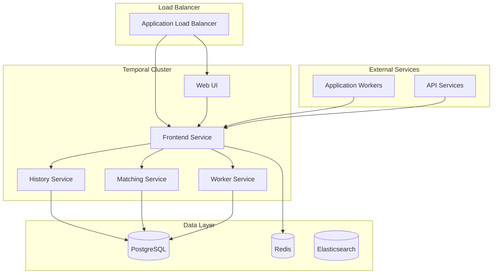

# Temporal Deployment

This guide provides comprehensive deployment instructions for Temporal.io server cluster in enterprise environments, covering high availability setup, configuration, scaling, and operational best practices.

## Overview

The Temporal deployment includes:
- Temporal server cluster with multiple services
- High availability configuration
- Auto-scaling and load balancing
- Service mesh integration
- Monitoring and observability
- Configuration management

## Architecture Components

### Temporal Services



## Helm Chart Configuration

### Main Temporal Chart Values

```yaml
# helm/values/temporal/production.yaml
server:
  image:
    repository: temporalio/server
    tag: "1.20.0"
    pullPolicy: IfNotPresent
  
  replicaCount: 3
  
  config:
    # Persistence configuration
    persistence:
      defaultStore: default
      visibilityStore: visibility
      numHistoryShards: 4096
      
      datastores:
        default:
          driver: "postgres"
          host: "postgresql-primary"
          port: 5432
          database: "temporal"
          user: "temporal"
          password: "${POSTGRES_PASSWORD}"
          maxConns: 50
          maxIdleConns: 10
          maxConnLifetime: "1h"
          tls:
            enabled: true
            caFile: "/etc/temporal/certs/ca.crt"
            certFile: "/etc/temporal/certs/tls.crt"
            keyFile: "/etc/temporal/certs/tls.key"
            serverName: "postgresql-primary"
        
        visibility:
          driver: "postgres"
          host: "postgresql-primary"
          port: 5432
          database: "temporal_visibility"
          user: "temporal"
          password: "${POSTGRES_PASSWORD}"
          maxConns: 10
          maxIdleConns: 5
          maxConnLifetime: "1h"
          tls:
            enabled: true
            caFile: "/etc/temporal/certs/ca.crt"
            certFile: "/etc/temporal/certs/tls.crt"
            keyFile: "/etc/temporal/certs/tls.key"
            serverName: "postgresql-primary"
    
    # Global configuration
    global:
      membership:
        maxJoinDuration: 30s
        broadcastAddress: ""
      
      pprof:
        port: 7936
      
      metrics:
        prometheus:
          timerType: "histogram"
          listenAddress: "0.0.0.0:9090"
        
        statsd: {}
      
      tls:
        internode:
          server:
            certFile: "/etc/temporal/certs/tls.crt"
            keyFile: "/etc/temporal/certs/tls.key"
            clientCAFile: "/etc/temporal/certs/ca.crt"
            requireClientAuth: true
          client:
            serverName: "temporal"
            certFile: "/etc/temporal/certs/tls.crt"
            keyFile: "/etc/temporal/certs/tls.key"
            caFile: "/etc/temporal/certs/ca.crt"
    
    # Service-specific configurations
    services:
      frontend:
        rpc:
          grpcPort: 7233
          membershipPort: 6933
          bindOnLocalHost: false
        
        metrics:
          prometheus:
            listenAddress: "0.0.0.0:9090"
        
        # Rate limiting
        rps: 1200
        
        # Authentication
        authorizer:
          jwtKeyProvider:
            keySourceURIs:
              - "https://auth.company.com/.well-known/jwks.json"
            refreshInterval: "1h"
          permissionsClaimName: "permissions"
      
      history:
        rpc:
          grpcPort: 7234
          membershipPort: 6934
          bindOnLocalHost: false
        
        metrics:
          prometheus:
            listenAddress: "0.0.0.0:9090"
        
        # History service tuning
        numHistoryShards: 4096
        historyCountLimitError: 50000
        historyCountLimitWarn: 10000
      
      matching:
        rpc:
          grpcPort: 7235
          membershipPort: 6935
          bindOnLocalHost: false
        
        metrics:
          prometheus:
            listenAddress: "0.0.0.0:9090"
        
        # Matching service tuning
        numTasklistWritePartitions: 3
        numTasklistReadPartitions: 3
      
      worker:
        rpc:
          grpcPort: 7239
          membershipPort: 6939
          bindOnLocalHost: false
        
        metrics:
          prometheus:
            listenAddress: "0.0.0.0:9090"
  
  # Resource configuration per service
  frontend:
    replicaCount: 3
    resources:
      requests:
        memory: "512Mi"
        cpu: "250m"
      limits:
        memory: "1Gi"
        cpu: "500m"
    
    service:
      type: ClusterIP
      port: 7233
      annotations:
        service.beta.kubernetes.io/aws-load-balancer-type: nlb
        service.beta.kubernetes.io/aws-load-balancer-internal: "true"
    
    autoscaling:
      enabled: true
      minReplicas: 3
      maxReplicas: 10
      targetCPUUtilizationPercentage: 70
      targetMemoryUtilizationPercentage: 80
  
  history:
    replicaCount: 3
    resources:
      requests:
        memory: "1Gi"
        cpu: "500m"
      limits:
        memory: "2Gi"
        cpu: "1000m"
    
    autoscaling:
      enabled: true
      minReplicas: 3
      maxReplicas: 10
      targetCPUUtilizationPercentage: 70
      targetMemoryUtilizationPercentage: 80
  
  matching:
    replicaCount: 3
    resources:
      requests:
        memory: "512Mi"
        cpu: "250m"
      limits:
        memory: "1Gi"
        cpu: "500m"
    
    autoscaling:
      enabled: true
      minReplicas: 3
      maxReplicas: 8
      targetCPUUtilizationPercentage: 70
      targetMemoryUtilizationPercentage: 80
  
  worker:
    replicaCount: 2
    resources:
      requests:
        memory: "512Mi"
        cpu: "250m"
      limits:
        memory: "1Gi"
        cpu: "500m"

# Web UI configuration
web:
  enabled: true
  image:
    repository: temporalio/web
    tag: "2.8.0"
    pullPolicy: IfNotPresent
  
  replicaCount: 2
  
  config:
    auth:
      enabled: true
      providers:
        - label: "Company SSO"
          type: "oidc"
          providerUrl: "https://auth.company.com"
          clientId: "temporal-web"
          clientSecret: "${OIDC_CLIENT_SECRET}"
          scopes:
            - "openid"
            - "profile"
            - "email"
          callbackUrl: "https://temporal.company.com/auth/callback"
    
    routing:
      default_to_namespace: "default"
      issue_report_link: "https://github.com/company/temporal-issues"
    
    temporal:
      grpc_endpoint: "temporal-frontend:7233"
      grpc_ca: "/etc/temporal/certs/ca.crt"
      grpc_cert: "/etc/temporal/certs/tls.crt"
      grpc_key: "/etc/temporal/certs/tls.key"
  
  service:
    type: ClusterIP
    port: 8080
    annotations:
      service.beta.kubernetes.io/aws-load-balancer-type: alb
      service.beta.kubernetes.io/aws-load-balancer-scheme: internet-facing
      service.beta.kubernetes.io/aws-load-balancer-ssl-redirect: "443"
  
  ingress:
    enabled: true
    className: "alb"
    annotations:
      alb.ingress.kubernetes.io/scheme: internet-facing
      alb.ingress.kubernetes.io/target-type: ip
      alb.ingress.kubernetes.io/certificate-arn: "arn:aws:acm:us-west-2:ACCOUNT:certificate/CERT-ID"
      alb.ingress.kubernetes.io/ssl-redirect: "443"
      alb.ingress.kubernetes.io/listen-ports: '[{"HTTP": 80}, {"HTTPS": 443}]'
    hosts:
      - host: temporal.company.com
        paths:
          - path: /
            pathType: Prefix
    tls:
      - hosts:
          - temporal.company.com
        secretName: temporal-web-tls

# Elasticsearch for advanced visibility (optional)
elasticsearch:
  enabled: true
  image:
    repository: elasticsearch
    tag: "7.17.0"
  
  master:
    replicaCount: 3
    resources:
      requests:
        memory: "1Gi"
        cpu: "500m"
      limits:
        memory: "2Gi"
        cpu: "1000m"
  
  data:
    replicaCount: 3
    resources:
      requests:
        memory: "2Gi"
        cpu: "1000m"
      limits:
        memory: "4Gi"
        cpu: "2000m"
    
    persistence:
      storageClass: "gp3"
      size: "100Gi"

# Prometheus configuration
prometheus:
  enabled: true
  serviceMonitor:
    enabled: true
    interval: "30s"
    namespace: "monitoring"
    additionalLabels:
      app: temporal
```

### Environment-Specific Values

#### Development Environment
```yaml
# helm/values/temporal/development.yaml
server:
  replicaCount: 1
  
  frontend:
    replicaCount: 1
    resources:
      requests:
        memory: "256Mi"
        cpu: "100m"
      limits:
        memory: "512Mi"
        cpu: "250m"
    autoscaling:
      enabled: false
  
  history:
    replicaCount: 1
    resources:
      requests:
        memory: "512Mi"
        cpu: "250m"
      limits:
        memory: "1Gi"
        cpu: "500m"
    autoscaling:
      enabled: false
  
  matching:
    replicaCount: 1
    resources:
      requests:
        memory: "256Mi"
        cpu: "100m"
      limits:
        memory: "512Mi"
        cpu: "250m"
    autoscaling:
      enabled: false
  
  worker:
    replicaCount: 1

web:
  replicaCount: 1
  config:
    auth:
      enabled: false

elasticsearch:
  enabled: false

prometheus:
  enabled: true
```

#### Production Environment
```yaml
# helm/values/temporal/production.yaml
server:
  replicaCount: 5
  
  frontend:
    replicaCount: 5
    resources:
      requests:
        memory: "1Gi"
        cpu: "500m"
      limits:
        memory: "2Gi"
        cpu: "1000m"
    autoscaling:
      enabled: true
      minReplicas: 5
      maxReplicas: 20
  
  history:
    replicaCount: 5
    resources:
      requests:
        memory: "2Gi"
        cpu: "1000m"
      limits:
        memory: "4Gi"
        cpu: "2000m"
    autoscaling:
      enabled: true
      minReplicas: 5
      maxReplicas: 15
  
  matching:
    replicaCount: 5
    resources:
      requests:
        memory: "1Gi"
        cpu: "500m"
      limits:
        memory: "2Gi"
        cpu: "1000m"
    autoscaling:
      enabled: true
      minReplicas: 5
      maxReplicas: 12
  
  worker:
    replicaCount: 3

web:
  replicaCount: 3
  config:
    auth:
      enabled: true

elasticsearch:
  enabled: true
  master:
    replicaCount: 3
  data:
    replicaCount: 5

prometheus:
  enabled: true
```

## Secrets Configuration

### Database Connection Secrets
```yaml
# k8s/temporal/secrets/database-connection.yaml
apiVersion: external-secrets.io/v1beta1
kind: ExternalSecret
metadata:
  name: temporal-database-connection
  namespace: temporal-system
spec:
  refreshInterval: 1h
  secretStoreRef:
    name: vault-backend
    kind: SecretStore
  target:
    name: temporal-database-connection
    creationPolicy: Owner
    template:
      type: Opaque
      data:
        POSTGRES_PASSWORD: "{{ .password }}"
        POSTGRES_CONNECTION_STRING: "postgres://{{ .username }}:{{ .password }}@{{ .host }}:{{ .port }}/{{ .database }}?sslmode=require"
        VISIBILITY_CONNECTION_STRING: "postgres://{{ .username }}:{{ .password }}@{{ .host }}:{{ .port }}/{{ .visibility_database }}?sslmode=require"
  data:
  - secretKey: username
    remoteRef:
      key: temporal/database
      property: username
  - secretKey: password
    remoteRef:
      key: temporal/database
      property: password
  - secretKey: host
    remoteRef:
      key: temporal/database
      property: host
  - secretKey: port
    remoteRef:
      key: temporal/database
      property: port
  - secretKey: database
    remoteRef:
      key: temporal/database
      property: database
  - secretKey: visibility_database
    remoteRef:
      key: temporal/database
      property: visibility_database
```

### Authentication Secrets
```yaml
# k8s/temporal/secrets/auth-secrets.yaml
apiVersion: external-secrets.io/v1beta1
kind: ExternalSecret
metadata:
  name: temporal-auth-secrets
  namespace: temporal-system
spec:
  refreshInterval: 1h
  secretStoreRef:
    name: vault-backend
    kind: SecretStore
  target:
    name: temporal-auth-secrets
    creationPolicy: Owner
  data:
  - secretKey: OIDC_CLIENT_SECRET
    remoteRef:
      key: temporal/auth
      property: oidc_client_secret
  - secretKey: JWT_PRIVATE_KEY
    remoteRef:
      key: temporal/auth
      property: jwt_private_key
  - secretKey: JWT_PUBLIC_KEY
    remoteRef:
      key: temporal/auth
      property: jwt_public_key
```

## Service Configuration

### Service Definitions
```yaml
# k8s/temporal/services/temporal-services.yaml
apiVersion: v1
kind: Service
metadata:
  name: temporal-frontend
  namespace: temporal-system
  labels:
    app.kubernetes.io/name: temporal
    app.kubernetes.io/component: frontend
spec:
  type: ClusterIP
  ports:
  - port: 7233
    targetPort: 7233
    protocol: TCP
    name: rpc
  - port: 9090
    targetPort: 9090
    protocol: TCP
    name: metrics
  selector:
    app.kubernetes.io/name: temporal
    app.kubernetes.io/component: frontend

---
apiVersion: v1
kind: Service
metadata:
  name: temporal-history
  namespace: temporal-system
  labels:
    app.kubernetes.io/name: temporal
    app.kubernetes.io/component: history
spec:
  type: ClusterIP
  ports:
  - port: 7234
    targetPort: 7234
    protocol: TCP
    name: rpc
  - port: 9090
    targetPort: 9090
    protocol: TCP
    name: metrics
  selector:
    app.kubernetes.io/name: temporal
    app.kubernetes.io/component: history

---
apiVersion: v1
kind: Service
metadata:
  name: temporal-matching
  namespace: temporal-system
  labels:
    app.kubernetes.io/name: temporal
    app.kubernetes.io/component: matching
spec:
  type: ClusterIP
  ports:
  - port: 7235
    targetPort: 7235
    protocol: TCP
    name: rpc
  - port: 9090
    targetPort: 9090
    protocol: TCP
    name: metrics
  selector:
    app.kubernetes.io/name: temporal
    app.kubernetes.io/component: matching

---
apiVersion: v1
kind: Service
metadata:
  name: temporal-web
  namespace: temporal-system
  labels:
    app.kubernetes.io/name: temporal
    app.kubernetes.io/component: web
spec:
  type: ClusterIP
  ports:
  - port: 8080
    targetPort: 8080
    protocol: TCP
    name: http
  selector:
    app.kubernetes.io/name: temporal
    app.kubernetes.io/component: web
```

### Load Balancer Configuration
```yaml
# k8s/temporal/services/load-balancer.yaml
apiVersion: v1
kind: Service
metadata:
  name: temporal-frontend-external
  namespace: temporal-system
  annotations:
    service.beta.kubernetes.io/aws-load-balancer-type: "nlb"
    service.beta.kubernetes.io/aws-load-balancer-internal: "true"
    service.beta.kubernetes.io/aws-load-balancer-cross-zone-load-balancing-enabled: "true"
    service.beta.kubernetes.io/aws-load-balancer-backend-protocol: "tcp"
    service.beta.kubernetes.io/aws-load-balancer-healthcheck-protocol: "tcp"
    service.beta.kubernetes.io/aws-load-balancer-healthcheck-interval: "10"
    service.beta.kubernetes.io/aws-load-balancer-healthcheck-timeout: "6"
    service.beta.kubernetes.io/aws-load-balancer-healthy-threshold: "2"
    service.beta.kubernetes.io/aws-load-balancer-unhealthy-threshold: "2"
spec:
  type: LoadBalancer
  ports:
  - port: 7233
    targetPort: 7233
    protocol: TCP
    name: rpc
  selector:
    app.kubernetes.io/name: temporal
    app.kubernetes.io/component: frontend
```

## Monitoring and Observability

### ServiceMonitor for Prometheus
```yaml
# k8s/temporal/monitoring/service-monitor.yaml
apiVersion: monitoring.coreos.com/v1
kind: ServiceMonitor
metadata:
  name: temporal-server
  namespace: temporal-system
  labels:
    app.kubernetes.io/name: temporal
spec:
  selector:
    matchLabels:
      app.kubernetes.io/name: temporal
  endpoints:
  - port: metrics
    interval: 30s
    path: /metrics
    honorLabels: true
  namespaceSelector:
    matchNames:
    - temporal-system
```

### Grafana Dashboard ConfigMap
```yaml
# k8s/temporal/monitoring/grafana-dashboard.yaml
apiVersion: v1
kind: ConfigMap
metadata:
  name: temporal-dashboard
  namespace: monitoring
  labels:
    grafana_dashboard: "1"
data:
  temporal-overview.json: |
    {
      "dashboard": {
        "id": null,
        "title": "Temporal Overview",
        "tags": ["temporal"],
        "style": "dark",
        "timezone": "browser",
        "panels": [
          {
            "id": 1,
            "title": "Frontend Service Health",
            "type": "stat",
            "targets": [
              {
                "expr": "up{job=\"temporal-server\", service=\"temporal-frontend\"}",
                "legendFormat": "{{instance}}"
              }
            ],
            "gridPos": {"h": 8, "w": 12, "x": 0, "y": 0}
          },
          {
            "id": 2,
            "title": "Request Rate",
            "type": "graph",
            "targets": [
              {
                "expr": "rate(temporal_request_total[5m])",
                "legendFormat": "{{operation}}"
              }
            ],
            "gridPos": {"h": 8, "w": 12, "x": 12, "y": 0}
          },
          {
            "id": 3,
            "title": "Request Latency",
            "type": "graph",
            "targets": [
              {
                "expr": "histogram_quantile(0.95, rate(temporal_request_latency_bucket[5m]))",
                "legendFormat": "95th percentile"
              },
              {
                "expr": "histogram_quantile(0.50, rate(temporal_request_latency_bucket[5m]))",
                "legendFormat": "50th percentile"
              }
            ],
            "gridPos": {"h": 8, "w": 12, "x": 0, "y": 8}
          },
          {
            "id": 4,
            "title": "Active Workflows",
            "type": "graph",
            "targets": [
              {
                "expr": "temporal_workflow_active_count",
                "legendFormat": "{{namespace}}"
              }
            ],
            "gridPos": {"h": 8, "w": 12, "x": 12, "y": 8}
          }
        ],
        "time": {
          "from": "now-1h",
          "to": "now"
        },
        "refresh": "30s"
      }
    }
```

## Deployment Automation

### Deployment Script
```bash
#!/bin/bash
# scripts/deploy-temporal.sh

set -euo pipefail

ENVIRONMENT=${1:-development}
NAMESPACE="temporal-system"
HELM_CHART_VERSION=${2:-1.20.0}

# Colors for output
RED='\033[0;31m'
GREEN='\033[0;32m'
YELLOW='\033[1;33m'
NC='\033[0m'

log() {
    echo -e "${GREEN}[$(date +'%Y-%m-%d %H:%M:%S')] $1${NC}"
}

warn() {
    echo -e "${YELLOW}[$(date +'%Y-%m-%d %H:%M:%S')] WARNING: $1${NC}"
}

error() {
    echo -e "${RED}[$(date +'%Y-%m-%d %H:%M:%S')] ERROR: $1${NC}"
    exit 1
}

# Validate environment
if [[ ! "$ENVIRONMENT" =~ ^(development|staging|production)$ ]]; then
    error "Invalid environment. Must be one of: development, staging, production"
fi

log "Deploying Temporal cluster to $ENVIRONMENT environment"

# Check prerequisites
log "Checking prerequisites..."
if ! command -v kubectl &> /dev/null; then
    error "kubectl is required but not installed"
fi

if ! command -v helm &> /dev/null; then
    error "helm is required but not installed"
fi

# Verify cluster connectivity
if ! kubectl cluster-info > /dev/null 2>&1; then
    error "Cannot connect to Kubernetes cluster"
fi

# Create namespace if it doesn't exist
log "Ensuring namespace exists..."
kubectl create namespace "$NAMESPACE" --dry-run=client -o yaml | kubectl apply -f -

# Add Temporal Helm repository
log "Adding Temporal Helm repository..."
helm repo add temporalio https://go.temporal.io/helm-charts
helm repo update

# Apply secrets
log "Applying secrets..."
kubectl apply -f k8s/temporal/secrets/

# Wait for secrets to be ready
log "Waiting for external secrets to sync..."
kubectl wait --for=condition=Ready externalsecret/temporal-database-connection -n "$NAMESPACE" --timeout=300s
kubectl wait --for=condition=Ready externalsecret/temporal-auth-secrets -n "$NAMESPACE" --timeout=300s

# Deploy Temporal server
log "Deploying Temporal server..."
helm upgrade --install temporal temporalio/temporal \
    --namespace "$NAMESPACE" \
    --version "$HELM_CHART_VERSION" \
    --values "helm/values/temporal/base.yaml" \
    --values "helm/values/temporal/${ENVIRONMENT}.yaml" \
    --wait --timeout=15m

# Apply additional Kubernetes resources
log "Applying additional resources..."
kubectl apply -f k8s/temporal/services/
kubectl apply -f k8s/temporal/monitoring/

# Wait for services to be ready
log "Waiting for services to be ready..."
kubectl wait --for=condition=available deployment/temporal-frontend -n "$NAMESPACE" --timeout=600s
kubectl wait --for=condition=available deployment/temporal-history -n "$NAMESPACE" --timeout=600s
kubectl wait --for=condition=available deployment/temporal-matching -n "$NAMESPACE" --timeout=600s
kubectl wait --for=condition=available deployment/temporal-worker -n "$NAMESPACE" --timeout=600s

if helm get values temporal -n "$NAMESPACE" | grep -q "web:.*enabled: true"; then
    kubectl wait --for=condition=available deployment/temporal-web -n "$NAMESPACE" --timeout=600s
fi

# Verify deployment
log "Verifying deployment..."
FRONTEND_READY=$(kubectl get deployment temporal-frontend -n "$NAMESPACE" -o jsonpath='{.status.readyReplicas}')
HISTORY_READY=$(kubectl get deployment temporal-history -n "$NAMESPACE" -o jsonpath='{.status.readyReplicas}')
MATCHING_READY=$(kubectl get deployment temporal-matching -n "$NAMESPACE" -o jsonpath='{.status.readyReplicas}')

log "Frontend replicas ready: $FRONTEND_READY"
log "History replicas ready: $HISTORY_READY"
log "Matching replicas ready: $MATCHING_READY"

# Test connectivity
log "Testing connectivity..."
kubectl run temporal-test --image=temporalio/admin-tools:latest --rm -i --restart=Never -- \
    temporal --address temporal-frontend:7233 workflow list --namespace default || warn "Connectivity test failed"

log "Temporal deployment completed successfully!"
log "Access the web UI at: https://temporal.${ENVIRONMENT}.company.com"
log "gRPC endpoint: temporal-frontend.${NAMESPACE}.svc.cluster.local:7233"
```

### Health Check Script
```bash
#!/bin/bash
# scripts/health-check-temporal.sh

set -euo pipefail

NAMESPACE="temporal-system"

log() {
    echo -e "\033[0;32m[$(date +'%Y-%m-%d %H:%M:%S')] $1\033[0m"
}

error() {
    echo -e "\033[0;31m[$(date +'%Y-%m-%d %H:%M:%S')] ERROR: $1\033[0m"
}

warn() {
    echo -e "\033[1;33m[$(date +'%Y-%m-%d %H:%M:%S')] WARNING: $1\033[0m"
}

log "Running Temporal cluster health checks..."

# Check pod status
log "Checking pod status..."
PODS_NOT_READY=$(kubectl get pods -n "$NAMESPACE" -o jsonpath='{.items[?(@.status.phase!="Running")].metadata.name}')
if [[ -n "$PODS_NOT_READY" ]]; then
    warn "Pods not ready: $PODS_NOT_READY"
else
    log "✓ All pods are running"
fi

# Check service endpoints
log "Checking service endpoints..."
SERVICES=("temporal-frontend" "temporal-history" "temporal-matching" "temporal-worker")
for service in "${SERVICES[@]}"; do
    ENDPOINTS=$(kubectl get endpoints "$service" -n "$NAMESPACE" -o jsonpath='{.subsets[*].addresses[*].ip}' | wc -w)
    if [[ $ENDPOINTS -gt 0 ]]; then
        log "✓ $service has $ENDPOINTS endpoints"
    else
        error "✗ $service has no endpoints"
    fi
done

# Check database connectivity
log "Checking database connectivity..."
kubectl run db-test --image=postgres:13 --rm -i --restart=Never -- \
    pg_isready -h postgresql-primary -p 5432 -U temporal > /dev/null 2>&1
if [[ $? -eq 0 ]]; then
    log "✓ Database connectivity OK"
else
    error "✗ Database connectivity failed"
fi

# Check Temporal frontend health
log "Checking Temporal frontend health..."
kubectl run temporal-health --image=temporalio/admin-tools:latest --rm -i --restart=Never -- \
    temporal --address temporal-frontend:7233 cluster health > /dev/null 2>&1
if [[ $? -eq 0 ]]; then
    log "✓ Temporal frontend health OK"
else
    error "✗ Temporal frontend health check failed"
fi

# Check metrics endpoints
log "Checking metrics endpoints..."
for service in "${SERVICES[@]}"; do
    kubectl run metrics-test --image=curlimages/curl:latest --rm -i --restart=Never -- \
        curl -f "http://${service}:9090/metrics" > /dev/null 2>&1
    if [[ $? -eq 0 ]]; then
        log "✓ $service metrics endpoint OK"
    else
        warn "✗ $service metrics endpoint failed"
    fi
done

# Check web UI (if enabled)
if kubectl get deployment temporal-web -n "$NAMESPACE" > /dev/null 2>&1; then
    log "Checking web UI health..."
    kubectl run web-test --image=curlimages/curl:latest --rm -i --restart=Never -- \
        curl -f "http://temporal-web:8080/" > /dev/null 2>&1
    if [[ $? -eq 0 ]]; then
        log "✓ Web UI health OK"
    else
        warn "✗ Web UI health check failed"
    fi
fi

log "Health check completed"
```

### Rolling Update Script
```bash
#!/bin/bash
# scripts/rolling-update-temporal.sh

set -euo pipefail

NAMESPACE="temporal-system"
NEW_VERSION=${1:-latest}

log() {
    echo -e "\033[0;32m[$(date +'%Y-%m-%d %H:%M:%S')] $1\033[0m"
}

warn() {
    echo -e "\033[1;33m[$(date +'%Y-%m-%d %H:%M:%S')] WARNING: $1\033[0m"
}

error() {
    echo -e "\033[0;31m[$(date +'%Y-%m-%d %H:%M:%S')] ERROR: $1\033[0m"
    exit 1
}

log "Starting rolling update to version: $NEW_VERSION"

# Backup current deployment
log "Backing up current deployment..."
helm get values temporal -n "$NAMESPACE" > "temporal-backup-$(date +%Y%m%d-%H%M%S).yaml"

# Update Temporal server
log "Updating Temporal server..."
helm upgrade temporal temporalio/temporal \
    --namespace "$NAMESPACE" \
    --set server.image.tag="$NEW_VERSION" \
    --reuse-values \
    --wait --timeout=15m

# Monitor rollout
log "Monitoring rollout status..."
kubectl rollout status deployment/temporal-frontend -n "$NAMESPACE" --timeout=600s
kubectl rollout status deployment/temporal-history -n "$NAMESPACE" --timeout=600s
kubectl rollout status deployment/temporal-matching -n "$NAMESPACE" --timeout=600s
kubectl rollout status deployment/temporal-worker -n "$NAMESPACE" --timeout=600s

# Verify update
log "Verifying update..."
CURRENT_VERSION=$(kubectl get deployment temporal-frontend -n "$NAMESPACE" -o jsonpath='{.spec.template.spec.containers[0].image}' | cut -d: -f2)
if [[ "$CURRENT_VERSION" == "$NEW_VERSION" ]]; then
    log "✓ Update completed successfully to version: $CURRENT_VERSION"
else
    error "✗ Update failed. Current version: $CURRENT_VERSION, Expected: $NEW_VERSION"
fi

# Run health checks
log "Running post-update health checks..."
./scripts/health-check-temporal.sh

log "Rolling update completed successfully!"
```

This comprehensive Temporal deployment guide provides enterprise-grade deployment with high availability, monitoring, automation scripts, and operational procedures for production environments.
