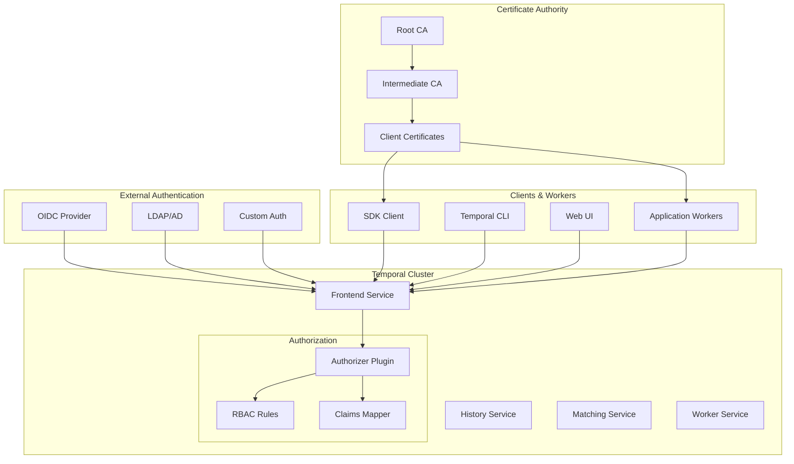

# Authentication & Authorization

This guide provides comprehensive authentication and authorization strategies for Temporal.io deployments, ensuring secure access control across all components including server, workers, and client applications.

## Overview

Temporal.io security involves multiple layers:
- **Authentication**: Verifying identity of users and services
- **Authorization**: Controlling access to resources and operations
- **mTLS**: Mutual TLS for service-to-service communication
- **RBAC**: Role-based access control for fine-grained permissions
- **Integration**: OIDC, LDAP, and custom authentication providers

## Architecture



## Authentication Methods

### 1. API Key Authentication

#### Server Configuration
```yaml
# config/auth-config.yaml
auth:
  enabled: true
  authorizer: "api-key"
  token_key_id: "temporal-api-key"
  
global:
  authorization:
    jwtKeyProvider:
      keySourceURIs:
        - "https://auth.company.com/.well-known/jwks.json"
    permissionsClaimName: "permissions"
    authorizer: "api-key"
```

#### API Key Management
```go
// auth/api-key-manager.go
package auth

import (
    "context"
    "crypto/rand"
    "encoding/base64"
    "fmt"
    "time"
    
    "github.com/golang-jwt/jwt/v4"
)

type APIKeyManager struct {
    signingKey []byte
    issuer     string
    audience   string
}

type APIKeyClaims struct {
    UserID      string   `json:"user_id"`
    Permissions []string `json:"permissions"`
    Namespaces  []string `json:"namespaces"`
    jwt.RegisteredClaims
}

func NewAPIKeyManager(signingKey []byte, issuer, audience string) *APIKeyManager {
    return &APIKeyManager{
        signingKey: signingKey,
        issuer:     issuer,
        audience:   audience,
    }
}

func (m *APIKeyManager) GenerateAPIKey(userID string, permissions, namespaces []string, expiry time.Duration) (string, error) {
    now := time.Now()
    claims := APIKeyClaims{
        UserID:      userID,
        Permissions: permissions,
        Namespaces:  namespaces,
        RegisteredClaims: jwt.RegisteredClaims{
            Issuer:    m.issuer,
            Audience:  jwt.ClaimStrings{m.audience},
            Subject:   userID,
            IssuedAt:  jwt.NewNumericDate(now),
            ExpiresAt: jwt.NewNumericDate(now.Add(expiry)),
            NotBefore: jwt.NewNumericDate(now),
            ID:        generateJTI(),
        },
    }
    
    token := jwt.NewWithClaims(jwt.SigningMethodHS256, claims)
    return token.SignedString(m.signingKey)
}

func (m *APIKeyManager) ValidateAPIKey(tokenString string) (*APIKeyClaims, error) {
    token, err := jwt.ParseWithClaims(tokenString, &APIKeyClaims{}, func(token *jwt.Token) (interface{}, error) {
        if _, ok := token.Method.(*jwt.SigningMethodHMAC); !ok {
            return nil, fmt.Errorf("unexpected signing method: %v", token.Header["alg"])
        }
        return m.signingKey, nil
    })
    
    if err != nil {
        return nil, err
    }
    
    if claims, ok := token.Claims.(*APIKeyClaims); ok && token.Valid {
        return claims, nil
    }
    
    return nil, fmt.Errorf("invalid token")
}

func generateJTI() string {
    bytes := make([]byte, 16)
    rand.Read(bytes)
    return base64.URLEncoding.EncodeToString(bytes)
}
```

#### Client Usage
```go
// client/auth-client.go
package client

import (
    "context"
    "crypto/tls"
    
    "go.temporal.io/sdk/client"
)

func NewAuthenticatedClient(hostPort, namespace, apiKey string) (client.Client, error) {
    return client.Dial(client.Options{
        HostPort:  hostPort,
        Namespace: namespace,
        ConnectionOptions: client.ConnectionOptions{
            TLS: &tls.Config{
                ServerName: "temporal.company.com",
            },
        },
        Credentials: client.NewAPIKeyStaticCredentials(apiKey),
    })
}
```

### 2. OIDC Authentication

#### OIDC Configuration
```yaml
# config/oidc-config.yaml
auth:
  enabled: true
  authorizer: "oidc"
  
global:
  authorization:
    jwtKeyProvider:
      keySourceURIs:
        - "https://auth.company.com/.well-known/jwks.json"
      refreshInterval: "1h"
    permissionsClaimName: "permissions"
    authorizer: "oidc"
    
oidc:
  issuer_url: "https://auth.company.com"
  client_id: "temporal-cluster"
  client_secret: "${OIDC_CLIENT_SECRET}"
  scopes:
    - "openid"
    - "profile"
    - "email"
    - "temporal:read"
    - "temporal:write"
  redirect_urls:
    - "https://temporal.company.com/auth/callback"
  claims_mapping:
    user_id: "sub"
    email: "email"
    groups: "groups"
    permissions: "temporal_permissions"
```

#### OIDC Integration
```go
// auth/oidc-provider.go
package auth

import (
    "context"
    "encoding/json"
    "fmt"
    "net/http"
    
    "github.com/coreos/go-oidc/v3/oidc"
    "golang.org/x/oauth2"
)

type OIDCProvider struct {
    provider     *oidc.Provider
    oauth2Config oauth2.Config
    verifier     *oidc.IDTokenVerifier
}

type OIDCConfig struct {
    IssuerURL    string   `json:"issuer_url"`
    ClientID     string   `json:"client_id"`
    ClientSecret string   `json:"client_secret"`
    RedirectURL  string   `json:"redirect_url"`
    Scopes       []string `json:"scopes"`
}

func NewOIDCProvider(ctx context.Context, config OIDCConfig) (*OIDCProvider, error) {
    provider, err := oidc.NewProvider(ctx, config.IssuerURL)
    if err != nil {
        return nil, fmt.Errorf("failed to create OIDC provider: %w", err)
    }
    
    oauth2Config := oauth2.Config{
        ClientID:     config.ClientID,
        ClientSecret: config.ClientSecret,
        RedirectURL:  config.RedirectURL,
        Endpoint:     provider.Endpoint(),
        Scopes:       config.Scopes,
    }
    
    verifier := provider.Verifier(&oidc.Config{
        ClientID: config.ClientID,
    })
    
    return &OIDCProvider{
        provider:     provider,
        oauth2Config: oauth2Config,
        verifier:     verifier,
    }, nil
}

func (p *OIDCProvider) GetAuthURL(state string) string {
    return p.oauth2Config.AuthCodeURL(state, oauth2.AccessTypeOffline)
}

func (p *OIDCProvider) ExchangeCode(ctx context.Context, code string) (*oidc.IDToken, error) {
    token, err := p.oauth2Config.Exchange(ctx, code)
    if err != nil {
        return nil, fmt.Errorf("failed to exchange code: %w", err)
    }
    
    rawIDToken, ok := token.Extra("id_token").(string)
    if !ok {
        return nil, fmt.Errorf("no id_token in response")
    }
    
    idToken, err := p.verifier.Verify(ctx, rawIDToken)
    if err != nil {
        return nil, fmt.Errorf("failed to verify ID token: %w", err)
    }
    
    return idToken, nil
}

type UserClaims struct {
    Sub         string   `json:"sub"`
    Email       string   `json:"email"`
    Groups      []string `json:"groups"`
    Permissions []string `json:"temporal_permissions"`
}

func (p *OIDCProvider) ParseClaims(idToken *oidc.IDToken) (*UserClaims, error) {
    var claims UserClaims
    if err := idToken.Claims(&claims); err != nil {
        return nil, fmt.Errorf("failed to parse claims: %w", err)
    }
    return &claims, nil
}
```

### 3. mTLS Authentication

#### Certificate Generation
```bash
#!/bin/bash
# scripts/generate-certs.sh

set -euo pipefail

CERT_DIR="certs"
CA_KEY="$CERT_DIR/ca-key.pem"
CA_CERT="$CERT_DIR/ca-cert.pem"
DAYS_VALID=3650

log() {
    echo -e "\033[0;32m[$(date +'%Y-%m-%d %H:%M:%S')] $1\033[0m"
}

error() {
    echo -e "\033[0;31m[$(date +'%Y-%m-%d %H:%M:%S')] ERROR: $1\033[0m"
    exit 1
}

# Create certificate directory
mkdir -p "$CERT_DIR"

# Generate CA private key
if [[ ! -f "$CA_KEY" ]]; then
    log "Generating CA private key..."
    openssl genrsa -out "$CA_KEY" 4096
    chmod 600 "$CA_KEY"
fi

# Generate CA certificate
if [[ ! -f "$CA_CERT" ]]; then
    log "Generating CA certificate..."
    openssl req -new -x509 -key "$CA_KEY" -sha256 -subj "/C=US/ST=CA/O=Company/CN=Temporal CA" -days $DAYS_VALID -out "$CA_CERT"
fi

# Function to generate client/server certificates
generate_cert() {
    local name="$1"
    local common_name="$2"
    local san="${3:-}"
    
    local key_file="$CERT_DIR/${name}-key.pem"
    local csr_file="$CERT_DIR/${name}-csr.pem"
    local cert_file="$CERT_DIR/${name}-cert.pem"
    
    # Generate private key
    log "Generating private key for $name..."
    openssl genrsa -out "$key_file" 2048
    chmod 600 "$key_file"
    
    # Create certificate signing request
    log "Creating CSR for $name..."
    if [[ -n "$san" ]]; then
        # Create config file for SAN
        local config_file="$CERT_DIR/${name}.conf"
        cat > "$config_file" << EOF
[req]
distinguished_name = req_distinguished_name
req_extensions = v3_req
prompt = no

[req_distinguished_name]
C = US
ST = CA
O = Company
CN = $common_name

[v3_req]
keyUsage = keyEncipherment, dataEncipherment
extendedKeyUsage = serverAuth, clientAuth
subjectAltName = @alt_names

[alt_names]
DNS.1 = $common_name
$san
EOF
        openssl req -new -key "$key_file" -out "$csr_file" -config "$config_file"
        
        # Sign certificate with CA
        log "Signing certificate for $name..."
        openssl x509 -req -in "$csr_file" -CA "$CA_CERT" -CAkey "$CA_KEY" -CAcreateserial -out "$cert_file" -days $DAYS_VALID -extensions v3_req -extfile "$config_file"
        
        # Clean up
        rm "$config_file" "$csr_file"
    else
        openssl req -new -key "$key_file" -out "$csr_file" -subj "/C=US/ST=CA/O=Company/CN=$common_name"
        
        # Sign certificate with CA
        log "Signing certificate for $name..."
        openssl x509 -req -in "$csr_file" -CA "$CA_CERT" -CAkey "$CA_KEY" -CAcreateserial -out "$cert_file" -days $DAYS_VALID
        
        # Clean up
        rm "$csr_file"
    fi
    
    log "✓ Generated certificate for $name: $cert_file"
}

# Generate server certificate
generate_cert "server" "temporal.company.com" "DNS.2 = temporal-frontend
DNS.3 = temporal-frontend.temporal.svc.cluster.local
DNS.4 = localhost
IP.1 = 127.0.0.1"

# Generate client certificates
generate_cert "client" "temporal-client"
generate_cert "worker" "temporal-worker"
generate_cert "admin" "temporal-admin"

log "✓ All certificates generated successfully!"
log "CA Certificate: $CA_CERT"
log "Use these certificates for mTLS authentication with Temporal"
```

#### mTLS Configuration
```yaml
# config/mtls-config.yaml
tls:
  # Server TLS configuration
  frontend:
    server:
      certFile: "/etc/temporal/certs/server-cert.pem"
      keyFile: "/etc/temporal/certs/server-key.pem"
      clientCaFiles:
        - "/etc/temporal/certs/ca-cert.pem"
      requireClientAuth: true
  
  # Internal service communication
  internode:
    server:
      certFile: "/etc/temporal/certs/server-cert.pem"
      keyFile: "/etc/temporal/certs/server-key.pem"
      clientCaFiles:
        - "/etc/temporal/certs/ca-cert.pem"
      requireClientAuth: true
    client:
      certFile: "/etc/temporal/certs/client-cert.pem"
      keyFile: "/etc/temporal/certs/client-key.pem"
      serverCaFiles:
        - "/etc/temporal/certs/ca-cert.pem"
      serverName: "temporal.company.com"

# Database TLS
persistence:
  default:
    sql:
      tls:
        enabled: true
        caFile: "/etc/temporal/certs/ca-cert.pem"
        certFile: "/etc/temporal/certs/client-cert.pem"
        keyFile: "/etc/temporal/certs/client-key.pem"
        serverName: "postgres.company.com"
```

## Authorization Framework

### 1. Custom Authorizer Plugin

#### Plugin Interface
```go
// auth/authorizer.go
package auth

import (
    "context"
    
    "go.temporal.io/server/common/authorization"
)

type TemporalAuthorizer struct {
    rbacProvider RBACProvider
    logger       log.Logger
}

func NewTemporalAuthorizer(rbacProvider RBACProvider, logger log.Logger) authorization.Authorizer {
    return &TemporalAuthorizer{
        rbacProvider: rbacProvider,
        logger:       logger,
    }
}

func (a *TemporalAuthorizer) Authorize(ctx context.Context, claims *authorization.Claims, target *authorization.CallTarget) (authorization.Result, error) {
    // Extract user information from claims
    userID := claims.Subject
    if userID == "" {
        return authorization.Result{Decision: authorization.DecisionDeny}, nil
    }
    
    // Get user permissions
    permissions, err := a.rbacProvider.GetUserPermissions(ctx, userID)
    if err != nil {
        a.logger.Error("Failed to get user permissions", tag.Error(err), tag.WorkflowID(userID))
        return authorization.Result{Decision: authorization.DecisionDeny}, err
    }
    
    // Check if user has required permission for the target
    required := getRequiredPermission(target)
    if !hasPermission(permissions, required) {
        a.logger.Warn("User denied access", 
            tag.WorkflowID(userID), 
            tag.Value("required", required),
            tag.Value("target", target.APIName))
        return authorization.Result{Decision: authorization.DecisionDeny}, nil
    }
    
    return authorization.Result{Decision: authorization.DecisionAllow}, nil
}

func getRequiredPermission(target *authorization.CallTarget) string {
    switch target.APIName {
    case "StartWorkflowExecution":
        return "temporal:workflow:start"
    case "TerminateWorkflowExecution":
        return "temporal:workflow:terminate"
    case "DescribeWorkflowExecution":
        return "temporal:workflow:read"
    case "ListWorkflowExecutions":
        return "temporal:workflow:list"
    case "GetWorkflowExecutionHistory":
        return "temporal:workflow:history"
    case "SignalWorkflowExecution":
        return "temporal:workflow:signal"
    case "QueryWorkflow":
        return "temporal:workflow:query"
    case "CreateSchedule":
        return "temporal:schedule:create"
    case "UpdateSchedule":
        return "temporal:schedule:update"
    case "DeleteSchedule":
        return "temporal:schedule:delete"
    case "DescribeNamespace":
        return "temporal:namespace:read"
    case "ListNamespaces":
        return "temporal:namespace:list"
    default:
        return "temporal:unknown"
    }
}

func hasPermission(userPermissions []string, required string) bool {
    for _, perm := range userPermissions {
        if perm == required || perm == "temporal:admin" {
            return true
        }
        // Check wildcard permissions
        if matchesWildcard(perm, required) {
            return true
        }
    }
    return false
}

func matchesWildcard(pattern, permission string) bool {
    // Simple wildcard matching for permissions like "temporal:workflow:*"
    if !strings.HasSuffix(pattern, "*") {
        return false
    }
    prefix := strings.TrimSuffix(pattern, "*")
    return strings.HasPrefix(permission, prefix)
}
```

### 2. RBAC Provider

#### Role-Based Access Control
```go
// auth/rbac.go
package auth

import (
    "context"
    "encoding/json"
    "fmt"
    "time"
    
    "go.temporal.io/server/common/log"
    "go.temporal.io/server/common/log/tag"
)

type RBACProvider interface {
    GetUserPermissions(ctx context.Context, userID string) ([]string, error)
    GetUserRoles(ctx context.Context, userID string) ([]string, error)
    GetRolePermissions(ctx context.Context, role string) ([]string, error)
    ValidateUserAccess(ctx context.Context, userID, namespace, action string) (bool, error)
}

type Role struct {
    Name        string   `json:"name"`
    Description string   `json:"description"`
    Permissions []string `json:"permissions"`
    Namespaces  []string `json:"namespaces"`
}

type User struct {
    ID         string   `json:"id"`
    Email      string   `json:"email"`
    Roles      []string `json:"roles"`
    Namespaces []string `json:"namespaces"`
    Active     bool     `json:"active"`
    CreatedAt  time.Time `json:"created_at"`
    UpdatedAt  time.Time `json:"updated_at"`
}

type CachedRBACProvider struct {
    storage StorageProvider
    cache   CacheProvider
    logger  log.Logger
}

func NewCachedRBACProvider(storage StorageProvider, cache CacheProvider, logger log.Logger) RBACProvider {
    return &CachedRBACProvider{
        storage: storage,
        cache:   cache,
        logger:  logger,
    }
}

func (p *CachedRBACProvider) GetUserPermissions(ctx context.Context, userID string) ([]string, error) {
    // Check cache first
    cacheKey := fmt.Sprintf("user_permissions:%s", userID)
    if cached, err := p.cache.Get(ctx, cacheKey); err == nil {
        var permissions []string
        if err := json.Unmarshal(cached, &permissions); err == nil {
            return permissions, nil
        }
    }
    
    // Get user roles
    roles, err := p.GetUserRoles(ctx, userID)
    if err != nil {
        return nil, fmt.Errorf("failed to get user roles: %w", err)
    }
    
    // Aggregate permissions from all roles
    permissionSet := make(map[string]bool)
    for _, role := range roles {
        rolePerms, err := p.GetRolePermissions(ctx, role)
        if err != nil {
            p.logger.Warn("Failed to get role permissions", 
                tag.Value("role", role), 
                tag.Error(err))
            continue
        }
        
        for _, perm := range rolePerms {
            permissionSet[perm] = true
        }
    }
    
    // Convert set to slice
    permissions := make([]string, 0, len(permissionSet))
    for perm := range permissionSet {
        permissions = append(permissions, perm)
    }
    
    // Cache the result
    if data, err := json.Marshal(permissions); err == nil {
        p.cache.Set(ctx, cacheKey, data, 5*time.Minute)
    }
    
    return permissions, nil
}

func (p *CachedRBACProvider) GetUserRoles(ctx context.Context, userID string) ([]string, error) {
    user, err := p.storage.GetUser(ctx, userID)
    if err != nil {
        return nil, fmt.Errorf("failed to get user: %w", err)
    }
    
    if !user.Active {
        return nil, fmt.Errorf("user account is inactive")
    }
    
    return user.Roles, nil
}

func (p *CachedRBACProvider) GetRolePermissions(ctx context.Context, roleName string) ([]string, error) {
    // Check cache first
    cacheKey := fmt.Sprintf("role_permissions:%s", roleName)
    if cached, err := p.cache.Get(ctx, cacheKey); err == nil {
        var permissions []string
        if err := json.Unmarshal(cached, &permissions); err == nil {
            return permissions, nil
        }
    }
    
    role, err := p.storage.GetRole(ctx, roleName)
    if err != nil {
        return nil, fmt.Errorf("failed to get role: %w", err)
    }
    
    // Cache the result
    if data, err := json.Marshal(role.Permissions); err == nil {
        p.cache.Set(ctx, cacheKey, data, 10*time.Minute)
    }
    
    return role.Permissions, nil
}

func (p *CachedRBACProvider) ValidateUserAccess(ctx context.Context, userID, namespace, action string) (bool, error) {
    permissions, err := p.GetUserPermissions(ctx, userID)
    if err != nil {
        return false, err
    }
    
    // Check if user has admin permission
    for _, perm := range permissions {
        if perm == "temporal:admin" {
            return true, nil
        }
    }
    
    // Check namespace-specific permissions
    requiredPerm := fmt.Sprintf("temporal:%s:%s", namespace, action)
    wildcardPerm := fmt.Sprintf("temporal:%s:*", namespace)
    globalPerm := fmt.Sprintf("temporal:*:%s", action)
    
    for _, perm := range permissions {
        if perm == requiredPerm || perm == wildcardPerm || perm == globalPerm {
            return true, nil
        }
    }
    
    return false, nil
}
```

### 3. Default Roles Configuration

#### Predefined Roles
```yaml
# config/rbac-roles.yaml
roles:
  - name: "temporal-admin"
    description: "Full administrative access to Temporal cluster"
    permissions:
      - "temporal:admin"
    namespaces:
      - "*"
  
  - name: "temporal-developer"
    description: "Developer access for workflow development and testing"
    permissions:
      - "temporal:workflow:start"
      - "temporal:workflow:terminate"
      - "temporal:workflow:read"
      - "temporal:workflow:list"
      - "temporal:workflow:history"
      - "temporal:workflow:signal"
      - "temporal:workflow:query"
      - "temporal:activity:*"
      - "temporal:schedule:read"
      - "temporal:schedule:list"
      - "temporal:namespace:read"
    namespaces:
      - "development"
      - "testing"
  
  - name: "temporal-operator"
    description: "Operations team access for monitoring and maintenance"
    permissions:
      - "temporal:workflow:read"
      - "temporal:workflow:list"
      - "temporal:workflow:history"
      - "temporal:workflow:terminate"
      - "temporal:activity:read"
      - "temporal:activity:list"
      - "temporal:schedule:*"
      - "temporal:namespace:read"
      - "temporal:namespace:list"
      - "temporal:cluster:read"
    namespaces:
      - "*"
  
  - name: "temporal-viewer"
    description: "Read-only access for monitoring and observability"
    permissions:
      - "temporal:workflow:read"
      - "temporal:workflow:list"
      - "temporal:workflow:history"
      - "temporal:activity:read"
      - "temporal:activity:list"
      - "temporal:schedule:read"
      - "temporal:schedule:list"
      - "temporal:namespace:read"
      - "temporal:namespace:list"
    namespaces:
      - "*"
  
  - name: "temporal-service"
    description: "Service account access for automated systems"
    permissions:
      - "temporal:workflow:start"
      - "temporal:workflow:signal"
      - "temporal:workflow:query"
      - "temporal:activity:*"
    namespaces:
      - "production"
      - "staging"

users:
  - id: "admin@company.com"
    email: "admin@company.com"
    roles:
      - "temporal-admin"
    namespaces:
      - "*"
    active: true
  
  - id: "developer@company.com"
    email: "developer@company.com"
    roles:
      - "temporal-developer"
    namespaces:
      - "development"
      - "testing"
    active: true
  
  - id: "ops@company.com"
    email: "ops@company.com"
    roles:
      - "temporal-operator"
    namespaces:
      - "*"
    active: true
```

## Kubernetes Integration

### 1. Service Account Configuration
```yaml
# k8s/rbac.yaml
apiVersion: v1
kind: ServiceAccount
metadata:
  name: temporal-server
  namespace: temporal
  annotations:
    eks.amazonaws.com/role-arn: arn:aws:iam::ACCOUNT:role/temporal-server-role

---
apiVersion: rbac.authorization.k8s.io/v1
kind: ClusterRole
metadata:
  name: temporal-server
rules:
- apiGroups: [""]
  resources: ["secrets", "configmaps"]
  verbs: ["get", "list", "watch"]
- apiGroups: [""]
  resources: ["pods"]
  verbs: ["get", "list", "watch"]

---
apiVersion: rbac.authorization.k8s.io/v1
kind: ClusterRoleBinding
metadata:
  name: temporal-server
roleRef:
  apiGroup: rbac.authorization.k8s.io
  kind: ClusterRole
  name: temporal-server
subjects:
- kind: ServiceAccount
  name: temporal-server
  namespace: temporal
```

### 2. Secret Management Integration
```yaml
# k8s/external-secrets.yaml
apiVersion: external-secrets.io/v1beta1
kind: ExternalSecret
metadata:
  name: temporal-auth-secrets
  namespace: temporal
spec:
  refreshInterval: 1h
  secretStoreRef:
    name: vault-backend
    kind: SecretStore
  target:
    name: temporal-auth-secrets
    creationPolicy: Owner
  data:
  - secretKey: jwt-signing-key
    remoteRef:
      key: temporal/auth
      property: jwt_signing_key
  - secretKey: oidc-client-secret
    remoteRef:
      key: temporal/auth
      property: oidc_client_secret
  - secretKey: api-key-secret
    remoteRef:
      key: temporal/auth
      property: api_key_secret
```

This comprehensive authentication and authorization guide provides enterprise-grade security patterns for Temporal.io deployments with support for multiple authentication methods, fine-grained authorization, and secure integration with modern identity providers.
