# Security Best Practices

This guide provides comprehensive security best practices for Temporal.io deployments, covering defense-in-depth strategies, operational security, compliance requirements, and incident response procedures for enterprise environments.

## Overview

Security best practices for Temporal.io encompass:
- **Defense in Depth**: Multi-layered security controls
- **Principle of Least Privilege**: Minimal access rights
- **Zero Trust Architecture**: Never trust, always verify
- **Security by Design**: Built-in security from the start
- **Continuous Monitoring**: Real-time threat detection
- **Compliance**: Meeting regulatory requirements

## Security Architecture Framework

```mermaid
graph TB
    subgraph "Security Layers"
        PERIMETER[Perimeter Security]
        NETWORK[Network Security]
        COMPUTE[Compute Security]
        APPLICATION[Application Security]
        DATA[Data Security]
        IDENTITY[Identity Security]
    end
    
    subgraph "Perimeter Security"
        WAF[Web Application Firewall]
        DDOS[DDoS Protection]
        CDN[Content Delivery Network]
    end
    
    subgraph "Network Security"
        NETPOL[Network Policies]
        MICROSEG[Micro-segmentation]
        VPN[VPN Gateway]
        FIREWALL[Next-Gen Firewall]
    end
    
    subgraph "Compute Security"
        RBAC[RBAC Controls]
        PSP[Pod Security Policies]
        RUNTIME[Runtime Security]
        VULN[Vulnerability Scanning]
    end
    
    subgraph "Application Security"
        AUTHN[Authentication]
        AUTHZ[Authorization]
        TLS[TLS Encryption]
        SECRETS[Secrets Management]
    end
    
    subgraph "Data Security"
        ENCRYPTION[Data Encryption]
        BACKUP[Secure Backups]
        DLP[Data Loss Prevention]
        AUDIT[Audit Logging]
    end
    
    subgraph "Identity Security"
        MFA[Multi-Factor Auth]
        SSO[Single Sign-On]
        PAM[Privileged Access]
        LIFECYCLE[Identity Lifecycle]
    end
    
    PERIMETER --> NETWORK
    NETWORK --> COMPUTE
    COMPUTE --> APPLICATION
    APPLICATION --> DATA
    DATA --> IDENTITY
```



## Infrastructure Security

### 1. Kubernetes Security Hardening

#### Cluster Security Configuration
```yaml
# k8s/security/cluster-security.yaml
apiVersion: v1
kind: ConfigMap
metadata:
  name: cluster-security-config
  namespace: kube-system
data:
  kube-apiserver-config.yaml: |
    # API Server Security Settings
    audit-log-maxage: 30
    audit-log-maxbackup: 3
    audit-log-maxsize: 100
    audit-log-path: /var/log/audit.log
    audit-policy-file: /etc/kubernetes/audit-policy.yaml
    enable-admission-plugins: >
      NamespaceLifecycle,
      LimitRanger,
      ServiceAccount,
      TaintNodesByCondition,
      Priority,
      DefaultTolerationSeconds,
      DefaultStorageClass,
      StorageObjectInUseProtection,
      PersistentVolumeClaimResize,
      RuntimeClass,
      CertificateApproval,
      CertificateSigning,
      CertificateSubjectRestriction,
      DefaultIngressClass,
      MutatingAdmissionWebhook,
      ValidatingAdmissionWebhook,
      ResourceQuota,
      PodSecurityPolicy,
      NodeRestriction
    authorization-mode: Node,RBAC
    anonymous-auth: false
    insecure-port: 0
    secure-port: 6443
    tls-cipher-suites: >
      TLS_ECDHE_ECDSA_WITH_AES_128_GCM_SHA256,
      TLS_ECDHE_RSA_WITH_AES_128_GCM_SHA256,
      TLS_ECDHE_ECDSA_WITH_AES_256_GCM_SHA384,
      TLS_ECDHE_RSA_WITH_AES_256_GCM_SHA384,
      TLS_ECDHE_ECDSA_WITH_CHACHA20_POLY1305,
      TLS_ECDHE_RSA_WITH_CHACHA20_POLY1305
    tls-min-version: VersionTLS12
```

#### Pod Security Standards
```yaml
# k8s/security/pod-security-standards.yaml
apiVersion: v1
kind: Namespace
metadata:
  name: temporal
  labels:
    pod-security.kubernetes.io/enforce: restricted
    pod-security.kubernetes.io/audit: restricted
    pod-security.kubernetes.io/warn: restricted

---
apiVersion: policy/v1beta1
kind: PodSecurityPolicy
metadata:
  name: temporal-restricted
spec:
  privileged: false
  allowPrivilegeEscalation: false
  requiredDropCapabilities:
    - ALL
  volumes:
    - 'configMap'
    - 'emptyDir'
    - 'projected'
    - 'secret'
    - 'downwardAPI'
    - 'persistentVolumeClaim'
  hostNetwork: false
  hostIPC: false
  hostPID: false
  runAsUser:
    rule: 'MustRunAsNonRoot'
  runAsGroup:
    rule: 'MustRunAs'
    ranges:
      - min: 1
        max: 65535
  seLinux:
    rule: 'RunAsAny'
  supplementalGroups:
    rule: 'MustRunAs'
    ranges:
      - min: 1
        max: 65535
  fsGroup:
    rule: 'MustRunAs'
    ranges:
      - min: 1
        max: 65535
  readOnlyRootFilesystem: true
```

#### Security Context Enforcement
```yaml
# k8s/security/security-context.yaml
apiVersion: apps/v1
kind: Deployment
metadata:
  name: temporal-frontend
  namespace: temporal
spec:
  template:
    spec:
      securityContext:
        runAsNonRoot: true
        runAsUser: 1000
        runAsGroup: 1000
        fsGroup: 1000
        seccompProfile:
          type: RuntimeDefault
      containers:
      - name: temporal
        securityContext:
          allowPrivilegeEscalation: false
          readOnlyRootFilesystem: true
          runAsNonRoot: true
          runAsUser: 1000
          runAsGroup: 1000
          capabilities:
            drop:
            - ALL
        volumeMounts:
        - name: tmp
          mountPath: /tmp
        - name: var-cache
          mountPath: /var/cache
      volumes:
      - name: tmp
        emptyDir: {}
      - name: var-cache
        emptyDir: {}
```

### 2. Container Security

#### Base Image Security
```dockerfile
# security/Dockerfile.temporal-secure
# Use minimal, distroless base image
FROM gcr.io/distroless/java:11

# Add security labels
LABEL security.vendor="Company Name" \
      security.scanned="true" \
      security.scan-date="2024-01-15" \
      security.vulnerabilities="none"

# Copy application with minimal permissions
COPY --chown=1000:1000 temporal-server.jar /app/

# Use non-root user
USER 1000:1000

# Set read-only root filesystem
VOLUME ["/tmp", "/var/cache"]

# Health check
HEALTHCHECK --interval=30s --timeout=3s --start-period=5s --retries=3 \
  CMD ["java", "-cp", "/app/temporal-server.jar", "io.temporal.server.HealthCheck"]

ENTRYPOINT ["java", "-jar", "/app/temporal-server.jar"]
```

#### Container Scanning Pipeline
```yaml
# .github/workflows/container-security.yaml
name: Container Security Scan

on:
  push:
    branches: [main]
  pull_request:
    branches: [main]

jobs:
  security-scan:
    runs-on: ubuntu-latest
    steps:
    - name: Checkout code
      uses: actions/checkout@v4

    - name: Build container image
      run: docker build -t temporal-security-test .

    - name: Run Trivy vulnerability scanner
      uses: aquasecurity/trivy-action@master
      with:
        image-ref: 'temporal-security-test'
        format: 'sarif'
        output: 'trivy-results.sarif'
        severity: 'CRITICAL,HIGH'
        exit-code: '1'

    - name: Upload Trivy scan results
      uses: github/codeql-action/upload-sarif@v2
      with:
        sarif_file: 'trivy-results.sarif'

    - name: Run Snyk container scan
      uses: snyk/actions/docker@master
      env:
        SNYK_TOKEN: ${{ secrets.SNYK_TOKEN }}
      with:
        image: temporal-security-test
        args: --severity-threshold=high

    - name: Run Docker Bench Security
      run: |
        docker run --rm --net host --pid host --userns host --cap-add audit_control \
          -e DOCKER_CONTENT_TRUST=$DOCKER_CONTENT_TRUST \
          -v /etc:/etc:ro \
          -v /usr/bin/containerd:/usr/bin/containerd:ro \
          -v /usr/bin/runc:/usr/bin/runc:ro \
          -v /usr/lib/systemd:/usr/lib/systemd:ro \
          -v /var/lib:/var/lib:ro \
          -v /var/run/docker.sock:/var/run/docker.sock:ro \
          --label docker_bench_security \
          docker/docker-bench-security
```

## Application Security

### 1. Secure Development Practices

#### Code Security Analysis
```yaml
# .github/workflows/code-security.yaml
name: Code Security Analysis

on:
  push:
    branches: [main]
  pull_request:
    branches: [main]

jobs:
  security-analysis:
    runs-on: ubuntu-latest
    steps:
    - name: Checkout code
      uses: actions/checkout@v4

    - name: Run CodeQL Analysis
      uses: github/codeql-action/init@v2
      with:
        languages: go, java, javascript

    - name: Autobuild
      uses: github/codeql-action/autobuild@v2

    - name: Perform CodeQL Analysis
      uses: github/codeql-action/analyze@v2

    - name: Run Semgrep security scan
      uses: returntocorp/semgrep-action@v1
      with:
        config: >-
          p/security-audit
          p/secrets
          p/owasp-top-ten

    - name: Run SonarCloud Scan
      uses: SonarSource/sonarcloud-github-action@master
      env:
        GITHUB_TOKEN: ${{ secrets.GITHUB_TOKEN }}
        SONAR_TOKEN: ${{ secrets.SONAR_TOKEN }}

    - name: Run Gosec Security Scanner
      uses: securecodewarrior/github-action-gosec@master
      with:
        args: '-fmt sarif -out gosec-results.sarif ./...'

    - name: Upload Gosec results
      uses: github/codeql-action/upload-sarif@v2
      with:
        sarif_file: 'gosec-results.sarif'
```

#### Dependency Security
```yaml
# .github/workflows/dependency-security.yaml
name: Dependency Security Check

on:
  push:
    branches: [main]
  pull_request:
    branches: [main]
  schedule:
    - cron: '0 6 * * *'  # Daily at 6 AM

jobs:
  dependency-check:
    runs-on: ubuntu-latest
    steps:
    - name: Checkout code
      uses: actions/checkout@v4

    - name: Run OWASP Dependency Check
      uses: dependency-check/Dependency-Check_Action@main
      with:
        project: 'temporal-io'
        path: '.'
        format: 'ALL'
        args: >
          --enableRetired
          --enableExperimental
          --failOnCVSS 7

    - name: Run Snyk dependency scan
      uses: snyk/actions/node@master
      env:
        SNYK_TOKEN: ${{ secrets.SNYK_TOKEN }}
      with:
        args: --severity-threshold=high

    - name: Run npm audit
      run: |
        npm audit --audit-level high
        npm audit fix --force

    - name: Run Go vulnerability check
      run: |
        go install golang.org/x/vuln/cmd/govulncheck@latest
        govulncheck ./...
```

### 2. Secure Configuration Management

#### Application Security Configuration
```yaml
# config/security-config.yaml
security:
  # Authentication configuration
  authentication:
    enabled: true
    method: "jwt"
    jwt:
      algorithm: "RS256"
      key_rotation_interval: "24h"
      max_token_age: "1h"
      issuer: "temporal.company.com"
      audience: "temporal-cluster"
    
    mTLS:
      enabled: true
      require_client_cert: true
      verify_client_cert: true
      ca_file: "/etc/temporal/certs/ca.crt"
      cert_file: "/etc/temporal/certs/server.crt"
      key_file: "/etc/temporal/certs/server.key"
  
  # Authorization configuration
  authorization:
    enabled: true
    default_policy: "deny"
    rbac:
      enabled: true
      policy_file: "/etc/temporal/rbac/policy.yaml"
      role_mapping_file: "/etc/temporal/rbac/roles.yaml"
  
  # Encryption configuration
  encryption:
    # Data encryption at rest
    at_rest:
      enabled: true
      algorithm: "AES-256-GCM"
      key_rotation_interval: "90d"
      key_provider: "vault"
    
    # Data encryption in transit
    in_transit:
      enabled: true
      min_tls_version: "1.2"
      cipher_suites:
        - "TLS_ECDHE_ECDSA_WITH_AES_256_GCM_SHA384"
        - "TLS_ECDHE_RSA_WITH_AES_256_GCM_SHA384"
        - "TLS_ECDHE_ECDSA_WITH_AES_128_GCM_SHA256"
        - "TLS_ECDHE_RSA_WITH_AES_128_GCM_SHA256"
  
  # Audit configuration
  audit:
    enabled: true
    level: "info"
    log_format: "json"
    log_file: "/var/log/temporal/audit.log"
    max_file_size: "100MB"
    max_files: 10
    fields:
      - "timestamp"
      - "user_id"
      - "action"
      - "resource"
      - "result"
      - "ip_address"
      - "user_agent"
  
  # Rate limiting
  rate_limiting:
    enabled: true
    global_limit: "1000/min"
    per_user_limit: "100/min"
    per_ip_limit: "500/min"
  
  # Security headers
  headers:
    enabled: true
    hsts:
      enabled: true
      max_age: "31536000"
      include_subdomains: true
      preload: true
    csp:
      enabled: true
      policy: "default-src 'self'; script-src 'self' 'unsafe-inline'; style-src 'self' 'unsafe-inline'"
    frame_options: "DENY"
    content_type_options: "nosniff"
    xss_protection: "1; mode=block"
```

### 3. Input Validation and Sanitization

#### Workflow Input Validation
```go
// security/validation.go
package security

import (
    "fmt"
    "regexp"
    "strings"
    "time"
    
    "github.com/go-playground/validator/v10"
    "github.com/microcosm-cc/bluemonday"
)

// InputValidator provides comprehensive input validation
type InputValidator struct {
    validator *validator.Validate
    sanitizer *bluemonday.Policy
}

// NewInputValidator creates a new input validator
func NewInputValidator() *InputValidator {
    v := validator.New()
    
    // Custom validation rules
    v.RegisterValidation("workflow_id", validateWorkflowID)
    v.RegisterValidation("task_queue", validateTaskQueue)
    v.RegisterValidation("namespace", validateNamespace)
    
    // HTML sanitizer
    p := bluemonday.StrictPolicy()
    
    return &InputValidator{
        validator: v,
        sanitizer: p,
    }
}

// WorkflowInput represents validated workflow input
type WorkflowInput struct {
    WorkflowID   string            `validate:"required,workflow_id,max=255"`
    TaskQueue    string            `validate:"required,task_queue,max=100"`
    Namespace    string            `validate:"required,namespace,max=100"`
    Input        map[string]interface{} `validate:"required"`
    Timeout      time.Duration     `validate:"min=1s,max=24h"`
    RetryPolicy  *RetryPolicy      `validate:"omitempty"`
}

type RetryPolicy struct {
    MaxAttempts     int           `validate:"min=1,max=100"`
    InitialInterval time.Duration `validate:"min=1s,max=1h"`
    MaxInterval     time.Duration `validate:"min=1s,max=24h"`
    BackoffFactor   float64       `validate:"min=1.0,max=10.0"`
}

// ValidateWorkflowInput validates workflow input parameters
func (v *InputValidator) ValidateWorkflowInput(input *WorkflowInput) error {
    if err := v.validator.Struct(input); err != nil {
        return fmt.Errorf("validation failed: %w", err)
    }
    
    // Sanitize string inputs
    input.WorkflowID = v.sanitizer.Sanitize(input.WorkflowID)
    input.TaskQueue = v.sanitizer.Sanitize(input.TaskQueue)
    input.Namespace = v.sanitizer.Sanitize(input.Namespace)
    
    // Validate input data size
    if err := v.validateDataSize(input.Input); err != nil {
        return fmt.Errorf("input data validation failed: %w", err)
    }
    
    return nil
}

// Custom validation functions
func validateWorkflowID(fl validator.FieldLevel) bool {
    workflowID := fl.Field().String()
    
    // Workflow ID pattern: alphanumeric, hyphens, underscores
    pattern := `^[a-zA-Z0-9_-]+$`
    matched, _ := regexp.MatchString(pattern, workflowID)
    
    return matched && !containsMaliciousPatterns(workflowID)
}

func validateTaskQueue(fl validator.FieldLevel) bool {
    taskQueue := fl.Field().String()
    
    // Task queue pattern: alphanumeric, hyphens, dots
    pattern := `^[a-zA-Z0-9._-]+$`
    matched, _ := regexp.MatchString(pattern, taskQueue)
    
    return matched && !containsMaliciousPatterns(taskQueue)
}

func validateNamespace(fl validator.FieldLevel) bool {
    namespace := fl.Field().String()
    
    // Namespace pattern: lowercase alphanumeric, hyphens
    pattern := `^[a-z0-9-]+$`
    matched, _ := regexp.MatchString(pattern, namespace)
    
    return matched && !containsMaliciousPatterns(namespace)
}

func containsMaliciousPatterns(input string) bool {
    maliciousPatterns := []string{
        "<script", "</script>", "javascript:", "vbscript:",
        "onload=", "onerror=", "onclick=", "onmouseover=",
        "eval(", "exec(", "system(", "shell_exec(",
        "../", "..\\", "/etc/passwd", "/proc/",
        "DROP TABLE", "DELETE FROM", "INSERT INTO", "UPDATE SET",
        "UNION SELECT", "OR 1=1", "AND 1=1",
    }
    
    lowerInput := strings.ToLower(input)
    for _, pattern := range maliciousPatterns {
        if strings.Contains(lowerInput, strings.ToLower(pattern)) {
            return true
        }
    }
    
    return false
}

func (v *InputValidator) validateDataSize(data interface{}) error {
    // Convert to JSON and check size
    jsonData, err := json.Marshal(data)
    if err != nil {
        return fmt.Errorf("failed to marshal data: %w", err)
    }
    
    const maxSize = 2 * 1024 * 1024 // 2MB limit
    if len(jsonData) > maxSize {
        return fmt.Errorf("input data exceeds maximum size of %d bytes", maxSize)
    }
    
    return nil
}
```

## Data Protection

### 1. Encryption Standards

#### Data Encryption Configuration
```yaml
# config/encryption-config.yaml
encryption:
  # Database encryption
  database:
    enabled: true
    provider: "vault"
    key_derivation: "PBKDF2"
    algorithm: "AES-256-GCM"
    key_rotation: "quarterly"
    
    # Column-level encryption for sensitive data
    column_encryption:
      enabled: true
      columns:
        - "workflow_execution.input"
        - "workflow_execution.result"
        - "activity_task.input"
        - "activity_task.result"
        - "history_event.event_data"
  
  # Payload encryption
  payload:
    enabled: true
    codec: "aes-gcm-256"
    key_management: "vault"
    compression: "gzip"
    
    # Encryption metadata
    metadata:
      algorithm_header: "x-temporal-encryption-algorithm"
      key_id_header: "x-temporal-key-id"
      compression_header: "x-temporal-compression"
  
  # Search attribute encryption
  search_attributes:
    enabled: true
    encrypted_attributes:
      - "customer_id"
      - "payment_method"
      - "personal_data"
    
    # Deterministic encryption for searchable fields
    deterministic_encryption:
      enabled: true
      algorithm: "AES-SIV"
  
  # Key management
  key_management:
    provider: "vault"
    auto_rotation: true
    rotation_interval: "90d"
    min_key_versions: 3
    
    vault:
      address: "https://vault.company.com"
      path: "temporal/encryption"
      role: "temporal-encryption"
```

#### Payload Encryption Implementation
```go
// security/encryption.go
package security

import (
    "crypto/aes"
    "crypto/cipher"
    "crypto/rand"
    "encoding/base64"
    "fmt"
    "io"
    
    "go.temporal.io/sdk/converter"
)

// EncryptionCodec implements payload encryption
type EncryptionCodec struct {
    keyManager KeyManager
    fallback   converter.PayloadCodec
}

type KeyManager interface {
    GetCurrentKey() ([]byte, string, error)
    GetKey(keyID string) ([]byte, error)
    RotateKey() error
}

// NewEncryptionCodec creates a new encryption codec
func NewEncryptionCodec(keyManager KeyManager) *EncryptionCodec {
    return &EncryptionCodec{
        keyManager: keyManager,
        fallback:   converter.NewJSONPayloadCodec(),
    }
}

// Encode encrypts payloads
func (e *EncryptionCodec) Encode(payloads []*commonpb.Payload) ([]*commonpb.Payload, error) {
    if len(payloads) == 0 {
        return payloads, nil
    }
    
    // Get current encryption key
    key, keyID, err := e.keyManager.GetCurrentKey()
    if err != nil {
        return nil, fmt.Errorf("failed to get encryption key: %w", err)
    }
    
    encryptedPayloads := make([]*commonpb.Payload, len(payloads))
    for i, payload := range payloads {
        encrypted, err := e.encryptPayload(payload, key, keyID)
        if err != nil {
            return nil, fmt.Errorf("failed to encrypt payload %d: %w", i, err)
        }
        encryptedPayloads[i] = encrypted
    }
    
    return encryptedPayloads, nil
}

// Decode decrypts payloads
func (e *EncryptionCodec) Decode(payloads []*commonpb.Payload) ([]*commonpb.Payload, error) {
    if len(payloads) == 0 {
        return payloads, nil
    }
    
    decryptedPayloads := make([]*commonpb.Payload, len(payloads))
    for i, payload := range payloads {
        if e.isEncrypted(payload) {
            decrypted, err := e.decryptPayload(payload)
            if err != nil {
                return nil, fmt.Errorf("failed to decrypt payload %d: %w", i, err)
            }
            decryptedPayloads[i] = decrypted
        } else {
            decryptedPayloads[i] = payload
        }
    }
    
    return decryptedPayloads, nil
}

func (e *EncryptionCodec) encryptPayload(payload *commonpb.Payload, key []byte, keyID string) (*commonpb.Payload, error) {
    // Serialize payload
    data, err := payload.Marshal()
    if err != nil {
        return nil, fmt.Errorf("failed to marshal payload: %w", err)
    }
    
    // Create AES-GCM cipher
    block, err := aes.NewCipher(key)
    if err != nil {
        return nil, fmt.Errorf("failed to create cipher: %w", err)
    }
    
    gcm, err := cipher.NewGCM(block)
    if err != nil {
        return nil, fmt.Errorf("failed to create GCM: %w", err)
    }
    
    // Generate nonce
    nonce := make([]byte, gcm.NonceSize())
    if _, err := io.ReadFull(rand.Reader, nonce); err != nil {
        return nil, fmt.Errorf("failed to generate nonce: %w", err)
    }
    
    // Encrypt data
    ciphertext := gcm.Seal(nonce, nonce, data, nil)
    
    // Create encrypted payload
    encryptedPayload := &commonpb.Payload{
        Metadata: map[string][]byte{
            "encryption":  []byte("aes-gcm-256"),
            "key-id":      []byte(keyID),
            "encoding":    []byte("binary/encrypted"),
        },
        Data: ciphertext,
    }
    
    return encryptedPayload, nil
}

func (e *EncryptionCodec) decryptPayload(payload *commonpb.Payload) (*commonpb.Payload, error) {
    // Extract key ID
    keyIDBytes, exists := payload.Metadata["key-id"]
    if !exists {
        return nil, fmt.Errorf("missing key-id in encrypted payload")
    }
    
    keyID := string(keyIDBytes)
    key, err := e.keyManager.GetKey(keyID)
    if err != nil {
        return nil, fmt.Errorf("failed to get decryption key: %w", err)
    }
    
    // Create AES-GCM cipher
    block, err := aes.NewCipher(key)
    if err != nil {
        return nil, fmt.Errorf("failed to create cipher: %w", err)
    }
    
    gcm, err := cipher.NewGCM(block)
    if err != nil {
        return nil, fmt.Errorf("failed to create GCM: %w", err)
    }
    
    // Extract nonce and ciphertext
    ciphertext := payload.Data
    if len(ciphertext) < gcm.NonceSize() {
        return nil, fmt.Errorf("ciphertext too short")
    }
    
    nonce := ciphertext[:gcm.NonceSize()]
    ciphertext = ciphertext[gcm.NonceSize():]
    
    // Decrypt data
    plaintext, err := gcm.Open(nil, nonce, ciphertext, nil)
    if err != nil {
        return nil, fmt.Errorf("failed to decrypt payload: %w", err)
    }
    
    // Unmarshal original payload
    originalPayload := &commonpb.Payload{}
    if err := originalPayload.Unmarshal(plaintext); err != nil {
        return nil, fmt.Errorf("failed to unmarshal decrypted payload: %w", err)
    }
    
    return originalPayload, nil
}

func (e *EncryptionCodec) isEncrypted(payload *commonpb.Payload) bool {
    encryption, exists := payload.Metadata["encryption"]
    return exists && string(encryption) == "aes-gcm-256"
}
```

### 2. Data Loss Prevention

#### DLP Configuration
```yaml
# k8s/security/dlp-config.yaml
apiVersion: v1
kind: ConfigMap
metadata:
  name: dlp-config
  namespace: temporal
data:
  dlp-rules.yaml: |
    data_loss_prevention:
      enabled: true
      rules:
        - name: "Credit Card Detection"
          pattern: '\b(?:\d{4}[-\s]?){3}\d{4}\b'
          action: "mask"
          severity: "high"
          description: "Detects credit card numbers"
        
        - name: "SSN Detection"
          pattern: '\b\d{3}-\d{2}-\d{4}\b'
          action: "block"
          severity: "critical"
          description: "Detects Social Security Numbers"
        
        - name: "Email Detection"
          pattern: '\b[A-Za-z0-9._%+-]+@[A-Za-z0-9.-]+\.[A-Z|a-z]{2,}\b'
          action: "mask"
          severity: "medium"
          description: "Detects email addresses"
        
        - name: "Phone Number Detection"
          pattern: '\b\d{3}-\d{3}-\d{4}\b'
          action: "mask"
          severity: "medium"
          description: "Detects phone numbers"
      
      masking:
        credit_card: "****-****-****-XXXX"
        ssn: "***-**-XXXX"
        email: "****@****.***"
        phone: "***-***-XXXX"
      
      audit:
        enabled: true
        log_violations: true
        alert_on_block: true
```

## Monitoring and Incident Response

### 1. Security Monitoring

#### Security Event Detection
```yaml
# k8s/monitoring/security-alerts.yaml
apiVersion: monitoring.coreos.com/v1
kind: PrometheusRule
metadata:
  name: temporal-security-alerts
  namespace: temporal-monitoring
spec:
  groups:
  - name: security-events
    rules:
    - alert: SuspiciousWorkflowActivity
      expr: rate(temporal_workflow_executions_total{status="failed"}[5m]) > 10
      for: 2m
      labels:
        severity: warning
        category: security
      annotations:
        summary: "High rate of failed workflow executions"
        description: "{{ $value }} failed workflow executions per second"
    
    - alert: UnauthorizedAPIAccess
      expr: rate(temporal_api_requests_total{status="403"}[5m]) > 5
      for: 1m
      labels:
        severity: critical
        category: security
      annotations:
        summary: "High rate of unauthorized API access attempts"
        description: "{{ $value }} unauthorized requests per second"
    
    - alert: AnomalousUserBehavior
      expr: rate(temporal_user_actions_total[5m]) > 100
      for: 5m
      labels:
        severity: warning
        category: security
      annotations:
        summary: "Anomalous user behavior detected"
        description: "User {{ $labels.user }} performing {{ $value }} actions per second"
    
    - alert: PotentialDataExfiltration
      expr: rate(temporal_payload_size_bytes[5m]) > 100000000  # 100MB/s
      for: 2m
      labels:
        severity: critical
        category: security
      annotations:
        summary: "Large data transfer detected"
        description: "{{ $value }} bytes per second data transfer"
    
    - alert: SecurityPolicyViolation
      expr: increase(temporal_policy_violations_total[5m]) > 0
      for: 0m
      labels:
        severity: critical
        category: security
      annotations:
        summary: "Security policy violation detected"
        description: "{{ $value }} policy violations in the last 5 minutes"
```

#### SIEM Integration
```yaml
# k8s/monitoring/siem-integration.yaml
apiVersion: v1
kind: ConfigMap
metadata:
  name: siem-config
  namespace: temporal-monitoring
data:
  fluent-bit.conf: |
    [SERVICE]
        Flush         1
        Log_Level     info
        Daemon        off
        Parsers_File  parsers.conf
    
    [INPUT]
        Name              tail
        Path              /var/log/temporal/*.log
        Parser            json
        Tag               temporal.security
        Refresh_Interval  5
    
    [FILTER]
        Name    modify
        Match   temporal.security
        Add     source temporal
        Add     environment production
        Add     facility security
    
    [OUTPUT]
        Name        forward
        Match       temporal.security
        Host        siem.company.com
        Port        24224
        tls         on
        tls.verify  on
        tls.ca_file /etc/ssl/certs/ca-certificates.crt
```

### 2. Incident Response

#### Security Incident Playbook
```yaml
# docs/security/incident-response-playbook.yaml
incident_response:
  severity_levels:
    critical:
      description: "Immediate threat to system security or data"
      response_time: "15 minutes"
      escalation: "CISO, Security Team, On-call Engineer"
    
    high:
      description: "Significant security concern requiring urgent attention"
      response_time: "1 hour"
      escalation: "Security Team, Engineering Manager"
    
    medium:
      description: "Security issue requiring investigation"
      response_time: "4 hours"
      escalation: "Security Team"
    
    low:
      description: "Minor security concern or potential issue"
      response_time: "24 hours"
      escalation: "Security Team"
  
  response_procedures:
    data_breach:
      immediate_actions:
        - "Isolate affected systems"
        - "Preserve evidence"
        - "Assess scope of breach"
        - "Notify stakeholders"
      
      investigation_steps:
        - "Collect and analyze logs"
        - "Identify attack vector"
        - "Determine data accessed"
        - "Document timeline"
      
      containment:
        - "Patch vulnerabilities"
        - "Update access controls"
        - "Implement additional monitoring"
        - "Review security policies"
    
    unauthorized_access:
      immediate_actions:
        - "Disable compromised accounts"
        - "Change relevant passwords"
        - "Review access logs"
        - "Check for privilege escalation"
      
      investigation_steps:
        - "Analyze authentication logs"
        - "Review network traffic"
        - "Check for lateral movement"
        - "Identify affected resources"
      
      remediation:
        - "Implement MFA"
        - "Review access policies"
        - "Update monitoring rules"
        - "Conduct security training"
```

#### Automated Response Actions
```bash
#!/bin/bash
# scripts/security-incident-response.sh

set -euo pipefail

INCIDENT_TYPE="$1"
SEVERITY="$2"
AFFECTED_RESOURCE="$3"

log() {
    echo -e "\033[0;32m[$(date +'%Y-%m-%d %H:%M:%S')] $1\033[0m"
}

error() {
    echo -e "\033[0;31m[$(date +'%Y-%m-%d %H:%M:%S')] ERROR: $1\033[0m"
    exit 1
}

# Function to isolate compromised pod
isolate_pod() {
    local pod_name="$1"
    local namespace="$2"
    
    log "Isolating pod $pod_name in namespace $namespace"
    
    # Apply network policy to isolate pod
    cat << EOF | kubectl apply -f -
apiVersion: networking.k8s.io/v1
kind: NetworkPolicy
metadata:
  name: isolate-${pod_name}
  namespace: ${namespace}
spec:
  podSelector:
    matchLabels:
      name: ${pod_name}
  policyTypes:
  - Ingress
  - Egress
EOF
    
    log "Pod $pod_name isolated"
}

# Function to disable user account
disable_user() {
    local user_id="$1"
    
    log "Disabling user account: $user_id"
    
    # Remove user from all roles
    kubectl patch configmap temporal-rbac-config -n temporal \
        --type='json' \
        -p="[{\"op\": \"remove\", \"path\": \"/data/users/${user_id}\"}]"
    
    # Revoke active sessions
    kubectl exec -n temporal deployment/temporal-frontend -- \
        temporal operator cluster upsert-search-attributes \
        --name "user_${user_id}_disabled" \
        --type "Bool" \
        --value "true"
    
    log "User $user_id disabled"
}

# Function to collect forensic data
collect_forensics() {
    local resource="$1"
    local output_dir="/tmp/forensics/$(date +%Y%m%d_%H%M%S)"
    
    mkdir -p "$output_dir"
    
    log "Collecting forensic data for $resource"
    
    # Collect pod logs
    if kubectl get pod "$resource" -n temporal &>/dev/null; then
        kubectl logs "$resource" -n temporal --previous > "$output_dir/pod-logs.txt"
        kubectl describe pod "$resource" -n temporal > "$output_dir/pod-description.txt"
    fi
    
    # Collect audit logs
    kubectl get events -n temporal --sort-by='.lastTimestamp' > "$output_dir/events.txt"
    
    # Collect network policies
    kubectl get networkpolicies -n temporal -o yaml > "$output_dir/network-policies.yaml"
    
    # Create forensic package
    tar -czf "/tmp/forensics-${resource}-$(date +%Y%m%d_%H%M%S).tar.gz" -C "$output_dir" .
    
    log "Forensic data collected: $output_dir"
}

# Function to send security alert
send_alert() {
    local incident_type="$1"
    local severity="$2"
    local details="$3"
    
    # Send to security team via webhook
    curl -X POST "${SECURITY_WEBHOOK_URL}" \
        -H "Content-Type: application/json" \
        -d "{
            \"incident_type\": \"$incident_type\",
            \"severity\": \"$severity\",
            \"timestamp\": \"$(date -u +%Y-%m-%dT%H:%M:%SZ)\",
            \"details\": \"$details\",
            \"cluster\": \"${CLUSTER_NAME:-unknown}\"
        }"
    
    log "Security alert sent"
}

main() {
    log "Security incident response triggered"
    log "Type: $INCIDENT_TYPE, Severity: $SEVERITY, Resource: $AFFECTED_RESOURCE"
    
    case "$INCIDENT_TYPE" in
        "unauthorized_access")
            disable_user "$AFFECTED_RESOURCE"
            collect_forensics "$AFFECTED_RESOURCE"
            ;;
        "compromised_pod")
            isolate_pod "$AFFECTED_RESOURCE" "temporal"
            collect_forensics "$AFFECTED_RESOURCE"
            ;;
        "data_exfiltration")
            # Implement network restrictions
            kubectl apply -f /etc/security/emergency-network-policies.yaml
            collect_forensics "$AFFECTED_RESOURCE"
            ;;
        *)
            log "Unknown incident type: $INCIDENT_TYPE"
            ;;
    esac
    
    # Send alert for critical and high severity incidents
    if [[ "$SEVERITY" == "critical" || "$SEVERITY" == "high" ]]; then
        send_alert "$INCIDENT_TYPE" "$SEVERITY" "Automated response executed for $AFFECTED_RESOURCE"
    fi
    
    log "Incident response completed"
}

main "$@"
```

## Compliance and Auditing

### 1. Compliance Framework Integration

#### SOC 2 Compliance Configuration
```yaml
# config/compliance/soc2-config.yaml
soc2_compliance:
  availability:
    monitoring:
      uptime_target: "99.9%"
      alerting: "enabled"
      escalation: "automatic"
    
    backup:
      frequency: "daily"
      retention: "90 days"
      testing: "monthly"
      encryption: "AES-256"
  
  security:
    access_control:
      mfa_required: true
      password_policy: "complex"
      session_timeout: "30 minutes"
      privileged_access_monitoring: true
    
    vulnerability_management:
      scanning_frequency: "weekly"
      patch_timeframe: "30 days"
      critical_patch_timeframe: "7 days"
    
    incident_response:
      documented_procedures: true
      response_timeframes: "defined"
      testing_frequency: "quarterly"
  
  processing_integrity:
    data_validation:
      input_validation: "comprehensive"
      processing_controls: "automated"
      error_handling: "documented"
    
    change_management:
      approval_process: "required"
      testing_requirements: "mandatory"
      rollback_procedures: "documented"
  
  confidentiality:
    data_classification:
      scheme: "public, internal, confidential, restricted"
      handling_procedures: "documented"
      access_controls: "role-based"
    
    encryption:
      data_at_rest: "AES-256"
      data_in_transit: "TLS 1.2+"
      key_management: "centralized"
  
  privacy:
    data_minimization: true
    consent_management: "implemented"
    data_retention: "policy-defined"
    data_subject_rights: "supported"
```

#### GDPR Compliance Implementation
```go
// compliance/gdpr.go
package compliance

import (
    "context"
    "fmt"
    "time"
    
    "go.temporal.io/sdk/workflow"
)

// GDPRCompliance handles GDPR compliance requirements
type GDPRCompliance struct {
    dataProcessor DataProcessor
    auditLogger   AuditLogger
}

// DataSubjectRequest represents a GDPR data subject request
type DataSubjectRequest struct {
    RequestID     string    `json:"request_id"`
    RequestType   string    `json:"request_type"` // access, portability, erasure, rectification
    SubjectID     string    `json:"subject_id"`
    RequestDate   time.Time `json:"request_date"`
    VerificationStatus string `json:"verification_status"`
    ProcessingDeadline time.Time `json:"processing_deadline"`
}

// ProcessDataSubjectRequest workflow
func (g *GDPRCompliance) ProcessDataSubjectRequest(ctx workflow.Context, request DataSubjectRequest) error {
    logger := workflow.GetLogger(ctx)
    logger.Info("Processing GDPR data subject request", "request_id", request.RequestID, "type", request.RequestType)
    
    // Verify identity
    verificationResult := &workflow.Future{}
    err := workflow.ExecuteActivity(ctx, g.VerifySubjectIdentity, request.SubjectID).Get(ctx, verificationResult)
    if err != nil {
        return fmt.Errorf("identity verification failed: %w", err)
    }
    
    // Process request based on type
    switch request.RequestType {
    case "access":
        return g.processAccessRequest(ctx, request)
    case "portability":
        return g.processPortabilityRequest(ctx, request)
    case "erasure":
        return g.processErasureRequest(ctx, request)
    case "rectification":
        return g.processRectificationRequest(ctx, request)
    default:
        return fmt.Errorf("unsupported request type: %s", request.RequestType)
    }
}

func (g *GDPRCompliance) processErasureRequest(ctx workflow.Context, request DataSubjectRequest) error {
    // Right to be forgotten implementation
    logger := workflow.GetLogger(ctx)
    
    // Find all data for subject
    var dataLocations []string
    err := workflow.ExecuteActivity(ctx, g.FindPersonalData, request.SubjectID).Get(ctx, &dataLocations)
    if err != nil {
        return fmt.Errorf("failed to find personal data: %w", err)
    }
    
    // Check for legal basis to retain data
    var retentionRequirements []string
    err = workflow.ExecuteActivity(ctx, g.CheckRetentionRequirements, request.SubjectID).Get(ctx, &retentionRequirements)
    if err != nil {
        return fmt.Errorf("failed to check retention requirements: %w", err)
    }
    
    // Erase data where no legal basis exists
    for _, location := range dataLocations {
        if !g.hasRetentionRequirement(location, retentionRequirements) {
            err = workflow.ExecuteActivity(ctx, g.ErasePersonalData, location, request.SubjectID).Get(ctx, nil)
            if err != nil {
                logger.Error("Failed to erase data", "location", location, "error", err)
                // Continue with other locations
            }
        }
    }
    
    // Generate completion report
    report := g.generateErasureReport(request.SubjectID, dataLocations, retentionRequirements)
    err = workflow.ExecuteActivity(ctx, g.SendCompletionReport, request.RequestID, report).Get(ctx, nil)
    if err != nil {
        return fmt.Errorf("failed to send completion report: %w", err)
    }
    
    return nil
}

// Audit logging for compliance
func (g *GDPRCompliance) LogComplianceEvent(event ComplianceEvent) {
    g.auditLogger.Log(AuditEntry{
        Timestamp:   time.Now(),
        EventType:   "gdpr_compliance",
        Action:      event.Action,
        Subject:     event.Subject,
        Object:      event.Object,
        Result:      event.Result,
        Details:     event.Details,
        Compliance:  "GDPR",
        Retention:   "7 years",
    })
}
```

This comprehensive security best practices guide provides enterprise-grade security controls, monitoring, and compliance frameworks for Temporal.io deployments, ensuring robust protection against threats while meeting regulatory requirements.
