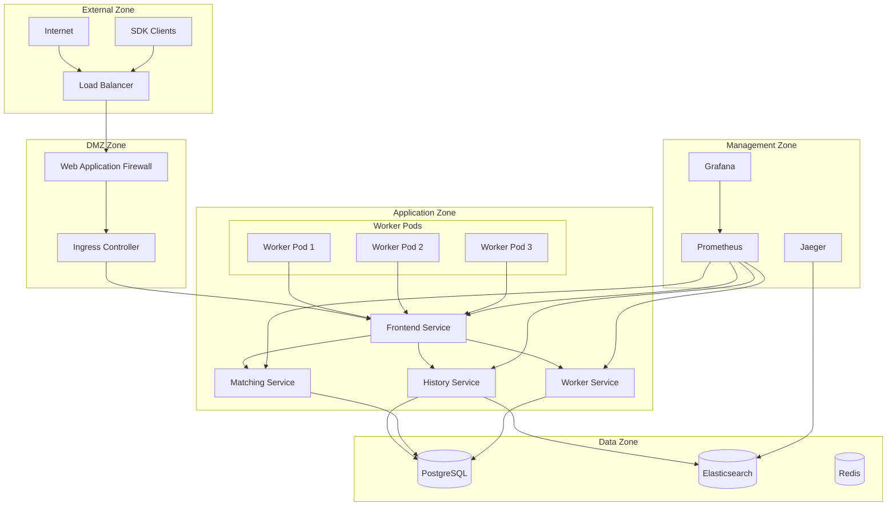

# Network Policies

This guide provides comprehensive network security policies for Temporal.io deployments, implementing zero-trust networking principles with granular traffic control between services, external systems, and client applications.

## Overview

Network policies in Temporal.io deployments control:
- **Inter-Service Communication**: Between Temporal components
- **Client Access**: From SDK clients and workers to Temporal services
- **Database Access**: Connectivity to PostgreSQL and Elasticsearch
- **External Services**: Integration with monitoring, logging, and other systems
- **Ingress Traffic**: External access through load balancers and ingress controllers

## Architecture



## Zero-Trust Network Policies

### 1. Default Deny Policy

#### Global Default Deny
```yaml
# k8s/network-policies/00-default-deny.yaml
apiVersion: networking.k8s.io/v1
kind: NetworkPolicy
metadata:
  name: default-deny-all
  namespace: temporal
spec:
  podSelector: {}
  policyTypes:
  - Ingress
  - Egress

---
apiVersion: networking.k8s.io/v1
kind: NetworkPolicy
metadata:
  name: default-deny-all
  namespace: temporal-monitoring
spec:
  podSelector: {}
  policyTypes:
  - Ingress
  - Egress

---
apiVersion: networking.k8s.io/v1
kind: NetworkPolicy
metadata:
  name: default-deny-all
  namespace: temporal-workers
spec:
  podSelector: {}
  policyTypes:
  - Ingress
  - Egress
```

### 2. DNS Resolution Policy

#### Allow DNS for All Pods
```yaml
# k8s/network-policies/01-allow-dns.yaml
apiVersion: networking.k8s.io/v1
kind: NetworkPolicy
metadata:
  name: allow-dns-access
  namespace: temporal
spec:
  podSelector: {}
  policyTypes:
  - Egress
  egress:
  - to: []
    ports:
    - protocol: UDP
      port: 53
    - protocol: TCP
      port: 53
  - to:
    - namespaceSelector:
        matchLabels:
          name: kube-system
    ports:
    - protocol: UDP
      port: 53
    - protocol: TCP
      port: 53

---
apiVersion: networking.k8s.io/v1
kind: NetworkPolicy
metadata:
  name: allow-dns-access
  namespace: temporal-monitoring
spec:
  podSelector: {}
  policyTypes:
  - Egress
  egress:
  - to: []
    ports:
    - protocol: UDP
      port: 53
    - protocol: TCP
      port: 53

---
apiVersion: networking.k8s.io/v1
kind: NetworkPolicy
metadata:
  name: allow-dns-access
  namespace: temporal-workers
spec:
  podSelector: {}
  policyTypes:
  - Egress
  egress:
  - to: []
    ports:
    - protocol: UDP
      port: 53
    - protocol: TCP
      port: 53
```

## Temporal Service Policies

### 1. Frontend Service Policy

#### Frontend Network Policy
```yaml
# k8s/network-policies/temporal-frontend.yaml
apiVersion: networking.k8s.io/v1
kind: NetworkPolicy
metadata:
  name: temporal-frontend-policy
  namespace: temporal
spec:
  podSelector:
    matchLabels:
      app: temporal-frontend
  policyTypes:
  - Ingress
  - Egress
  
  ingress:
  # Allow ingress controller access
  - from:
    - namespaceSelector:
        matchLabels:
          name: ingress-nginx
    ports:
    - protocol: TCP
      port: 7233
  
  # Allow load balancer access
  - from: []
    ports:
    - protocol: TCP
      port: 7233
  
  # Allow worker access
  - from:
    - namespaceSelector:
        matchLabels:
          name: temporal-workers
    ports:
    - protocol: TCP
      port: 7233
  
  # Allow SDK client access
  - from:
    - namespaceSelector:
        matchLabels:
          name: temporal-clients
    ports:
    - protocol: TCP
      port: 7233
  
  # Allow monitoring access
  - from:
    - namespaceSelector:
        matchLabels:
          name: temporal-monitoring
    - podSelector:
        matchLabels:
          app: prometheus
    ports:
    - protocol: TCP
      port: 9090  # Metrics port
  
  # Allow internal service communication
  - from:
    - podSelector:
        matchLabels:
          app: temporal-history
    - podSelector:
        matchLabels:
          app: temporal-matching
    - podSelector:
        matchLabels:
          app: temporal-worker
    ports:
    - protocol: TCP
      port: 7233
    - protocol: TCP
      port: 7234  # Membership port
  
  egress:
  # Allow communication to history service
  - to:
    - podSelector:
        matchLabels:
          app: temporal-history
    ports:
    - protocol: TCP
      port: 7234
    - protocol: TCP
      port: 7235
  
  # Allow communication to matching service
  - to:
    - podSelector:
        matchLabels:
          app: temporal-matching
    ports:
    - protocol: TCP
      port: 7235
  
  # Allow communication to worker service
  - to:
    - podSelector:
        matchLabels:
          app: temporal-worker
    ports:
    - protocol: TCP
      port: 7239
  
  # Allow database access
  - to: []
    ports:
    - protocol: TCP
      port: 5432  # PostgreSQL
  
  # Allow external service access (specify as needed)
  - to: []
    ports:
    - protocol: TCP
      port: 443   # HTTPS
    - protocol: TCP
      port: 80    # HTTP
```

### 2. History Service Policy

#### History Network Policy
```yaml
# k8s/network-policies/temporal-history.yaml
apiVersion: networking.k8s.io/v1
kind: NetworkPolicy
metadata:
  name: temporal-history-policy
  namespace: temporal
spec:
  podSelector:
    matchLabels:
      app: temporal-history
  policyTypes:
  - Ingress
  - Egress
  
  ingress:
  # Allow frontend service access
  - from:
    - podSelector:
        matchLabels:
          app: temporal-frontend
    ports:
    - protocol: TCP
      port: 7234
    - protocol: TCP
      port: 7235
  
  # Allow matching service access
  - from:
    - podSelector:
        matchLabels:
          app: temporal-matching
    ports:
    - protocol: TCP
      port: 7235
  
  # Allow worker service access
  - from:
    - podSelector:
        matchLabels:
          app: temporal-worker
    ports:
    - protocol: TCP
      port: 7235
  
  # Allow monitoring access
  - from:
    - namespaceSelector:
        matchLabels:
          name: temporal-monitoring
    - podSelector:
        matchLabels:
          app: prometheus
    ports:
    - protocol: TCP
      port: 9090  # Metrics port
  
  # Allow other history instances (clustering)
  - from:
    - podSelector:
        matchLabels:
          app: temporal-history
    ports:
    - protocol: TCP
      port: 7234
    - protocol: TCP
      port: 7235
  
  egress:
  # Allow database access
  - to: []
    ports:
    - protocol: TCP
      port: 5432  # PostgreSQL
  
  # Allow Elasticsearch access
  - to: []
    ports:
    - protocol: TCP
      port: 9200  # Elasticsearch
    - protocol: TCP
      port: 9300  # Elasticsearch transport
  
  # Allow communication to other history instances
  - to:
    - podSelector:
        matchLabels:
          app: temporal-history
    ports:
    - protocol: TCP
      port: 7234
    - protocol: TCP
      port: 7235
  
  # Allow communication to frontend for membership
  - to:
    - podSelector:
        matchLabels:
          app: temporal-frontend
    ports:
    - protocol: TCP
      port: 7234
```

### 3. Matching Service Policy

#### Matching Network Policy
```yaml
# k8s/network-policies/temporal-matching.yaml
apiVersion: networking.k8s.io/v1
kind: NetworkPolicy
metadata:
  name: temporal-matching-policy
  namespace: temporal
spec:
  podSelector:
    matchLabels:
      app: temporal-matching
  policyTypes:
  - Ingress
  - Egress
  
  ingress:
  # Allow frontend service access
  - from:
    - podSelector:
        matchLabels:
          app: temporal-frontend
    ports:
    - protocol: TCP
      port: 7235
  
  # Allow history service access
  - from:
    - podSelector:
        matchLabels:
          app: temporal-history
    ports:
    - protocol: TCP
      port: 7235
  
  # Allow worker service access
  - from:
    - podSelector:
        matchLabels:
          app: temporal-worker
    ports:
    - protocol: TCP
      port: 7235
  
  # Allow monitoring access
  - from:
    - namespaceSelector:
        matchLabels:
          name: temporal-monitoring
    - podSelector:
        matchLabels:
          app: prometheus
    ports:
    - protocol: TCP
      port: 9090  # Metrics port
  
  # Allow other matching instances (clustering)
  - from:
    - podSelector:
        matchLabels:
          app: temporal-matching
    ports:
    - protocol: TCP
      port: 7235
  
  egress:
  # Allow database access
  - to: []
    ports:
    - protocol: TCP
      port: 5432  # PostgreSQL
  
  # Allow communication to history service
  - to:
    - podSelector:
        matchLabels:
          app: temporal-history
    ports:
    - protocol: TCP
      port: 7235
  
  # Allow communication to other matching instances
  - to:
    - podSelector:
        matchLabels:
          app: temporal-matching
    ports:
    - protocol: TCP
      port: 7235
  
  # Allow communication to frontend for membership
  - to:
    - podSelector:
        matchLabels:
          app: temporal-frontend
    ports:
    - protocol: TCP
      port: 7234
```

### 4. Worker Service Policy

#### Worker Network Policy
```yaml
# k8s/network-policies/temporal-worker.yaml
apiVersion: networking.k8s.io/v1
kind: NetworkPolicy
metadata:
  name: temporal-worker-policy
  namespace: temporal
spec:
  podSelector:
    matchLabels:
      app: temporal-worker
  policyTypes:
  - Ingress
  - Egress
  
  ingress:
  # Allow frontend service access
  - from:
    - podSelector:
        matchLabels:
          app: temporal-frontend
    ports:
    - protocol: TCP
      port: 7239
  
  # Allow monitoring access
  - from:
    - namespaceSelector:
        matchLabels:
          name: temporal-monitoring
    - podSelector:
        matchLabels:
          app: prometheus
    ports:
    - protocol: TCP
      port: 9090  # Metrics port
  
  egress:
  # Allow communication to frontend service
  - to:
    - podSelector:
        matchLabels:
          app: temporal-frontend
    ports:
    - protocol: TCP
      port: 7233
  
  # Allow communication to history service
  - to:
    - podSelector:
        matchLabels:
          app: temporal-history
    ports:
    - protocol: TCP
      port: 7235
  
  # Allow communication to matching service
  - to:
    - podSelector:
        matchLabels:
          app: temporal-matching
    ports:
    - protocol: TCP
      port: 7235
  
  # Allow database access
  - to: []
    ports:
    - protocol: TCP
      port: 5432  # PostgreSQL
```

## Application Worker Policies

### 1. Worker Namespace Policy

#### Worker Access Policy
```yaml
# k8s/network-policies/application-workers.yaml
apiVersion: networking.k8s.io/v1
kind: NetworkPolicy
metadata:
  name: temporal-application-workers-policy
  namespace: temporal-workers
spec:
  podSelector:
    matchLabels:
      component: temporal-worker
  policyTypes:
  - Ingress
  - Egress
  
  ingress:
  # Allow monitoring access
  - from:
    - namespaceSelector:
        matchLabels:
          name: temporal-monitoring
    - podSelector:
        matchLabels:
          app: prometheus
    ports:
    - protocol: TCP
      port: 9090  # Metrics port
  
  # Allow health check access
  - from:
    - namespaceSelector:
        matchLabels:
          name: kube-system
    ports:
    - protocol: TCP
      port: 8080  # Health check port
  
  egress:
  # Allow access to Temporal frontend
  - to:
    - namespaceSelector:
        matchLabels:
          name: temporal
      podSelector:
        matchLabels:
          app: temporal-frontend
    ports:
    - protocol: TCP
      port: 7233
  
  # Allow access to external APIs (adjust as needed)
  - to: []
    ports:
    - protocol: TCP
      port: 443   # HTTPS
    - protocol: TCP
      port: 80    # HTTP
  
  # Allow database access if workers need direct DB access
  - to: []
    ports:
    - protocol: TCP
      port: 5432  # PostgreSQL
    - protocol: TCP
      port: 3306  # MySQL
    - protocol: TCP
      port: 27017 # MongoDB
  
  # Allow Redis access for caching
  - to: []
    ports:
    - protocol: TCP
      port: 6379  # Redis
```

### 2. Specific Worker Application Policy

#### Payment Worker Policy Example
```yaml
# k8s/network-policies/payment-worker.yaml
apiVersion: networking.k8s.io/v1
kind: NetworkPolicy
metadata:
  name: payment-worker-policy
  namespace: temporal-workers
spec:
  podSelector:
    matchLabels:
      app: payment-worker
  policyTypes:
  - Ingress
  - Egress
  
  ingress:
  # Allow monitoring access
  - from:
    - namespaceSelector:
        matchLabels:
          name: temporal-monitoring
    ports:
    - protocol: TCP
      port: 9090
  
  egress:
  # Allow access to Temporal
  - to:
    - namespaceSelector:
        matchLabels:
          name: temporal
    ports:
    - protocol: TCP
      port: 7233
  
  # Allow access to payment APIs
  - to: []
    ports:
    - protocol: TCP
      port: 443
    # Restrict to specific domains if possible
  
  # Allow database access
  - to:
    - namespaceSelector:
        matchLabels:
          name: databases
      podSelector:
        matchLabels:
          app: payments-db
    ports:
    - protocol: TCP
      port: 5432
```

## Database Access Policies

### 1. PostgreSQL Policy

#### Database Network Policy
```yaml
# k8s/network-policies/postgresql.yaml
apiVersion: networking.k8s.io/v1
kind: NetworkPolicy
metadata:
  name: postgresql-policy
  namespace: databases
spec:
  podSelector:
    matchLabels:
      app: postgresql
  policyTypes:
  - Ingress
  - Egress
  
  ingress:
  # Allow Temporal services access
  - from:
    - namespaceSelector:
        matchLabels:
          name: temporal
    ports:
    - protocol: TCP
      port: 5432
  
  # Allow backup services access
  - from:
    - namespaceSelector:
        matchLabels:
          name: backup-system
    ports:
    - protocol: TCP
      port: 5432
  
  # Allow monitoring access
  - from:
    - namespaceSelector:
        matchLabels:
          name: temporal-monitoring
      podSelector:
        matchLabels:
          app: postgres-exporter
    ports:
    - protocol: TCP
      port: 5432
  
  # Allow admin access from specific namespace
  - from:
    - namespaceSelector:
        matchLabels:
          name: database-admin
    ports:
    - protocol: TCP
      port: 5432
  
  egress:
  # Allow external backup destinations
  - to: []
    ports:
    - protocol: TCP
      port: 443   # S3/Cloud storage
  
  # Allow replication to read replicas
  - to:
    - podSelector:
        matchLabels:
          app: postgresql-replica
    ports:
    - protocol: TCP
      port: 5432
```

### 2. Elasticsearch Policy

#### Elasticsearch Network Policy
```yaml
# k8s/network-policies/elasticsearch.yaml
apiVersion: networking.k8s.io/v1
kind: NetworkPolicy
metadata:
  name: elasticsearch-policy
  namespace: databases
spec:
  podSelector:
    matchLabels:
      app: elasticsearch
  policyTypes:
  - Ingress
  - Egress
  
  ingress:
  # Allow Temporal history service access
  - from:
    - namespaceSelector:
        matchLabels:
          name: temporal
      podSelector:
        matchLabels:
          app: temporal-history
    ports:
    - protocol: TCP
      port: 9200
  
  # Allow Jaeger access for tracing
  - from:
    - namespaceSelector:
        matchLabels:
          name: temporal-monitoring
      podSelector:
        matchLabels:
          app: jaeger
    ports:
    - protocol: TCP
      port: 9200
  
  # Allow Kibana access
  - from:
    - namespaceSelector:
        matchLabels:
          name: temporal-monitoring
      podSelector:
        matchLabels:
          app: kibana
    ports:
    - protocol: TCP
      port: 9200
  
  # Allow monitoring access
  - from:
    - namespaceSelector:
        matchLabels:
          name: temporal-monitoring
      podSelector:
        matchLabels:
          app: elasticsearch-exporter
    ports:
    - protocol: TCP
      port: 9200
  
  # Allow cluster communication
  - from:
    - podSelector:
        matchLabels:
          app: elasticsearch
    ports:
    - protocol: TCP
      port: 9300   # Transport port
    - protocol: TCP
      port: 9200   # HTTP port
  
  egress:
  # Allow cluster communication
  - to:
    - podSelector:
        matchLabels:
          app: elasticsearch
    ports:
    - protocol: TCP
      port: 9300
    - protocol: TCP
      port: 9200
  
  # Allow external snapshot repositories
  - to: []
    ports:
    - protocol: TCP
      port: 443   # S3/Cloud storage
```

## Monitoring and Observability Policies

### 1. Prometheus Policy

#### Prometheus Network Policy
```yaml
# k8s/network-policies/prometheus.yaml
apiVersion: networking.k8s.io/v1
kind: NetworkPolicy
metadata:
  name: prometheus-policy
  namespace: temporal-monitoring
spec:
  podSelector:
    matchLabels:
      app: prometheus
  policyTypes:
  - Ingress
  - Egress
  
  ingress:
  # Allow Grafana access
  - from:
    - podSelector:
        matchLabels:
          app: grafana
    ports:
    - protocol: TCP
      port: 9090
  
  # Allow AlertManager access
  - from:
    - podSelector:
        matchLabels:
          app: alertmanager
    ports:
    - protocol: TCP
      port: 9090
  
  # Allow admin access
  - from:
    - namespaceSelector:
        matchLabels:
          name: admin-tools
    ports:
    - protocol: TCP
      port: 9090
  
  egress:
  # Allow scraping Temporal services
  - to:
    - namespaceSelector:
        matchLabels:
          name: temporal
    ports:
    - protocol: TCP
      port: 9090   # Metrics port
  
  # Allow scraping worker services
  - to:
    - namespaceSelector:
        matchLabels:
          name: temporal-workers
    ports:
    - protocol: TCP
      port: 9090   # Metrics port
  
  # Allow scraping database exporters
  - to:
    - namespaceSelector:
        matchLabels:
          name: databases
    ports:
    - protocol: TCP
      port: 9187   # PostgreSQL exporter
    - protocol: TCP
      port: 9114   # Elasticsearch exporter
  
  # Allow external alert destinations
  - to: []
    ports:
    - protocol: TCP
      port: 443    # Webhook endpoints
    - protocol: TCP
      port: 587    # SMTP
```

### 2. Grafana Policy

#### Grafana Network Policy
```yaml
# k8s/network-policies/grafana.yaml
apiVersion: networking.k8s.io/v1
kind: NetworkPolicy
metadata:
  name: grafana-policy
  namespace: temporal-monitoring
spec:
  podSelector:
    matchLabels:
      app: grafana
  policyTypes:
  - Ingress
  - Egress
  
  ingress:
  # Allow ingress controller access
  - from:
    - namespaceSelector:
        matchLabels:
          name: ingress-nginx
    ports:
    - protocol: TCP
      port: 3000
  
  # Allow load balancer access
  - from: []
    ports:
    - protocol: TCP
      port: 3000
  
  egress:
  # Allow access to Prometheus
  - to:
    - podSelector:
        matchLabels:
          app: prometheus
    ports:
    - protocol: TCP
      port: 9090
  
  # Allow access to Jaeger for tracing
  - to:
    - podSelector:
        matchLabels:
          app: jaeger-query
    ports:
    - protocol: TCP
      port: 16686
  
  # Allow external plugin downloads and updates
  - to: []
    ports:
    - protocol: TCP
      port: 443    # HTTPS
```

## Ingress and External Access Policies

### 1. Ingress Controller Policy

#### Ingress Network Policy
```yaml
# k8s/network-policies/ingress-controller.yaml
apiVersion: networking.k8s.io/v1
kind: NetworkPolicy
metadata:
  name: ingress-controller-policy
  namespace: ingress-nginx
spec:
  podSelector:
    matchLabels:
      app.kubernetes.io/name: ingress-nginx
  policyTypes:
  - Ingress
  - Egress
  
  ingress:
  # Allow external traffic
  - from: []
    ports:
    - protocol: TCP
      port: 80
    - protocol: TCP
      port: 443
  
  egress:
  # Allow access to Temporal frontend
  - to:
    - namespaceSelector:
        matchLabels:
          name: temporal
      podSelector:
        matchLabels:
          app: temporal-frontend
    ports:
    - protocol: TCP
      port: 7233
  
  # Allow access to Grafana
  - to:
    - namespaceSelector:
        matchLabels:
          name: temporal-monitoring
      podSelector:
        matchLabels:
          app: grafana
    ports:
    - protocol: TCP
      port: 3000
  
  # Allow access to Jaeger UI
  - to:
    - namespaceSelector:
        matchLabels:
          name: temporal-monitoring
      podSelector:
        matchLabels:
          app: jaeger-query
    ports:
    - protocol: TCP
      port: 16686
```

## Environment-Specific Policies

### 1. Development Environment

#### Development Relaxed Policy
```yaml
# k8s/network-policies/dev-environment.yaml
apiVersion: networking.k8s.io/v1
kind: NetworkPolicy
metadata:
  name: dev-relaxed-policy
  namespace: temporal-dev
spec:
  podSelector: {}
  policyTypes:
  - Ingress
  - Egress
  
  ingress:
  # Allow all internal cluster traffic
  - from:
    - namespaceSelector: {}
  
  egress:
  # Allow all egress for development
  - to: []
```

### 2. Production Environment

#### Production Strict Policy
```yaml
# k8s/network-policies/prod-environment.yaml
apiVersion: networking.k8s.io/v1
kind: NetworkPolicy
metadata:
  name: prod-strict-policy
  namespace: temporal-production
spec:
  podSelector: {}
  policyTypes:
  - Ingress
  - Egress
  
  ingress:
  # Only allow specific namespaces
  - from:
    - namespaceSelector:
        matchLabels:
          environment: production
  
  # Allow monitoring
  - from:
    - namespaceSelector:
        matchLabels:
          name: temporal-monitoring
  
  egress:
  # Restrict egress to specific destinations
  - to:
    - namespaceSelector:
        matchLabels:
          environment: production
  
  # Allow external HTTPS only
  - to: []
    ports:
    - protocol: TCP
      port: 443
```

## Policy Validation and Testing

### 1. Network Policy Testing Script

#### Policy Validation
```bash
#!/bin/bash
# scripts/test-network-policies.sh

set -euo pipefail

NAMESPACE="temporal"
TEST_NAMESPACE="network-policy-test"

log() {
    echo -e "\033[0;32m[$(date +'%Y-%m-%d %H:%M:%S')] $1\033[0m"
}

error() {
    echo -e "\033[0;31m[$(date +'%Y-%m-%d %H:%M:%S')] ERROR: $1\033[0m"
    exit 1
}

# Function to test connectivity
test_connectivity() {
    local source_pod="$1"
    local target_host="$2"
    local target_port="$3"
    local expected_result="$4"  # "allow" or "deny"
    
    log "Testing connectivity from $source_pod to $target_host:$target_port (expecting $expected_result)"
    
    if kubectl exec -n "$TEST_NAMESPACE" "$source_pod" -- timeout 5 nc -zv "$target_host" "$target_port" &>/dev/null; then
        result="allow"
    else
        result="deny"
    fi
    
    if [[ "$result" == "$expected_result" ]]; then
        log "✓ Test passed: $source_pod -> $target_host:$target_port ($result)"
    else
        error "✗ Test failed: $source_pod -> $target_host:$target_port (expected $expected_result, got $result)"
    fi
}

# Create test namespace
kubectl create namespace "$TEST_NAMESPACE" --dry-run=client -o yaml | kubectl apply -f -

# Label test namespace
kubectl label namespace "$TEST_NAMESPACE" name="$TEST_NAMESPACE" --overwrite

# Deploy test pods
cat << EOF | kubectl apply -f -
apiVersion: v1
kind: Pod
metadata:
  name: test-client
  namespace: $TEST_NAMESPACE
  labels:
    app: test-client
spec:
  containers:
  - name: netshoot
    image: nicolaka/netshoot
    command: ["/bin/bash"]
    args: ["-c", "while true; do sleep 30; done;"]
    
---
apiVersion: v1
kind: Pod
metadata:
  name: test-worker
  namespace: $TEST_NAMESPACE
  labels:
    app: test-worker
    component: temporal-worker
spec:
  containers:
  - name: netshoot
    image: nicolaka/netshoot
    command: ["/bin/bash"]
    args: ["-c", "while true; do sleep 30; done;"]
EOF

# Wait for pods to be ready
kubectl wait pod test-client -n "$TEST_NAMESPACE" --for=condition=Ready --timeout=60s
kubectl wait pod test-worker -n "$TEST_NAMESPACE" --for=condition=Ready --timeout=60s

# Test cases
log "Running network policy tests..."

# Test 1: Client should be able to access frontend
test_connectivity "test-client" "temporal-frontend.${NAMESPACE}.svc.cluster.local" "7233" "allow"

# Test 2: Client should not be able to access history directly
test_connectivity "test-client" "temporal-history.${NAMESPACE}.svc.cluster.local" "7235" "deny"

# Test 3: Worker should be able to access frontend
test_connectivity "test-worker" "temporal-frontend.${NAMESPACE}.svc.cluster.local" "7233" "allow"

# Test 4: Test DNS resolution
test_connectivity "test-client" "8.8.8.8" "53" "allow"

# Test 5: Test database access restrictions
test_connectivity "test-client" "postgresql.databases.svc.cluster.local" "5432" "deny"

log "✓ All network policy tests completed"

# Cleanup
kubectl delete namespace "$TEST_NAMESPACE"
```

### 2. Policy Monitoring

#### Network Policy Violations Monitor
```yaml
# k8s/monitoring/network-policy-monitor.yaml
apiVersion: monitoring.coreos.com/v1
kind: PrometheusRule
metadata:
  name: network-policy-violations
  namespace: temporal-monitoring
spec:
  groups:
  - name: network-policy
    rules:
    - alert: NetworkPolicyViolation
      expr: increase(networkpolicy_dropped_packets_total[5m]) > 10
      for: 2m
      labels:
        severity: warning
      annotations:
        summary: "High number of dropped packets due to network policies"
        description: "Network policy {{ $labels.policy }} has dropped {{ $value }} packets in the last 5 minutes"
    
    - alert: UnexpectedNetworkTraffic
      expr: increase(networkpolicy_allowed_packets_total{destination_port!~"7233|7234|7235|7239|5432|9200|53"}[5m]) > 0
      for: 1m
      labels:
        severity: critical
      annotations:
        summary: "Unexpected network traffic detected"
        description: "Traffic to unexpected port {{ $labels.destination_port }} detected from {{ $labels.source }}"
```

This comprehensive network policies guide provides zero-trust networking for Temporal.io deployments with granular traffic control, security boundaries, and monitoring capabilities.
