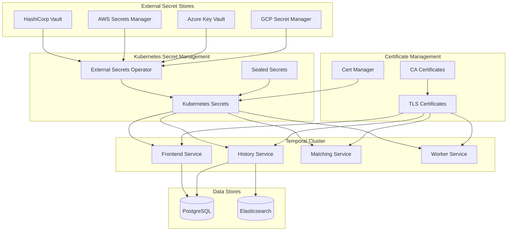

# Secrets Management

This guide provides comprehensive secrets management strategies for Temporal.io deployments, ensuring secure storage, access, and rotation of sensitive information including database credentials, API keys, certificates, and encryption keys.

## Overview

Secrets management in Temporal.io encompasses:
- **Database Credentials**: PostgreSQL and Elasticsearch authentication
- **TLS Certificates**: Server and client certificates for secure communication
- **API Keys**: Authentication tokens and service credentials
- **Encryption Keys**: Data encryption and JWT signing keys
- **External Service Credentials**: Third-party service authentication

## Architecture



## External Secrets Operator Integration

### 1. Installation and Configuration

#### External Secrets Operator Setup
```bash
#!/bin/bash
# scripts/install-external-secrets.sh

set -euo pipefail

NAMESPACE="external-secrets-system"
VERSION="v0.9.11"

log() {
    echo -e "\033[0;32m[$(date +'%Y-%m-%d %H:%M:%S')] $1\033[0m"
}

error() {
    echo -e "\033[0;31m[$(date +'%Y-%m-%d %H:%M:%S')] ERROR: $1\033[0m"
    exit 1
}

log "Installing External Secrets Operator..."

# Create namespace
kubectl create namespace "$NAMESPACE" --dry-run=client -o yaml | kubectl apply -f -

# Install using Helm
helm repo add external-secrets https://charts.external-secrets.io
helm repo update

helm install external-secrets external-secrets/external-secrets \
    --namespace "$NAMESPACE" \
    --version "$VERSION" \
    --set installCRDs=true \
    --set webhook.port=9443 \
    --set certController.create=true

# Wait for deployment
kubectl wait deployment external-secrets -n "$NAMESPACE" --for=condition=Available --timeout=300s
kubectl wait deployment external-secrets-webhook -n "$NAMESPACE" --for=condition=Available --timeout=300s
kubectl wait deployment external-secrets-cert-controller -n "$NAMESPACE" --for=condition=Available --timeout=300s

log "✓ External Secrets Operator installed successfully"
```

### 2. HashiCorp Vault Integration

#### Vault Secret Store Configuration
```yaml
# k8s/external-secrets/vault-secret-store.yaml
apiVersion: external-secrets.io/v1beta1
kind: SecretStore
metadata:
  name: vault-backend
  namespace: temporal
spec:
  provider:
    vault:
      server: "https://vault.company.com"
      path: "secret"
      version: "v2"
      auth:
        kubernetes:
          mountPath: "kubernetes"
          role: "temporal-secrets-reader"
          serviceAccountRef:
            name: "temporal-vault-auth"

---
apiVersion: v1
kind: ServiceAccount
metadata:
  name: temporal-vault-auth
  namespace: temporal
  annotations:
    vault.hashicorp.com/role: "temporal-secrets-reader"

---
apiVersion: rbac.authorization.k8s.io/v1
kind: ClusterRole
metadata:
  name: temporal-vault-auth
rules:
- apiGroups: [""]
  resources: ["serviceaccounts/token"]
  verbs: ["create"]

---
apiVersion: rbac.authorization.k8s.io/v1
kind: ClusterRoleBinding
metadata:
  name: temporal-vault-auth
roleRef:
  apiGroup: rbac.authorization.k8s.io
  kind: ClusterRole
  name: temporal-vault-auth
subjects:
- kind: ServiceAccount
  name: temporal-vault-auth
  namespace: temporal
```

#### Vault Policy Configuration
```hcl
# vault/policies/temporal-secrets.hcl
path "secret/data/temporal/*" {
  capabilities = ["read"]
}

path "secret/metadata/temporal/*" {
  capabilities = ["list", "read"]
}

path "pki/issue/temporal" {
  capabilities = ["create", "update"]
}

path "database/creds/temporal-readonly" {
  capabilities = ["read"]
}

path "database/creds/temporal-readwrite" {
  capabilities = ["read"]
}
```

#### Vault Kubernetes Auth Setup
```bash
#!/bin/bash
# scripts/setup-vault-auth.sh

set -euo pipefail

VAULT_ADDR="https://vault.company.com"
KUBERNETES_HOST="https://kubernetes.default.svc.cluster.local"
VAULT_SA_NAME="temporal-vault-auth"
NAMESPACE="temporal"

log() {
    echo -e "\033[0;32m[$(date +'%Y-%m-%d %H:%M:%S')] $1\033[0m"
}

# Get service account token
SA_JWT_TOKEN=$(kubectl get secret $(kubectl get sa $VAULT_SA_NAME -n $NAMESPACE -o jsonpath='{.secrets[0].name}') -n $NAMESPACE -o jsonpath='{.data.token}' | base64 --decode)
SA_CA_CRT=$(kubectl get secret $(kubectl get sa $VAULT_SA_NAME -n $NAMESPACE -o jsonpath='{.secrets[0].name}') -n $NAMESPACE -o jsonpath='{.data.ca\.crt}' | base64 --decode)

# Configure Vault Kubernetes auth
vault auth enable kubernetes

vault write auth/kubernetes/config \
    token_reviewer_jwt="$SA_JWT_TOKEN" \
    kubernetes_host="$KUBERNETES_HOST" \
    kubernetes_ca_cert="$SA_CA_CRT"

# Create role for temporal
vault write auth/kubernetes/role/temporal-secrets-reader \
    bound_service_account_names="$VAULT_SA_NAME" \
    bound_service_account_namespaces="$NAMESPACE" \
    policies="temporal-secrets" \
    ttl=24h

log "✓ Vault Kubernetes authentication configured"
```

### 3. AWS Secrets Manager Integration

#### AWS Secret Store Configuration
```yaml
# k8s/external-secrets/aws-secret-store.yaml
apiVersion: external-secrets.io/v1beta1
kind: SecretStore
metadata:
  name: aws-secrets-manager
  namespace: temporal
spec:
  provider:
    aws:
      service: SecretsManager
      region: us-west-2
      auth:
        serviceAccount:
          name: temporal-aws-secrets

---
apiVersion: v1
kind: ServiceAccount
metadata:
  name: temporal-aws-secrets
  namespace: temporal
  annotations:
    eks.amazonaws.com/role-arn: arn:aws:iam::ACCOUNT_ID:role/temporal-secrets-manager-role

---
apiVersion: external-secrets.io/v1beta1
kind: ClusterSecretStore
metadata:
  name: aws-parameter-store
spec:
  provider:
    aws:
      service: ParameterStore
      region: us-west-2
      auth:
        serviceAccount:
          name: temporal-aws-secrets
```

#### IAM Role Configuration
```json
{
  "Version": "2012-10-17",
  "Statement": [
    {
      "Effect": "Allow",
      "Action": [
        "secretsmanager:GetSecretValue",
        "secretsmanager:DescribeSecret"
      ],
      "Resource": [
        "arn:aws:secretsmanager:us-west-2:ACCOUNT_ID:secret:temporal/*"
      ]
    },
    {
      "Effect": "Allow",
      "Action": [
        "ssm:GetParameter",
        "ssm:GetParameters",
        "ssm:GetParametersByPath"
      ],
      "Resource": [
        "arn:aws:ssm:us-west-2:ACCOUNT_ID:parameter/temporal/*"
      ]
    }
  ]
}
```

## Database Secrets Management

### 1. PostgreSQL Credentials

#### Database Secret Configuration
```yaml
# k8s/external-secrets/database-secrets.yaml
apiVersion: external-secrets.io/v1beta1
kind: ExternalSecret
metadata:
  name: temporal-postgres-credentials
  namespace: temporal
spec:
  refreshInterval: 1h
  secretStoreRef:
    name: vault-backend
    kind: SecretStore
  target:
    name: temporal-postgres-credentials
    creationPolicy: Owner
    template:
      type: Opaque
      data:
        username: "{{ .username }}"
        password: "{{ .password }}"
        host: "{{ .host }}"
        port: "{{ .port }}"
        database: "{{ .database }}"
        connection-string: "postgres://{{ .username }}:{{ .password }}@{{ .host }}:{{ .port }}/{{ .database }}?sslmode=require"
        visibility-connection-string: "postgres://{{ .username }}:{{ .password }}@{{ .host }}:{{ .port }}/{{ .visibility_database }}?sslmode=require"
  data:
  - secretKey: username
    remoteRef:
      key: temporal/database
      property: username
  - secretKey: password
    remoteRef:
      key: temporal/database
      property: password
  - secretKey: host
    remoteRef:
      key: temporal/database
      property: host
  - secretKey: port
    remoteRef:
      key: temporal/database
      property: port
  - secretKey: database
    remoteRef:
      key: temporal/database
      property: database
  - secretKey: visibility_database
    remoteRef:
      key: temporal/database
      property: visibility_database

---
apiVersion: external-secrets.io/v1beta1
kind: ExternalSecret
metadata:
  name: temporal-postgres-admin-credentials
  namespace: temporal
spec:
  refreshInterval: 1h
  secretStoreRef:
    name: vault-backend
    kind: SecretStore
  target:
    name: temporal-postgres-admin-credentials
    creationPolicy: Owner
  data:
  - secretKey: username
    remoteRef:
      key: temporal/database-admin
      property: username
  - secretKey: password
    remoteRef:
      key: temporal/database-admin
      property: password
```

### 2. Dynamic Database Credentials with Vault

#### Vault Database Engine Configuration
```bash
#!/bin/bash
# scripts/setup-vault-database.sh

set -euo pipefail

VAULT_ADDR="https://vault.company.com"
DB_HOST="postgres.company.com"
DB_PORT="5432"

log() {
    echo -e "\033[0;32m[$(date +'%Y-%m-%d %H:%M:%S')] $1\033[0m"
}

# Enable database secrets engine
vault secrets enable database

# Configure PostgreSQL connection
vault write database/config/temporal-postgres \
    plugin_name=postgresql-database-plugin \
    connection_url="postgresql://{{username}}:{{password}}@${DB_HOST}:${DB_PORT}/postgres?sslmode=require" \
    allowed_roles="temporal-readonly,temporal-readwrite" \
    username="vault-admin" \
    password="$POSTGRES_VAULT_PASSWORD"

# Create readonly role
vault write database/roles/temporal-readonly \
    db_name=temporal-postgres \
    creation_statements="CREATE ROLE \"{{name}}\" WITH LOGIN PASSWORD '{{password}}' VALID UNTIL '{{expiration}}'; \
        GRANT SELECT ON ALL TABLES IN SCHEMA public TO \"{{name}}\";" \
    default_ttl="1h" \
    max_ttl="24h"

# Create readwrite role
vault write database/roles/temporal-readwrite \
    db_name=temporal-postgres \
    creation_statements="CREATE ROLE \"{{name}}\" WITH LOGIN PASSWORD '{{password}}' VALID UNTIL '{{expiration}}'; \
        GRANT SELECT, INSERT, UPDATE, DELETE ON ALL TABLES IN SCHEMA public TO \"{{name}}\";" \
    default_ttl="1h" \
    max_ttl="24h"

log "✓ Vault database engine configured for PostgreSQL"
```

#### Dynamic Database Secret
```yaml
# k8s/external-secrets/dynamic-database-secret.yaml
apiVersion: external-secrets.io/v1beta1
kind: ExternalSecret
metadata:
  name: temporal-dynamic-db-credentials
  namespace: temporal
spec:
  refreshInterval: 30m
  secretStoreRef:
    name: vault-backend
    kind: SecretStore
  target:
    name: temporal-dynamic-db-credentials
    creationPolicy: Owner
    template:
      type: Opaque
      data:
        username: "{{ .username }}"
        password: "{{ .password }}"
        connection-string: "postgres://{{ .username }}:{{ .password }}@postgres.company.com:5432/temporal?sslmode=require"
  data:
  - secretKey: username
    remoteRef:
      key: database/creds/temporal-readwrite
      property: username
  - secretKey: password
    remoteRef:
      key: database/creds/temporal-readwrite
      property: password
```

## TLS Certificate Secrets

### 1. Certificate Secret Management

#### TLS Certificate Secrets
```yaml
# k8s/external-secrets/tls-certificates.yaml
apiVersion: external-secrets.io/v1beta1
kind: ExternalSecret
metadata:
  name: temporal-server-tls-certs
  namespace: temporal
spec:
  refreshInterval: 6h
  secretStoreRef:
    name: vault-backend
    kind: SecretStore
  target:
    name: temporal-server-tls
    creationPolicy: Owner
    template:
      type: kubernetes.io/tls
      data:
        tls.crt: "{{ .server_cert }}"
        tls.key: "{{ .server_key }}"
        ca.crt: "{{ .ca_cert }}"
  data:
  - secretKey: server_cert
    remoteRef:
      key: temporal/tls/server
      property: certificate
  - secretKey: server_key
    remoteRef:
      key: temporal/tls/server
      property: private_key
  - secretKey: ca_cert
    remoteRef:
      key: temporal/tls/ca
      property: certificate

---
apiVersion: external-secrets.io/v1beta1
kind: ExternalSecret
metadata:
  name: temporal-client-tls-certs
  namespace: temporal
spec:
  refreshInterval: 6h
  secretStoreRef:
    name: vault-backend
    kind: SecretStore
  target:
    name: temporal-client-tls
    creationPolicy: Owner
    template:
      type: kubernetes.io/tls
  data:
  - secretKey: tls.crt
    remoteRef:
      key: temporal/tls/client
      property: certificate
  - secretKey: tls.key
    remoteRef:
      key: temporal/tls/client
      property: private_key
  - secretKey: ca.crt
    remoteRef:
      key: temporal/tls/ca
      property: certificate
```

### 2. Automated Certificate Generation with Vault PKI

#### Vault PKI Setup
```bash
#!/bin/bash
# scripts/setup-vault-pki.sh

set -euo pipefail

VAULT_ADDR="https://vault.company.com"

log() {
    echo -e "\033[0;32m[$(date +'%Y-%m-%d %H:%M:%S')] $1\033[0m"
}

# Enable PKI secrets engine
vault secrets enable -path=pki pki

# Tune the TTL
vault secrets tune -max-lease-ttl=87600h pki

# Generate root certificate
vault write -field=certificate pki/root/generate/internal \
    common_name="Company Root CA" \
    ttl=87600h > ca_cert.pem

# Configure URLs
vault write pki/config/urls \
    issuing_certificates="$VAULT_ADDR/v1/pki/ca" \
    crl_distribution_points="$VAULT_ADDR/v1/pki/crl"

# Enable intermediate PKI
vault secrets enable -path=pki_int pki
vault secrets tune -max-lease-ttl=43800h pki_int

# Generate intermediate CSR
vault write -format=json pki_int/intermediate/generate/internal \
    common_name="Company Intermediate CA" \
    | jq -r '.data.csr' > pki_intermediate.csr

# Sign intermediate certificate
vault write -format=json pki/root/sign-intermediate \
    csr=@pki_intermediate.csr \
    format=pem_bundle ttl="43800h" \
    | jq -r '.data.certificate' > intermediate.cert.pem

# Import signed certificate
vault write pki_int/intermediate/set-signed certificate=@intermediate.cert.pem

# Create role for temporal certificates
vault write pki_int/roles/temporal \
    allowed_domains="company.com,temporal.company.com" \
    allow_subdomains=true \
    max_ttl="720h"

log "✓ Vault PKI configured successfully"
```

#### Dynamic Certificate Generation
```yaml
# k8s/external-secrets/dynamic-certificates.yaml
apiVersion: external-secrets.io/v1beta1
kind: ExternalSecret
metadata:
  name: temporal-dynamic-server-cert
  namespace: temporal
spec:
  refreshInterval: 24h
  secretStoreRef:
    name: vault-backend
    kind: SecretStore
  target:
    name: temporal-dynamic-server-tls
    creationPolicy: Owner
    template:
      type: kubernetes.io/tls
      data:
        tls.crt: "{{ .certificate }}"
        tls.key: "{{ .private_key }}"
        ca.crt: "{{ .issuing_ca }}"
  data:
  - secretKey: certificate
    remoteRef:
      key: pki_int/issue/temporal
      property: certificate
  - secretKey: private_key
    remoteRef:
      key: pki_int/issue/temporal
      property: private_key
  - secretKey: issuing_ca
    remoteRef:
      key: pki_int/issue/temporal
      property: issuing_ca
```

## API Keys and JWT Secrets

### 1. JWT Signing Keys

#### JWT Secret Configuration
```yaml
# k8s/external-secrets/jwt-secrets.yaml
apiVersion: external-secrets.io/v1beta1
kind: ExternalSecret
metadata:
  name: temporal-jwt-secrets
  namespace: temporal
spec:
  refreshInterval: 24h
  secretStoreRef:
    name: vault-backend
    kind: SecretStore
  target:
    name: temporal-jwt-secrets
    creationPolicy: Owner
    template:
      type: Opaque
      data:
        jwt-signing-key: "{{ .signing_key }}"
        jwt-public-key: "{{ .public_key }}"
        jwt-key-id: "{{ .key_id }}"
  data:
  - secretKey: signing_key
    remoteRef:
      key: temporal/jwt
      property: signing_key
  - secretKey: public_key
    remoteRef:
      key: temporal/jwt
      property: public_key
  - secretKey: key_id
    remoteRef:
      key: temporal/jwt
      property: key_id

---
apiVersion: external-secrets.io/v1beta1
kind: ExternalSecret
metadata:
  name: temporal-api-keys
  namespace: temporal
spec:
  refreshInterval: 1h
  secretStoreRef:
    name: vault-backend
    kind: SecretStore
  target:
    name: temporal-api-keys
    creationPolicy: Owner
  data:
  - secretKey: admin-api-key
    remoteRef:
      key: temporal/api-keys
      property: admin_key
  - secretKey: worker-api-key
    remoteRef:
      key: temporal/api-keys
      property: worker_key
  - secretKey: monitoring-api-key
    remoteRef:
      key: temporal/api-keys
      property: monitoring_key
```

### 2. External Service Credentials

#### Third-Party Service Secrets
```yaml
# k8s/external-secrets/external-services.yaml
apiVersion: external-secrets.io/v1beta1
kind: ExternalSecret
metadata:
  name: temporal-external-services
  namespace: temporal
spec:
  refreshInterval: 1h
  secretStoreRef:
    name: vault-backend
    kind: SecretStore
  target:
    name: temporal-external-services
    creationPolicy: Owner
  data:
  - secretKey: elasticsearch-username
    remoteRef:
      key: temporal/elasticsearch
      property: username
  - secretKey: elasticsearch-password
    remoteRef:
      key: temporal/elasticsearch
      property: password
  - secretKey: redis-password
    remoteRef:
      key: temporal/redis
      property: password
  - secretKey: smtp-username
    remoteRef:
      key: temporal/smtp
      property: username
  - secretKey: smtp-password
    remoteRef:
      key: temporal/smtp
      property: password
  - secretKey: webhook-signing-secret
    remoteRef:
      key: temporal/webhooks
      property: signing_secret
```

## Sealed Secrets Alternative

### 1. Sealed Secrets Setup

#### Sealed Secrets Installation
```bash
#!/bin/bash
# scripts/install-sealed-secrets.sh

set -euo pipefail

NAMESPACE="kube-system"
VERSION="v0.24.0"

log() {
    echo -e "\033[0;32m[$(date +'%Y-%m-%d %H:%M:%S')] $1\033[0m"
}

log "Installing Sealed Secrets controller..."

# Install controller
kubectl apply -f "https://github.com/bitnami-labs/sealed-secrets/releases/download/${VERSION}/controller.yaml"

# Wait for deployment
kubectl wait deployment sealed-secrets-controller -n "$NAMESPACE" --for=condition=Available --timeout=300s

# Install kubeseal CLI
if ! command -v kubeseal &> /dev/null; then
    log "Installing kubeseal CLI..."
    wget "https://github.com/bitnami-labs/sealed-secrets/releases/download/${VERSION}/kubeseal-0.24.0-linux-amd64.tar.gz"
    tar xfz kubeseal-0.24.0-linux-amd64.tar.gz
    sudo install -m 755 kubeseal /usr/local/bin/kubeseal
    rm kubeseal kubeseal-0.24.0-linux-amd64.tar.gz
fi

log "✓ Sealed Secrets installed successfully"
```

#### Creating Sealed Secrets
```bash
#!/bin/bash
# scripts/create-sealed-secret.sh

set -euo pipefail

SECRET_NAME="$1"
NAMESPACE="$2"
KEY="$3"
VALUE="$4"

log() {
    echo -e "\033[0;32m[$(date +'%Y-%m-%d %H:%M:%S')] $1\033[0m"
}

# Create secret and seal it
kubectl create secret generic "$SECRET_NAME" \
    --from-literal="$KEY=$VALUE" \
    --dry-run=client -o yaml | \
    kubeseal -o yaml --namespace "$NAMESPACE" > "sealed-${SECRET_NAME}.yaml"

log "✓ Sealed secret created: sealed-${SECRET_NAME}.yaml"
```

### 2. Sealed Secret Examples

#### Database Credentials Sealed Secret
```yaml
# k8s/sealed-secrets/database-credentials.yaml
apiVersion: bitnami.com/v1alpha1
kind: SealedSecret
metadata:
  name: temporal-postgres-credentials
  namespace: temporal
spec:
  encryptedData:
    username: AgBy...  # Encrypted username
    password: AgCj...  # Encrypted password
    host: AgAz...      # Encrypted host
    port: AgBw...      # Encrypted port
    database: AgDf...  # Encrypted database name
  template:
    metadata:
      name: temporal-postgres-credentials
      namespace: temporal
    type: Opaque
```

## Secrets Rotation Automation

### 1. Automated Rotation Script

#### Secret Rotation Workflow
```bash
#!/bin/bash
# scripts/rotate-secrets.sh

set -euo pipefail

NAMESPACE="temporal"
VAULT_ADDR="https://vault.company.com"

log() {
    echo -e "\033[0;32m[$(date +'%Y-%m-%d %H:%M:%S')] $1\033[0m"
}

error() {
    echo -e "\033[0;31m[$(date +'%Y-%m-%d %H:%M:%S')] ERROR: $1\033[0m"
    exit 1
}

# Function to rotate database password
rotate_database_password() {
    local secret_name="$1"
    
    log "Rotating database password for secret: $secret_name"
    
    # Generate new password
    local new_password=$(openssl rand -base64 32)
    
    # Update password in Vault
    vault kv patch secret/temporal/database password="$new_password"
    
    # Force refresh of ExternalSecret
    kubectl annotate externalsecret "$secret_name" -n "$NAMESPACE" \
        force-sync="$(date +%s)" --overwrite
    
    # Wait for secret to be updated
    kubectl wait externalsecret "$secret_name" -n "$NAMESPACE" \
        --for=condition=Ready --timeout=60s
    
    log "✓ Database password rotated successfully"
}

# Function to rotate JWT signing key
rotate_jwt_key() {
    local secret_name="$1"
    
    log "Rotating JWT signing key for secret: $secret_name"
    
    # Generate new RSA key pair
    local private_key=$(openssl genrsa 2048)
    local public_key=$(echo "$private_key" | openssl rsa -pubout)
    local key_id=$(openssl rand -hex 8)
    
    # Update keys in Vault
    vault kv patch secret/temporal/jwt \
        signing_key="$private_key" \
        public_key="$public_key" \
        key_id="$key_id"
    
    # Force refresh of ExternalSecret
    kubectl annotate externalsecret "$secret_name" -n "$NAMESPACE" \
        force-sync="$(date +%s)" --overwrite
    
    log "✓ JWT signing key rotated successfully"
}

# Function to restart deployments after secret rotation
restart_deployments() {
    local deployments=("temporal-frontend" "temporal-history" "temporal-matching" "temporal-worker")
    
    for deployment in "${deployments[@]}"; do
        log "Restarting deployment: $deployment"
        kubectl rollout restart deployment "$deployment" -n "$NAMESPACE"
    done
    
    # Wait for rollouts to complete
    for deployment in "${deployments[@]}"; do
        kubectl rollout status deployment "$deployment" -n "$NAMESPACE" --timeout=300s
    done
    
    log "✓ All deployments restarted successfully"
}

main() {
    log "Starting secrets rotation process..."
    
    # Check if we need to rotate based on age or policy
    secrets_to_rotate=(
        "temporal-postgres-credentials"
        "temporal-jwt-secrets"
    )
    
    for secret in "${secrets_to_rotate[@]}"; do
        case "$secret" in
            "temporal-postgres-credentials")
                rotate_database_password "$secret"
                ;;
            "temporal-jwt-secrets")
                rotate_jwt_key "$secret"
                ;;
        esac
    done
    
    # Restart deployments to pick up new secrets
    restart_deployments
    
    log "✓ Secrets rotation completed successfully"
}

main "$@"
```

### 2. Secrets Monitoring and Alerting

#### Secret Expiry Monitoring
```yaml
# k8s/monitoring/secrets-monitor.yaml
apiVersion: monitoring.coreos.com/v1
kind: ServiceMonitor
metadata:
  name: external-secrets-metrics
  namespace: external-secrets-system
spec:
  selector:
    matchLabels:
      app.kubernetes.io/name: external-secrets
  endpoints:
  - port: metrics
    interval: 30s
    path: /metrics

---
apiVersion: monitoring.coreos.com/v1
kind: PrometheusRule
metadata:
  name: secrets-alerts
  namespace: temporal
spec:
  groups:
  - name: secrets-rotation
    rules:
    - alert: ExternalSecretSyncFailed
      expr: external_secrets_sync_calls_error > 0
      for: 5m
      labels:
        severity: warning
      annotations:
        summary: "External secret sync failed"
        description: "External secret {{ $labels.name }} in namespace {{ $labels.namespace }} failed to sync"
    
    - alert: SecretRotationOverdue
      expr: (time() - external_secrets_sync_calls_success_timestamp) > 86400 * 7
      for: 1h
      labels:
        severity: warning
      annotations:
        summary: "Secret rotation overdue"
        description: "Secret {{ $labels.name }} in namespace {{ $labels.namespace }} has not been rotated in over 7 days"
    
    - alert: DatabaseCredentialsExpiringSoon
      expr: |
        (
          external_secrets_sync_calls_success_timestamp{name="temporal-postgres-credentials"}
          + 86400 * 30  # 30 days
        ) - time() < 86400 * 7  # 7 days warning
      for: 1h
      labels:
        severity: critical
      annotations:
        summary: "Database credentials expiring soon"
        description: "Database credentials will expire within 7 days and need rotation"
```

## Security Best Practices

### 1. Secret Access Control

#### RBAC for Secrets
```yaml
# k8s/rbac/secrets-rbac.yaml
apiVersion: rbac.authorization.k8s.io/v1
kind: Role
metadata:
  namespace: temporal
  name: temporal-secrets-reader
rules:
- apiGroups: [""]
  resources: ["secrets"]
  verbs: ["get", "list", "watch"]
- apiGroups: ["external-secrets.io"]
  resources: ["externalsecrets", "secretstores"]
  verbs: ["get", "list", "watch"]

---
apiVersion: rbac.authorization.k8s.io/v1
kind: Role
metadata:
  namespace: temporal
  name: temporal-secrets-admin
rules:
- apiGroups: [""]
  resources: ["secrets"]
  verbs: ["*"]
- apiGroups: ["external-secrets.io"]
  resources: ["externalsecrets", "secretstores"]
  verbs: ["*"]

---
apiVersion: rbac.authorization.k8s.io/v1
kind: RoleBinding
metadata:
  name: temporal-service-secrets
  namespace: temporal
subjects:
- kind: ServiceAccount
  name: temporal-server
  namespace: temporal
roleRef:
  kind: Role
  name: temporal-secrets-reader
  apiGroup: rbac.authorization.k8s.io

---
apiVersion: rbac.authorization.k8s.io/v1
kind: RoleBinding
metadata:
  name: temporal-admin-secrets
  namespace: temporal
subjects:
- kind: Group
  name: temporal-admins
  apiGroup: rbac.authorization.k8s.io
roleRef:
  kind: Role
  name: temporal-secrets-admin
  apiGroup: rbac.authorization.k8s.io
```

### 2. Secrets Encryption at Rest

#### EncryptionConfiguration
```yaml
# k8s/encryption/secrets-encryption.yaml
apiVersion: apiserver.config.k8s.io/v1
kind: EncryptionConfiguration
resources:
- resources:
  - secrets
  providers:
  - aescbc:
      keys:
      - name: key1
        secret: <base64-encoded-secret>
  - identity: {}
```

### 3. Secrets Auditing

#### Audit Policy for Secrets
```yaml
# k8s/audit/secrets-audit-policy.yaml
apiVersion: audit.k8s.io/v1
kind: Policy
rules:
- level: RequestResponse
  resources:
  - group: ""
    resources: ["secrets"]
  verbs: ["create", "update", "patch", "delete"]
  
- level: Request
  resources:
  - group: ""
    resources: ["secrets"]
  verbs: ["get", "list", "watch"]
  
- level: RequestResponse
  resources:
  - group: "external-secrets.io"
    resources: ["externalsecrets", "secretstores"]
  verbs: ["create", "update", "patch", "delete"]
```

This comprehensive secrets management guide provides enterprise-grade security for Temporal.io deployments with multiple secret store integrations, automated rotation, and comprehensive monitoring capabilities.
