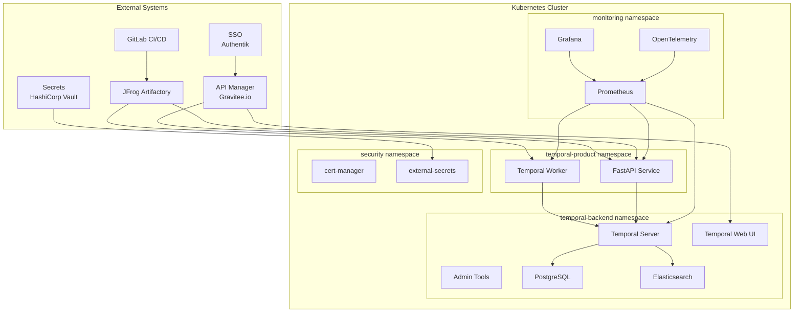

# Temporal.io Design and Implementation Guide

## Table of Contents
1. [Overview](#overview)
2. [Architecture Design](#architecture-design)
3. [Infrastructure Requirements](#infrastructure-requirements)
4. [Security Architecture](#security-architecture)
5. [Deployment Strategy](#deployment-strategy)
6. [Implementation Guide](#implementation-guide)
7. [Monitoring and Observability](#monitoring-and-observability)
8. [Development Workflow](#development-workflow)
9. [Operational Procedures](#operational-procedures)
10. [Troubleshooting](#troubleshooting)

## Overview

This guide provides a comprehensive design and implementation strategy for deploying Temporal.io in a production-ready Kubernetes environment with enterprise-grade security, monitoring, and DevOps practices.

### Target Architecture
- **Temporal Backend**: Deployed in `temporal-backend` namespace
- **Business Applications**: Deployed in `temporal-product` namespace
- **Database**: PostgreSQL for persistence and visibility
- **Search**: Elasticsearch for advanced visibility
- **Monitoring**: Prometheus + Grafana + OpenTelemetry
- **Security**: Authentik SSO + HashiCorp Vault + cert-manager
- **GitOps**: ArgoCD for deployment automation

### Personas
- **Developers**: Build workflows and activities
- **Product Owners**: Define business requirements
- **Architects**: Design system integration
- **SRE/DevOps**: Operate and maintain infrastructure

## Architecture Design

### High-Level Architecture



### Component Architecture

#### Temporal Server Components
1. **Frontend Service**: gRPC API endpoint for clients
2. **History Service**: Manages workflow execution history
3. **Matching Service**: Task queue management
4. **Worker Service**: Internal background operations

#### Database Schema
- **Default Store**: Main temporal database (PostgreSQL)
- **Visibility Store**: Search and filtering (PostgreSQL + Elasticsearch)

#### Security Layers
1. **Network**: Kubernetes NetworkPolicies
2. **Authentication**: SSO integration with Authentik
3. **Authorization**: RBAC + Temporal authorization
4. **Encryption**: TLS everywhere with cert-manager
5. **Secrets**: External Secrets with Vault integration

## Infrastructure Requirements

### Kubernetes Cluster Specifications

#### Minimum Requirements
- **Nodes**: 3+ worker nodes
- **CPU**: 8+ cores total
- **Memory**: 16GB+ total
- **Storage**: 100GB+ persistent storage
- **Kubernetes Version**: 1.25+

#### Production Requirements
- **Nodes**: 6+ worker nodes (multi-AZ)
- **CPU**: 32+ cores total
- **Memory**: 64GB+ total
- **Storage**: 500GB+ high-performance SSD
- **Network**: 10Gbps between nodes

### Resource Allocation

#### temporal-backend namespace
```yaml
resources:
  temporal-server:
    limits:
      cpu: 2000m
      memory: 4Gi
    requests:
      cpu: 1000m
      memory: 2Gi
  temporal-web:
    limits:
      cpu: 500m
      memory: 1Gi
    requests:
      cpu: 250m
      memory: 512Mi
  postgresql:
    limits:
      cpu: 2000m
      memory: 8Gi
    requests:
      cpu: 1000m
      memory: 4Gi
  elasticsearch:
    limits:
      cpu: 1000m
      memory: 4Gi
    requests:
      cpu: 500m
      memory: 2Gi
```

#### temporal-product namespace
```yaml
resources:
  temporal-worker:
    limits:
      cpu: 1000m
      memory: 2Gi
    requests:
      cpu: 500m
      memory: 1Gi
  fastapi-service:
    limits:
      cpu: 500m
      memory: 1Gi
    requests:
      cpu: 250m
      memory: 512Mi
```

## Security Architecture

### Authentication & Authorization

#### SSO Integration with Authentik
```yaml
# authentik-config.yaml
apiVersion: v1
kind: ConfigMap
metadata:
  name: temporal-auth-config
  namespace: temporal-backend
data:
  auth.yaml: |
    authorization:
      jwtKeyProvider:
        keySourceURIs:
          - "https://authentik.example.com/application/o/temporal/.well-known/jwks.json"
        refreshInterval: "1m"
      permissionsClaimName: "permissions"
      authorizer: "default"
      claimMapper: "default"
```

#### RBAC Configuration
```yaml
# temporal-rbac.yaml
apiVersion: rbac.authorization.k8s.io/v1
kind: Role
metadata:
  namespace: temporal-backend
  name: temporal-operator
rules:
- apiGroups: [""]
  resources: ["pods", "services", "configmaps", "secrets"]
  verbs: ["get", "list", "watch", "create", "update", "patch", "delete"]
- apiGroups: ["apps"]
  resources: ["deployments", "statefulsets"]
  verbs: ["get", "list", "watch", "create", "update", "patch", "delete"]
```

### TLS Configuration

#### cert-manager Integration
```yaml
# temporal-certificates.yaml
apiVersion: cert-manager.io/v1
kind: Certificate
metadata:
  name: temporal-server-tls
  namespace: temporal-backend
spec:
  secretName: temporal-server-tls-secret
  issuerRef:
    name: letsencrypt-prod
    kind: ClusterIssuer
  dnsNames:
    - temporal.example.com
    - temporal-frontend.temporal-backend.svc.cluster.local
```

### Secrets Management

#### External Secrets with Vault
```yaml
# vault-secret-store.yaml
apiVersion: external-secrets.io/v1beta1
kind: SecretStore
metadata:
  name: vault-backend
  namespace: temporal-backend
spec:
  provider:
    vault:
      server: "https://vault.example.com"
      path: "kv"
      version: "v2"
      auth:
        kubernetes:
          mountPath: "kubernetes"
          role: "temporal-backend"
```

```yaml
# temporal-db-secret.yaml
apiVersion: external-secrets.io/v1beta1
kind: ExternalSecret
metadata:
  name: temporal-db-credentials
  namespace: temporal-backend
spec:
  refreshInterval: 1h
  secretStoreRef:
    name: vault-backend
    kind: SecretStore
  target:
    name: temporal-db-secret
    creationPolicy: Owner
  data:
    - secretKey: username
      remoteRef:
        key: temporal/database
        property: username
    - secretKey: password
      remoteRef:
        key: temporal/database
        property: password
```

## Deployment Strategy

### GitOps with ArgoCD

#### Application Structure
```
temporal-infrastructure/
├── applications/
│   ├── temporal-backend.yaml
│   ├── temporal-product.yaml
│   └── monitoring.yaml
├── base/
│   ├── temporal-server/
│   ├── postgresql/
│   ├── elasticsearch/
│   └── monitoring/
├── overlays/
│   ├── development/
│   ├── staging/
│   └── production/
└── scripts/
    ├── deploy.sh
    └── validate.sh
```

#### ArgoCD Application
```yaml
# argocd-temporal-app.yaml
apiVersion: argoproj.io/v1alpha1
kind: Application
metadata:
  name: temporal-backend
  namespace: argocd
spec:
  project: default
  source:
    repoURL: https://gitlab.example.com/infrastructure/temporal-deploy.git
    targetRevision: HEAD
    path: overlays/production
  destination:
    server: https://kubernetes.default.svc
    namespace: temporal-backend
  syncPolicy:
    automated:
      prune: true
      selfHeal: true
    syncOptions:
      - CreateNamespace=true
```

### Namespace Configuration

#### temporal-backend namespace
```yaml
# temporal-backend-namespace.yaml
apiVersion: v1
kind: Namespace
metadata:
  name: temporal-backend
  labels:
    name: temporal-backend
    tier: backend
    monitoring: enabled
---
apiVersion: networking.k8s.io/v1
kind: NetworkPolicy
metadata:
  name: temporal-backend-policy
  namespace: temporal-backend
spec:
  podSelector: {}
  policyTypes:
  - Ingress
  - Egress
  ingress:
  - from:
    - namespaceSelector:
        matchLabels:
          name: temporal-product
    - namespaceSelector:
        matchLabels:
          name: monitoring
  egress:
  - to: []
    ports:
    - protocol: TCP
      port: 53
    - protocol: UDP
      port: 53
  - to:
    - namespaceSelector:
        matchLabels:
          name: temporal-backend
```

#### temporal-product namespace
```yaml
# temporal-product-namespace.yaml
apiVersion: v1
kind: Namespace
metadata:
  name: temporal-product
  labels:
    name: temporal-product
    tier: application
    monitoring: enabled
---
apiVersion: networking.k8s.io/v1
kind: NetworkPolicy
metadata:
  name: temporal-product-policy
  namespace: temporal-product
spec:
  podSelector: {}
  policyTypes:
  - Ingress
  - Egress
  ingress:
  - from:
    - namespaceSelector:
        matchLabels:
          name: monitoring
  egress:
  - to:
    - namespaceSelector:
        matchLabels:
          name: temporal-backend
  - to: []
    ports:
    - protocol: TCP
      port: 53
    - protocol: UDP
      port: 53
```

## Implementation Guide

### Step 1: Prerequisites Setup

#### 1.1 Install Required Tools
```bash
# Helm
curl https://raw.githubusercontent.com/helm/helm/main/scripts/get-helm-3 | bash

# ArgoCD CLI
curl -sSL -o argocd-linux-amd64 https://github.com/argoproj/argo-cd/releases/latest/download/argocd-linux-amd64
sudo install -m 555 argocd-linux-amd64 /usr/local/bin/argocd

# External Secrets Operator
helm repo add external-secrets https://charts.external-secrets.io
```

#### 1.2 Cluster Preparation
```bash
# Create namespaces
kubectl create namespace temporal-backend
kubectl create namespace temporal-product
kubectl create namespace monitoring
kubectl create namespace security

# Label namespaces
kubectl label namespace temporal-backend tier=backend monitoring=enabled
kubectl label namespace temporal-product tier=application monitoring=enabled
kubectl label namespace monitoring tier=monitoring
kubectl label namespace security tier=security
```

### Step 2: Security Infrastructure

#### 2.1 cert-manager Installation
```bash
# Install cert-manager
helm repo add jetstack https://charts.jetstack.io
helm repo update
helm install cert-manager jetstack/cert-manager \
  --namespace cert-manager \
  --create-namespace \
  --version v1.13.0 \
  --set installCRDs=true
```

#### 2.2 External Secrets Operator
```bash
# Install external-secrets
helm install external-secrets external-secrets/external-secrets \
  --namespace external-secrets-system \
  --create-namespace \
  --set installCRDs=true
```

#### 2.3 Setup Vault Integration
```bash
# Apply Vault SecretStore
kubectl apply -f vault-secret-store.yaml

# Apply External Secrets
kubectl apply -f temporal-db-secret.yaml
```

### Step 3: Database Setup

#### 3.1 PostgreSQL Installation
```yaml
# postgresql-values.yaml
postgresql:
  auth:
    existingSecret: "temporal-db-secret"
    secretKeys:
      adminPasswordKey: "password"
      userPasswordKey: "password"
    username: "temporal"
    database: "temporal"
  primary:
    persistence:
      enabled: true
      size: 100Gi
      storageClass: "fast-ssd"
    resources:
      limits:
        cpu: 2000m
        memory: 8Gi
      requests:
        cpu: 1000m
        memory: 4Gi
  metrics:
    enabled: true
    serviceMonitor:
      enabled: true
```

```bash
# Install PostgreSQL
helm repo add bitnami https://charts.bitnami.com/bitnami
helm install postgresql bitnami/postgresql \
  --namespace temporal-backend \
  --values postgresql-values.yaml
```

#### 3.2 Elasticsearch Installation
```yaml
# elasticsearch-values.yaml
replicas: 3
minimumMasterNodes: 2
esConfig:
  elasticsearch.yml: |
    cluster.name: "temporal-es"
    network.host: 0.0.0.0
    discovery.seed_hosts: "elasticsearch-master-headless"
    cluster.initial_master_nodes: "elasticsearch-master-0,elasticsearch-master-1,elasticsearch-master-2"
persistence:
  enabled: true
  size: 50Gi
  storageClass: "fast-ssd"
resources:
  limits:
    cpu: 1000m
    memory: 4Gi
  requests:
    cpu: 500m
    memory: 2Gi
```

```bash
# Install Elasticsearch
helm repo add elastic https://helm.elastic.co
helm install elasticsearch elastic/elasticsearch \
  --namespace temporal-backend \
  --values elasticsearch-values.yaml
```

### Step 4: Temporal Server Deployment

#### 4.1 Temporal Configuration
```yaml
# temporal-values.yaml
server:
  enabled: true
  replicaCount: 3
    image:
      repository: temporalio/server
      tag: "1.29.1"
  
  resources:
    limits:
      cpu: 2000m
      memory: 4Gi
    requests:
      cpu: 1000m
      memory: 2Gi

  config:
    logLevel: "info"
    numHistoryShards: 512
    
    persistence:
      default:
        driver: "sql"
        sql:
          driver: "postgres12"
          host: "postgresql"
          port: 5432
          database: "temporal"
          existingSecret: "temporal-db-secret"
          maxConns: 20
          maxIdleConns: 20
          maxConnLifetime: "1h"
          
      visibility:
        driver: "sql"
        sql:
          driver: "postgres12"
          host: "postgresql"
          port: 5432
          database: "temporal_visibility"
          existingSecret: "temporal-db-secret"
          maxConns: 20
          maxIdleConns: 20
          maxConnLifetime: "1h"
    
    # TLS Configuration
    tls:
      frontend:
        server:
          certFile: /etc/temporal/certs/tls.crt
          keyFile: /etc/temporal/certs/tls.key
          requireClientAuth: false
        client:
          serverName: temporal-frontend
          rootCaFiles:
            - /etc/temporal/certs/ca.crt

  additionalVolumes:
    - name: temporal-certs
      secret:
        secretName: temporal-server-tls-secret

  additionalVolumeMounts:
    - name: temporal-certs
      mountPath: /etc/temporal/certs
      readOnly: true

  frontend:
    service:
      type: ClusterIP
      port: 7233
    ingress:
      enabled: true
      className: "nginx"
      annotations:
        nginx.ingress.kubernetes.io/ssl-redirect: "true"
        nginx.ingress.kubernetes.io/backend-protocol: "GRPC"
      hosts:
        - host: temporal-api.example.com
          paths:
            - path: /
              pathType: Prefix
      tls:
        - secretName: temporal-api-tls
          hosts:
            - temporal-api.example.com

web:
  enabled: true
  replicaCount: 2
  image:
    repository: temporalio/ui
    tag: 2.37.1
  
  resources:
    limits:
      cpu: 500m
      memory: 1Gi
    requests:
      cpu: 250m
      memory: 512Mi

  service:
    type: ClusterIP
    port: 8080

  ingress:
    enabled: true
    className: "nginx"
    annotations:
      nginx.ingress.kubernetes.io/ssl-redirect: "true"
    hosts:
      - host: temporal-ui.example.com
        paths:
          - path: /
            pathType: Prefix
    tls:
      - secretName: temporal-ui-tls
        hosts:
          - temporal-ui.example.com

# Disable embedded databases
cassandra:
  enabled: false

mysql:
  enabled: false

# Enable monitoring
prometheus:
  enabled: false  # Using external Prometheus

grafana:
  enabled: false  # Using external Grafana

elasticsearch:
  enabled: false  # Using external Elasticsearch
  external: true
  host: "elasticsearch-master-headless"
  port: "9200"
  version: "v7"
  scheme: "http"
  logLevel: "error"
  visibilityIndex: "temporal_visibility_v1_prod"
```

#### 4.2 Deploy Temporal Server
```bash
# Add Temporal Helm repository
helm repo add temporalio https://go.temporal.io/helm-charts
helm repo update

# Install Temporal
helm install temporal temporalio/temporal \
  --namespace temporal-backend \
  --values temporal-values.yaml \
  --wait --timeout=10m
```

### Step 5: Monitoring Setup

#### 5.1 Prometheus Configuration
```yaml
# prometheus-values.yaml
prometheus:
  prometheusSpec:
    serviceMonitorSelectorNilUsesHelmValues: false
    serviceMonitorSelector: {}
    retention: 30d
    storageSpec:
      volumeClaimTemplate:
        spec:
          storageClassName: fast-ssd
          accessModes: ["ReadWriteOnce"]
          resources:
            requests:
              storage: 100Gi
    
    additionalScrapeConfigs:
      - job_name: 'temporal-server'
        kubernetes_sd_configs:
          - role: pod
            namespaces:
              names:
                - temporal-backend
        relabel_configs:
          - source_labels: [__meta_kubernetes_pod_annotation_prometheus_io_scrape]
            action: keep
            regex: true
          - source_labels: [__meta_kubernetes_pod_annotation_prometheus_io_path]
            action: replace
            target_label: __metrics_path__
            regex: (.+)

grafana:
  adminPassword: "admin123"  # Change in production
  persistence:
    enabled: true
    size: 10Gi
    storageClassName: fast-ssd
  
  datasources:
    datasources.yaml:
      apiVersion: 1
      datasources:
        - name: Prometheus
          type: prometheus
          url: http://prometheus-server:80
          access: proxy
          isDefault: true
  
  dashboardProviders:
    dashboardproviders.yaml:
      apiVersion: 1
      providers:
        - name: 'temporal'
          orgId: 1
          folder: 'Temporal'
          type: file
          disableDeletion: false
          editable: true
          options:
            path: /var/lib/grafana/dashboards/temporal

  dashboards:
    temporal:
      temporal-general:
        url: https://raw.githubusercontent.com/temporalio/dashboards/helm/server/server-general.json
        datasource: Prometheus
```

#### 5.2 Install Monitoring Stack
```bash
# Install Prometheus Operator
helm repo add prometheus-community https://prometheus-community.github.io/helm-charts
helm install monitoring prometheus-community/kube-prometheus-stack \
  --namespace monitoring \
  --values prometheus-values.yaml \
  --wait --timeout=10m
```

### Step 6: Application Deployment

#### 6.1 Temporal Worker Application
```yaml
# temporal-worker-deployment.yaml
apiVersion: apps/v1
kind: Deployment
metadata:
  name: temporal-worker
  namespace: temporal-product
spec:
  replicas: 3
  selector:
    matchLabels:
      app: temporal-worker
  template:
    metadata:
      labels:
        app: temporal-worker
      annotations:
        prometheus.io/scrape: "true"
        prometheus.io/port: "8080"
        prometheus.io/path: "/metrics"
    spec:
      containers:
      - name: temporal-worker
        image: your-registry.com/temporal-worker:latest
        ports:
        - containerPort: 8080
          name: metrics
        env:
        - name: TEMPORAL_HOST
          value: "temporal-frontend:7233"
        - name: TEMPORAL_NAMESPACE
          value: "default"
        resources:
          limits:
            cpu: 1000m
            memory: 2Gi
          requests:
            cpu: 500m
            memory: 1Gi
        livenessProbe:
          httpGet:
            path: /health
            port: 8080
          initialDelaySeconds: 30
          periodSeconds: 10
        readinessProbe:
          httpGet:
            path: /ready
            port: 8080
          initialDelaySeconds: 5
          periodSeconds: 5
```

#### 6.2 FastAPI Service
```yaml
# fastapi-deployment.yaml
apiVersion: apps/v1
kind: Deployment
metadata:
  name: fastapi-service
  namespace: temporal-product
spec:
  replicas: 2
  selector:
    matchLabels:
      app: fastapi-service
  template:
    metadata:
      labels:
        app: fastapi-service
      annotations:
        prometheus.io/scrape: "true"
        prometheus.io/port: "8000"
        prometheus.io/path: "/metrics"
    spec:
      containers:
      - name: fastapi
        image: your-registry.com/fastapi-service:latest
        ports:
        - containerPort: 8000
          name: http
        - containerPort: 8080
          name: metrics
        env:
        - name: TEMPORAL_HOST
          value: "temporal-frontend.temporal-backend:7233"
        - name: DATABASE_URL
          valueFrom:
            secretKeyRef:
              name: app-database-secret
              key: url
        resources:
          limits:
            cpu: 500m
            memory: 1Gi
          requests:
            cpu: 250m
            memory: 512Mi
        livenessProbe:
          httpGet:
            path: /health
            port: 8000
          initialDelaySeconds: 30
          periodSeconds: 10
        readinessProbe:
          httpGet:
            path: /ready
            port: 8000
          initialDelaySeconds: 5
          periodSeconds: 5
---
apiVersion: v1
kind: Service
metadata:
  name: fastapi-service
  namespace: temporal-product
spec:
  selector:
    app: fastapi-service
  ports:
  - name: http
    port: 80
    targetPort: 8000
---
apiVersion: networking.k8s.io/v1
kind: Ingress
metadata:
  name: fastapi-ingress
  namespace: temporal-product
  annotations:
    nginx.ingress.kubernetes.io/ssl-redirect: "true"
spec:
  ingressClassName: nginx
  tls:
  - hosts:
    - api.example.com
    secretName: fastapi-tls
  rules:
  - host: api.example.com
    http:
      paths:
      - path: /
        pathType: Prefix
        backend:
          service:
            name: fastapi-service
            port:
              number: 80
```

## Monitoring and Observability

### OpenTelemetry Integration

#### 6.1 OpenTelemetry Collector
```yaml
# otel-collector.yaml
apiVersion: opentelemetry.io/v1alpha1
kind: OpenTelemetryCollector
metadata:
  name: temporal-otel
  namespace: monitoring
spec:
  config: |
    receivers:
      prometheus:
        config:
          scrape_configs:
          - job_name: 'temporal-metrics'
            kubernetes_sd_configs:
            - role: pod
              namespaces:
                names:
                - temporal-backend
                - temporal-product
    
    processors:
      batch:
      resource:
        attributes:
        - key: service.name
          from_attribute: __meta_kubernetes_pod_label_app
          action: insert
    
    exporters:
      prometheus:
        endpoint: "0.0.0.0:8889"
      jaeger:
        endpoint: "jaeger-collector:14250"
        tls:
          insecure: true
    
    service:
      pipelines:
        metrics:
          receivers: [prometheus]
          processors: [batch, resource]
          exporters: [prometheus]
        traces:
          receivers: [otlp]
          processors: [batch, resource]
          exporters: [jaeger]
```

### Custom Dashboards

#### 6.2 Temporal Business Metrics Dashboard
```json
{
  "dashboard": {
    "title": "Temporal Business Metrics",
    "panels": [
      {
        "title": "Workflow Executions",
        "type": "graph",
        "targets": [
          {
            "expr": "rate(temporal_workflow_started_total[5m])",
            "legendFormat": "Started"
          },
          {
            "expr": "rate(temporal_workflow_completed_total[5m])",
            "legendFormat": "Completed"
          },
          {
            "expr": "rate(temporal_workflow_failed_total[5m])",
            "legendFormat": "Failed"
          }
        ]
      },
      {
        "title": "Task Queue Lag",
        "type": "graph",
        "targets": [
          {
            "expr": "temporal_task_queue_lag",
            "legendFormat": "{{task_queue}}"
          }
        ]
      },
      {
        "title": "Worker Health",
        "type": "stat",
        "targets": [
          {
            "expr": "up{job=\"temporal-worker\"}",
            "legendFormat": "Worker Instances"
          }
        ]
      }
    ]
  }
}
```

## Development Workflow

### Git Workflow with Conventional Commits

#### 7.1 Branch Strategy
```
main (production)
├── develop (integration)
├── feature/temporal-worker-enhancement
├── hotfix/critical-bug-fix
└── release/v1.2.0
```

#### 7.2 Conventional Commit Format
```
type(scope): description

[optional body]

[optional footer(s)]
```

**Types:**
- `feat`: New feature
- `fix`: Bug fix
- `docs`: Documentation changes
- `style`: Code style changes
- `refactor`: Code refactoring
- `test`: Test additions/modifications
- `chore`: Maintenance tasks

**Examples:**
```bash
git commit -m "feat(worker): add retry mechanism for failed activities"
git commit -m "fix(api): resolve connection timeout issue"
git commit -m "docs(deployment): update helm values documentation"
```

#### 7.3 Semantic Versioning
- **MAJOR**: Breaking changes (v2.0.0)
- **MINOR**: New features (v1.1.0)
- **PATCH**: Bug fixes (v1.0.1)

#### 7.4 CI/CD Pipeline
```yaml
# .gitlab-ci.yml
stages:
  - validate
  - test
  - build
  - security
  - deploy

variables:
  DOCKER_REGISTRY: "jfrog.example.com"
  HELM_REPO: "jfrog.example.com/helm"

validate:
  stage: validate
  script:
    - conventional-commit-lint
    - helm lint charts/temporal-worker
    - yaml-lint kubernetes/

test:
  stage: test
  script:
    - uv run pytest tests/
    - uv run coverage report --fail-under=80

build:
  stage: build
  script:
    - docker build -t $DOCKER_REGISTRY/temporal-worker:$CI_COMMIT_SHA .
    - docker push $DOCKER_REGISTRY/temporal-worker:$CI_COMMIT_SHA
    - helm package charts/temporal-worker
    - helm push temporal-worker-*.tgz oci://$HELM_REPO

security-scan:
  stage: security
  script:
    - trivy image $DOCKER_REGISTRY/temporal-worker:$CI_COMMIT_SHA
    - helm scan charts/temporal-worker

deploy-dev:
  stage: deploy
  environment: development
  script:
    - argocd app sync temporal-worker-dev
  only:
    - develop

deploy-prod:
  stage: deploy
  environment: production
  script:
    - argocd app sync temporal-worker-prod
  only:
    - main
  when: manual
```

### Python Development Setup

#### 7.5 Project Structure
```
temporal-worker/
├── pyproject.toml
├── uv.lock
├── src/
│   ├── worker/
│   │   ├── __init__.py
│   │   ├── activities.py
│   │   ├── workflows.py
│   │   └── main.py
│   └── shared/
│       ├── __init__.py
│       ├── models.py
│       └── utils.py
├── tests/
│   ├── test_activities.py
│   ├── test_workflows.py
│   └── conftest.py
├── docker/
│   └── Dockerfile
└── k8s/
    ├── deployment.yaml
    └── service.yaml
```

#### 7.6 pyproject.toml Configuration
```toml
[project]
name = "temporal-worker"
version = "1.0.0"
description = "Temporal worker for business processes"
requires-python = ">=3.11"
dependencies = [
    "temporalio>=1.7.0",
    "fastapi>=0.104.0",
    "pydantic>=2.0.0",
    "prometheus-client>=0.19.0",
    "structlog>=23.0.0",
]

[project.optional-dependencies]
dev = [
    "pytest>=7.0.0",
    "pytest-asyncio>=0.21.0",
    "pytest-cov>=4.0.0",
    "black>=23.0.0",
    "ruff>=0.1.0",
    "mypy>=1.7.0",
]

[build-system]
requires = ["hatchling"]
build-backend = "hatchling.build"

[tool.black]
line-length = 88
target-version = ['py311']

[tool.ruff]
target-version = "py311"
line-length = 88
select = ["E", "F", "UP", "B", "SIM", "I"]

[tool.mypy]
python_version = "3.11"
strict = true
```

## Operational Procedures

### Deployment Procedures

#### 8.1 Rolling Updates
```bash
# Update worker image
kubectl set image deployment/temporal-worker \
  temporal-worker=your-registry.com/temporal-worker:v1.2.0 \
  -n temporal-product

# Monitor rollout
kubectl rollout status deployment/temporal-worker -n temporal-product

# Rollback if needed
kubectl rollout undo deployment/temporal-worker -n temporal-product
```

#### 8.2 Database Migrations
```bash
# Create migration job
kubectl apply -f - <<EOF
apiVersion: batch/v1
kind: Job
metadata:
  name: temporal-schema-update
  namespace: temporal-backend
spec:
  template:
    spec:
      containers:
      - name: schema-update
        image: temporalio/admin-tools:1.27.2
        command:
        - /bin/sh
        - -c
        - |
          temporal-sql-tool \
            --plugin postgres12 \
            --ep postgresql:5432 \
            --u temporal \
            --pw \$DB_PASSWORD \
            --db temporal \
            update-schema \
            --schema-dir /etc/temporal/schema/postgresql/v12
        env:
        - name: DB_PASSWORD
          valueFrom:
            secretKeyRef:
              name: temporal-db-secret
              key: password
      restartPolicy: OnFailure
EOF
```

#### 8.3 Backup Procedures
```bash
# Database backup
kubectl exec -n temporal-backend postgresql-0 -- \
  pg_dump -U temporal -h localhost temporal > temporal-backup-$(date +%Y%m%d).sql

# Elasticsearch backup
kubectl exec -n temporal-backend elasticsearch-master-0 -- \
  curl -X PUT "localhost:9200/_snapshot/temporal_backup/snapshot_$(date +%Y%m%d)"
```

### Monitoring and Alerting

#### 8.4 Alerting Rules
```yaml
# temporal-alerts.yaml
groups:
- name: temporal.rules
  rules:
  - alert: TemporalServerDown
    expr: up{job="temporal-server"} == 0
    for: 1m
    labels:
      severity: critical
    annotations:
      summary: "Temporal server is down"
      description: "Temporal server {{ $labels.instance }} is down for more than 1 minute"

  - alert: HighWorkflowFailureRate
    expr: rate(temporal_workflow_failed_total[5m]) > 0.1
    for: 5m
    labels:
      severity: warning
    annotations:
      summary: "High workflow failure rate"
      description: "Workflow failure rate is {{ $value }} per second"

  - alert: DatabaseConnectionIssue
    expr: temporal_persistence_errors_total > 10
    for: 2m
    labels:
      severity: critical
    annotations:
      summary: "Database connection issues"
      description: "Temporal is experiencing database connection issues"
```

#### 8.5 Log Aggregation
```yaml
# fluent-bit-config.yaml
apiVersion: v1
kind: ConfigMap
metadata:
  name: fluent-bit-config
  namespace: logging
data:
  fluent-bit.conf: |
    [SERVICE]
        Flush         1
        Log_Level     info
        Daemon        off
        Parsers_File  parsers.conf

    [INPUT]
        Name              tail
        Path              /var/log/containers/*temporal*.log
        Parser            json
        Tag               temporal.*
        Refresh_Interval  5

    [FILTER]
        Name                kubernetes
        Match               temporal.*
        Kube_URL            https://kubernetes.default.svc:443
        Kube_CA_File        /var/run/secrets/kubernetes.io/serviceaccount/ca.crt
        Kube_Token_File     /var/run/secrets/kubernetes.io/serviceaccount/token

    [OUTPUT]
        Name  forward
        Match temporal.*
        Host  fluentd.logging.svc.cluster.local
        Port  24224
```

## Troubleshooting

### Common Issues and Solutions

#### 9.1 Temporal Server Issues

**Issue: Temporal server fails to start**
```bash
# Check server logs
kubectl logs -n temporal-backend deployment/temporal-server

# Common solutions:
# 1. Database connectivity
kubectl exec -n temporal-backend temporal-server-xxx -- \
  nc -zv postgresql 5432

# 2. Check configuration
kubectl get configmap -n temporal-backend temporal-config -o yaml

# 3. Verify secrets
kubectl get secret -n temporal-backend temporal-db-secret -o yaml
```

**Issue: High memory usage**
```bash
# Check memory metrics
kubectl top pods -n temporal-backend

# Adjust resources
kubectl patch deployment temporal-server -n temporal-backend -p '
{
  "spec": {
    "template": {
      "spec": {
        "containers": [{
          "name": "temporal-server",
          "resources": {
            "limits": {"memory": "8Gi"},
            "requests": {"memory": "4Gi"}
          }
        }]
      }
    }
  }
}'
```

#### 9.2 Database Issues

**Issue: Database connection pool exhaustion**
```bash
# Check connection metrics
kubectl exec -n temporal-backend postgresql-0 -- \
  psql -U temporal -c "SELECT count(*) FROM pg_stat_activity;"

# Increase connection pool
kubectl patch configmap temporal-config -n temporal-backend --patch '
{
  "data": {
    "config.yaml": "...\npersistence:\n  default:\n    sql:\n      maxConns: 50\n      maxIdleConns: 25\n..."
  }
}'
```

#### 9.3 Worker Issues

**Issue: Workers not receiving tasks**
```bash
# Check worker logs
kubectl logs -n temporal-product deployment/temporal-worker

# Verify task queue configuration
temporal workflow list --namespace default

# Check network connectivity
kubectl exec -n temporal-product temporal-worker-xxx -- \
  nc -zv temporal-frontend.temporal-backend 7233
```

#### 9.4 Performance Troubleshooting

**Performance Checklist:**
1. **Database Performance**
   ```sql
   -- Check slow queries
   SELECT query, mean_time, calls 
   FROM pg_stat_statements 
   ORDER BY mean_time DESC 
   LIMIT 10;
   ```

2. **Elasticsearch Performance**
   ```bash
   # Check cluster health
   kubectl exec -n temporal-backend elasticsearch-master-0 -- \
     curl -s localhost:9200/_cluster/health?pretty
   ```

3. **Kubernetes Resources**
   ```bash
   # Check resource usage
   kubectl top nodes
   kubectl top pods --all-namespaces --sort-by=memory
   ```

### Emergency Procedures

#### 9.5 Disaster Recovery

**Complete System Recovery:**
```bash
# 1. Restore database from backup
kubectl exec -n temporal-backend postgresql-0 -- \
  psql -U temporal -h localhost < temporal-backup-20231215.sql

# 2. Restore Elasticsearch snapshots
kubectl exec -n temporal-backend elasticsearch-master-0 -- \
  curl -X POST "localhost:9200/_snapshot/temporal_backup/snapshot_20231215/_restore"

# 3. Restart Temporal services
kubectl rollout restart deployment/temporal-server -n temporal-backend
kubectl rollout restart deployment/temporal-web -n temporal-backend

# 4. Verify system health
kubectl get pods -n temporal-backend
kubectl get pods -n temporal-product
```

**Partial Service Recovery:**
```bash
# Scale down affected services
kubectl scale deployment temporal-worker -n temporal-product --replicas=0

# Clear problematic workflows (if needed)
temporal workflow terminate --workflow-id problematic-workflow-id

# Scale back up
kubectl scale deployment temporal-worker -n temporal-product --replicas=3
```

### Health Checks and Validation

#### 9.6 System Validation Scripts
```bash
#!/bin/bash
# validate-temporal-deployment.sh

echo "Validating Temporal deployment..."

# Check namespace existence
for ns in temporal-backend temporal-product monitoring; do
  if kubectl get namespace $ns >/dev/null 2>&1; then
    echo "✓ Namespace $ns exists"
  else
    echo "✗ Namespace $ns missing"
    exit 1
  fi
done

# Check pod status
echo "Checking pod status..."
kubectl get pods -n temporal-backend -o wide
kubectl get pods -n temporal-product -o wide

# Verify services
echo "Checking services..."
kubectl get svc -n temporal-backend
kubectl get svc -n temporal-product

# Test connectivity
echo "Testing Temporal server connectivity..."
kubectl exec -n temporal-product deploy/temporal-worker -- \
  temporal workflow list --namespace default >/dev/null 2>&1 && \
  echo "✓ Temporal server accessible" || \
  echo "✗ Temporal server not accessible"

# Check metrics endpoint
echo "Testing metrics endpoints..."
kubectl port-forward -n temporal-backend svc/temporal-server 9090:9090 &
PF_PID=$!
sleep 5
curl -s http://localhost:9090/metrics | grep -q temporal && \
  echo "✓ Metrics endpoint responding" || \
  echo "✗ Metrics endpoint not responding"
kill $PF_PID

echo "Validation complete!"
```

## Conclusion

This comprehensive guide provides a production-ready implementation of Temporal.io with enterprise-grade security, monitoring, and operational procedures. The architecture supports scalability, high availability, and maintainability while following DevOps best practices.

### Key Benefits
- **Scalable Architecture**: Kubernetes-native deployment with horizontal scaling
- **Security First**: End-to-end encryption, SSO integration, and secrets management
- **Observability**: Comprehensive monitoring with Prometheus, Grafana, and OpenTelemetry
- **GitOps Ready**: Automated deployment with ArgoCD and conventional commits
- **Production Ready**: High availability, backup procedures, and disaster recovery

### Next Steps
1. **Environment Setup**: Follow the implementation guide step by step
2. **Security Hardening**: Implement additional security measures as needed
3. **Performance Testing**: Conduct load testing to validate performance
4. **Team Training**: Train development and operations teams on the new platform
5. **Documentation**: Maintain up-to-date documentation for ongoing operations

For additional support and advanced configurations, refer to the official Temporal.io documentation and consider engaging with the Temporal community for best practices and optimization strategies.
